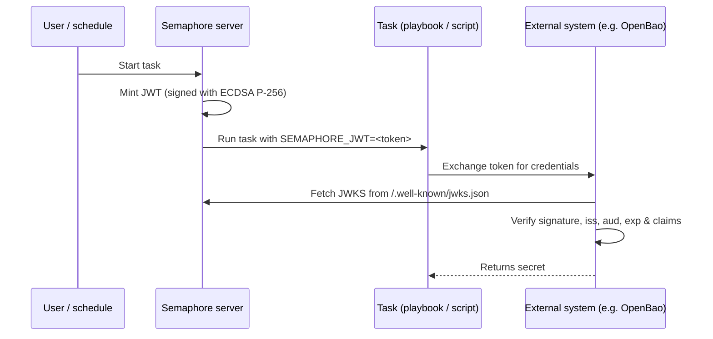

# Task JWT issuance

Semaphore can mint a short-lived [JSON Web Token (JWT)](https://datatracker.ietf.org/doc/html/rfc7519)
for every task execution. The token is signed by Semaphore and exposed to the
playbook (or shell/Terraform/PowerShell/Python script) as the
`SEMAPHORE_JWT` environment variable.

Together with the [JWKS endpoint](#jwks-endpoint) that Semaphore publishes, the
token lets external systems authenticate a task without any pre-shared secret.

This page describes the **server-side configuration**. For per-template
configuration and consumption inside a task, see the
[user guide page on task JWTs](/user-guide/task-templates/jwt).

______________________________________________________________________

## How it works



Signing uses an **ECDSA P-256** key pair. The private key is generated on first
use, encrypted with the same `access_key_encryption` key that protects other
secrets, and stored in the Semaphore database. The public key is served via
the JWKS endpoint.

______________________________________________________________________

## Configuration

JWT issuance is **disabled by default**. Enable it in your `config.json`:

```json
{
    "jwt": {
        "enabled": true,
        "issuer": "https://semaphore.example.com",
        "default_ttl": "1h",
        "max_ttl": "24h"
    }
}
```

| Option | Default | Description |
| ----------------- | ------- | --------------------------------------------------------------------------------------------------------------------------------------- |
| `jwt.enabled` | `false` | When `false`, no tokens are minted and the JWKS endpoint returns `404`. |
| `jwt.issuer` | _none_ | Value emitted in the `iss` claim. Set this to a stable URL that identifies your Semaphore instance - external systems use it as a trust anchor. |
| `jwt.default_ttl` | `1h` | Token lifetime used when a template does not override it. Accepts Go-style durations (`30m`, `1h`, `90m`, ...). |
| `jwt.max_ttl` | `24h` | Maximum lifetime a token can have. Templates can't override the TTL with a value higher than this. |

:::tip
The signing key is encrypted at rest with the
[`access_key_encryption`](/admin-guide/configuration/config-file) key. Make
sure this option is configured **before** you enable JWTs. The key is
generated on first start and can not be re-encrypted afterwards.
:::

______________________________________________________________________

## JWKS endpoint

When JWT issuance is enabled, Semaphore exposes its public signing key at:

```
GET /.well-known/jwks.json
```

The response follows [RFC 7517](https://datatracker.ietf.org/doc/html/rfc7517)
and can be consumed directly by the JWT verifier:

```bash
curl https://semaphore.example.com/.well-known/jwks.json
```

```json
{
  "keys": [
    {
      "kty": "EC",
      "crv": "P-256",
      "kid": "...",
      "use": "sig",
      "alg": "ES256",
      "x": "...",
      "y": "..."
    }
  ]
}
```

______________________________________________________________________

## Key rotation

The signing key is created automatically when starting Semaphore with the JWT feature enabled.
To rotate it, remove the `jwt_signing_key` row from the
`option` table and restart Semaphore.
A fresh key pair will be created automatically.

Because rotation invalidates all previously issued tokens, do this only when
no existing token is in use anymore (e.g. no active running tasks)
