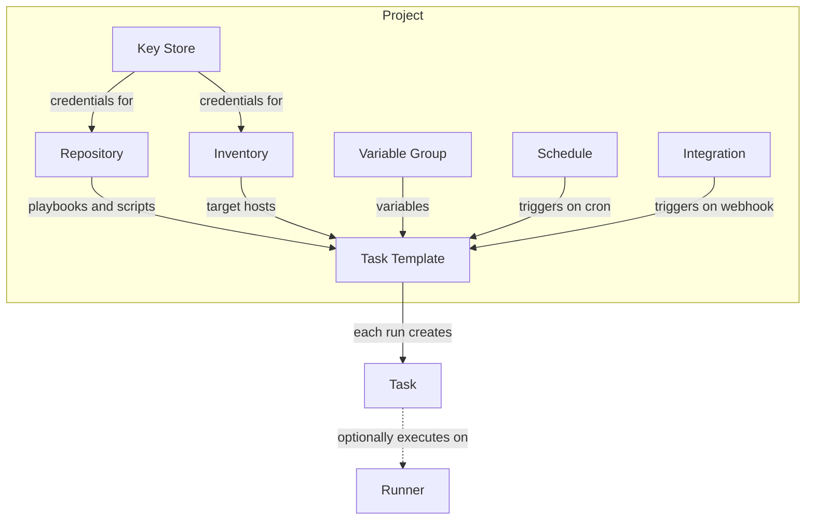

# Core concepts

Everything in Semaphore UI happens inside a **project**. A project contains the resources automation needs — repositories, inventories, credentials, and variables — and **task templates** that tie those resources together. Running a template creates a **task**. Schedules and integrations start templates automatically, and optional runners execute tasks on separate hosts.

## Project

A project is a place to separate management activity. Projects are independent from one another, so you can use them to organize unrelated systems — different teams, infrastructures, environments, or applications — within a single Semaphore installation. Each project has its own resources and its own team of users with roles. See [Projects](/user-guide/projects).

## Repository

A repository is where your Ansible playbooks, Terraform code, and scripts live. It can be a remote Git repository accessed over HTTPS or SSH, or a local path on the server. Every task template needs a repository to run. See [Repositories](/user-guide/repositories).

## Key Store

The Key Store holds the credentials Semaphore uses: SSH keys and login/password pairs for reaching hosts and private repositories, sudo credentials, and Ansible Vault passwords. Secrets are stored encrypted in the database, or in an external secret manager such as HashiCorp Vault or OpenBao. A key of type `None` is used for resources that need no authentication, such as public repositories. See [Key Store](/user-guide/key-store).

## Inventory

An inventory is the list of hosts Ansible runs plays against, together with host and group variables. Semaphore can store an inventory statically (edited in the web UI) or read it from a file in your repository or on the server. Each inventory references user credentials from the Key Store that Ansible uses to log in to the hosts. See [Inventory](/user-guide/inventory).

## Variable Group

A Variable Group (also called Environment) stores extra variables for your runs in JSON format, plus environment variables and secrets. Use it for configuration that is shared across templates, such as API endpoints or connection settings. See [Variable Groups](/user-guide/environment).

## Task Template

A task template defines how to run a task: which app to use (Ansible, Terraform/OpenTofu, Bash, PowerShell, or Python), which repository, inventory, and variable groups to use, and which playbook or script to execute. Templates can also define survey variables — input fields shown to the user at run time. See [Task Templates](/user-guide/task-templates/).

## Task

A task is a single run of a task template. Each task has a status and a live log you can follow while it runs and read afterwards. Task history is kept per template, so you can always see who ran what and when. See [Tasks](/user-guide/tasks).

## Schedule

A schedule runs a template automatically at predefined intervals, using standard cron syntax. Typical uses are regular backups, compliance checks, and system updates. See [Schedules](/user-guide/schedules).

## Integration

An integration triggers a template from an external service via a webhook endpoint — for example, when you push to GitHub. Matchers filter incoming requests, and value extractors pull data out of the payload and pass it to the task. See [Integrations](/user-guide/integrations).

## Runner

A runner is an agent on a separate host that connects to the Semaphore server, picks up tasks, clones the repository, and executes the job there instead of on the server. Runners let you isolate execution or distribute load across several machines; without them, the server runs tasks itself. See [Runners](/admin-guide/runners).

## Related pages

- [Quickstart](/getting-started/quickstart) — put these concepts into practice.
- [Glossary](/getting-started/glossary) — short definitions of all terms.
