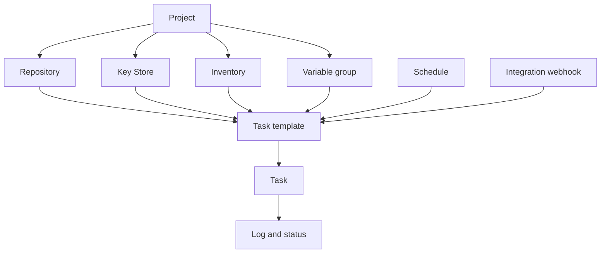

# Core concepts

Semaphore has one central idea: a **task template** gathers everything a run needs,
and running it produces a **task**. Learning where each piece of that "everything"
is configured is most of learning the product.

## The object model {#the-object-model}

### Projects hold everything {#projects-hold-everything}

A [project](/user-guide/projects) is the unit of isolation. Repositories, keys,
inventories, variable groups, templates, and task history belong to exactly one
project, and so does team membership. Two projects share nothing except the server
and its users, which is what makes a project the right boundary between teams,
environments, or customers.

### Resources describe the inputs {#resources-describe-the-inputs}

Four kinds of resource exist so that the same value can be reused by many templates
and changed in one place:

- A [repository](/user-guide/repositories) is where the playbook or script lives.
- The [Key Store](/user-guide/key-store) holds the SSH keys, logins, and tokens used
  to reach the repository and the target hosts.
- An [inventory](/user-guide/inventory) lists the hosts a run targets and how to
  connect to them.
- A [variable group](/user-guide/environment) carries variables and secrets into the
  run's environment.

### Templates define the run {#templates-define-the-run}

A [task template](/user-guide/task-templates) selects an application (Ansible,
Terraform, a script), one repository, the playbook or entry point inside it, and the
inventory, variable group, and keys to use. It also decides what the person starting
the task may change: [survey variables](/user-guide/task-templates/survey-vars) turn
a template into a form, and [prompts](/user-guide/task-templates/prompts) let a user
override the branch, inventory, or extra arguments.

### Tasks are the runs {#tasks-are-the-runs}

Starting a template creates a [task](/user-guide/tasks). The task has its own log,
status, duration, and the name of whoever started it, and that record stays after
the run finishes. Tasks start from the UI, from a
[schedule](/user-guide/schedules), from an
[integration webhook](/user-guide/integrations), from the
[API](/admin-guide/api), or from another template in a
[workflow](/user-guide/workflows).

## Glossary {#glossary}

| Term | Meaning |
|---|---|
| **Access key** | One entry in the Key Store: an SSH key, a login and password, or a token. Its secret part is encrypted in the database. |
| **Alert** | A notification sent when a task reaches a certain state. Channels are configured on the server, then enabled per project and per template. |
| **App** | The tool a template runs: Ansible, Terraform, OpenTofu, Terragrunt, Bash, PowerShell, or Python. |
| **Build template** | A template type that produces a versioned artifact; each run increments the version. |
| **Deploy template** | A template type linked to a build template; starting it asks which build version to ship. |
| **Executor** | How a runner launches a job: as a local process, in a Docker container, or in a Kubernetes Pod. |
| **Integration** | An incoming webhook that starts a template when an external system calls it. |
| **Inventory** | The hosts a task targets, as static text, a file in the repository, or a dynamic inventory script. |
| **Key Store** | The per-project collection of access keys. |
| **Project** | The top-level container: resources, templates, task history, and team membership. |
| **Role** | What a member may do inside a project. The built-in roles are Owner, Manager, Task Runner, and Guest. |
| **Runner** | A separate process that executes tasks for the server instead of the server executing them itself. |
| **Schedule** | A cron expression that starts a template without a person. |
| **Secret storage** | An external system such as HashiCorp Vault that holds secret values instead of the Semaphore database. |
| **Survey variable** | A field the template defines and the user fills in when starting a task; it becomes a variable for the run. |
| **Task** | One execution of a template, with its log, status, and author. |
| **Task template** | The reusable definition of what to run and with what. Often just "template". |
| **Variable group** | A named set of variables and secrets passed into the run. Called *Environment* in older versions and in the API. |
| **View** | A tab that groups a subset of a project's templates in the template list. |
| **Workflow** | A graph of templates run in sequence with branching, approvals, and delays. A Pro feature. |

## What's next {#whats-next}

- [Getting Started](/getting-started) — put the concepts to work in order.
- [User Guide](/user-guide) — one page per concept, with every field.
- [Architecture](/introduction/architecture) — how the server, database, and runners fit together.
