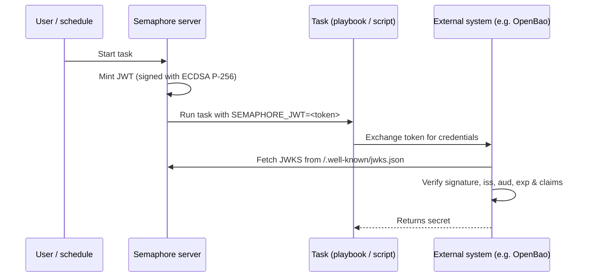

# Ausstellung von Task-JWTs

Semaphore kann für jede Task-Ausführung ein kurzlebiges [JSON Web Token (JWT)](https://datatracker.ietf.org/doc/html/rfc7519)
ausstellen. Das Token wird von Semaphore signiert und dem
Playbook (oder Shell-/Terraform-/PowerShell-/Python-Skript) als
Umgebungsvariable `SEMAPHORE_JWT` bereitgestellt.

Zusammen mit dem [JWKS-Endpunkt](#jwks-endpoint), den Semaphore veröffentlicht, ermöglicht das
Token externen Systemen, einen Task ohne vorab geteiltes Geheimnis zu authentifizieren.

Diese Seite beschreibt die **serverseitige Konfiguration**. Für die Konfiguration pro Template
und die Verwendung innerhalb eines Tasks siehe die
[Seite zu Task-JWTs im Benutzerhandbuch](/user-guide/task-templates/jwt).

______________________________________________________________________

## Funktionsweise {#how-it-works}



Die Signierung verwendet ein **ECDSA-P-256**-Schlüsselpaar. Der private Schlüssel wird bei der ersten
Verwendung generiert, mit demselben `access_key_encryption`-Schlüssel verschlüsselt, der auch andere
Geheimnisse schützt, und in der Semaphore-Datenbank gespeichert. Der öffentliche Schlüssel wird über
den JWKS-Endpunkt bereitgestellt.

______________________________________________________________________

## Konfiguration {#configuration}

Die JWT-Ausstellung ist **standardmäßig deaktiviert**. Aktivieren Sie sie in Ihrer `config.json`:

```json
{
    "jwt": {
        "enabled": true,
        "issuer": "https://semaphore.example.com",
        "default_ttl": "1h",
        "max_ttl": "24h"
    }
}
```

| Option | Standard | Beschreibung |
| ----------------- | ------- | --------------------------------------------------------------------------------------------------------------------------------------- |
| `jwt.enabled` | `false` | Bei `false` werden keine Token ausgestellt und der JWKS-Endpunkt liefert `404`. |
| `jwt.issuer` | _keiner_ | Wert, der im `iss`-Claim ausgegeben wird. Setzen Sie dies auf eine stabile URL, die Ihre Semaphore-Instanz identifiziert – externe Systeme verwenden sie als Vertrauensanker. |
| `jwt.default_ttl` | `1h` | Token-Lebensdauer, die verwendet wird, wenn ein Template sie nicht überschreibt. Akzeptiert Zeitspannen im Go-Stil (`30m`, `1h`, `90m`, ...). |
| `jwt.max_ttl` | `24h` | Maximale Lebensdauer, die ein Token haben kann. Templates können die TTL nicht mit einem höheren Wert überschreiben. |

:::tip
Der Signaturschlüssel wird im Ruhezustand mit dem
[`access_key_encryption`](/admin-guide/configuration/config-file)-Schlüssel verschlüsselt. Stellen Sie
sicher, dass diese Option konfiguriert ist, **bevor** Sie JWTs aktivieren. Der Schlüssel wird
beim ersten Start generiert und kann danach nicht mehr neu verschlüsselt werden.
:::

______________________________________________________________________

## JWKS-Endpunkt {#jwks-endpoint}

Wenn die JWT-Ausstellung aktiviert ist, stellt Semaphore seinen öffentlichen Signaturschlüssel bereit unter:

```
GET /.well-known/jwks.json
```

Die Antwort folgt [RFC 7517](https://datatracker.ietf.org/doc/html/rfc7517)
und kann direkt vom JWT-Verifizierer verwendet werden:

```bash
curl https://semaphore.example.com/.well-known/jwks.json
```

```json
{
  "keys": [
    {
      "kty": "EC",
      "crv": "P-256",
      "kid": "...",
      "use": "sig",
      "alg": "ES256",
      "x": "...",
      "y": "..."
    }
  ]
}
```

______________________________________________________________________

## Schlüsselrotation {#key-rotation}

Der Signaturschlüssel wird automatisch erstellt, wenn Semaphore mit aktivierter JWT-Funktion gestartet wird.
Um ihn zu rotieren, entfernen Sie die Zeile `jwt_signing_key` aus der
Tabelle `option` und starten Sie Semaphore neu.
Ein neues Schlüsselpaar wird automatisch erstellt.

Da die Rotation alle zuvor ausgestellten Token ungültig macht, sollten Sie dies nur tun, wenn
kein bestehendes Token mehr in Verwendung ist (z. B. keine aktiv laufenden Tasks)
