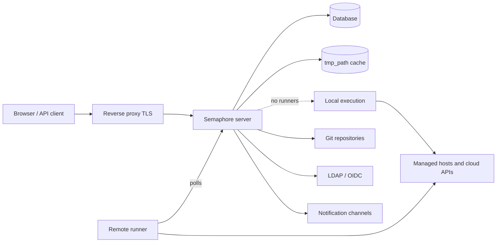

# Architektur

Eine Semaphore-Installation besteht aus drei zwingenden Teilen: einem **Serverprozess**,
einer **Datenbank** und einem **Ort, an dem Tasks ausgeführt werden**. Alles andere —
Runner, Redis, ein Reverse Proxy, ein Identity Provider — ist optional und kommt hinzu,
wenn ein konkreter Bedarf entsteht.

## Die Bestandteile {#the-parts}

### Server {#server}

Eine einzelne Go-Binärdatei. Sie enthält die kompilierte Weboberfläche, sodass ein
einziger Prozess die UI, die REST-API und einen WebSocket-Endpunkt unter `/api/ws`
bereitstellt, der Task-Ausgaben an geöffnete Browser streamt. Standardmäßig lauscht sie
auf Port `3000`.

In diesem Prozess laufen mehrere Dinge gleichzeitig ab:

| Bestandteil | Aufgabe |
|---|---|
| HTTP-API und UI | Alles, was Browser und API-Clients aufrufen. |
| Task-Pool | Die Warteschlange der Tasks, ihre Parallelitätsgrenzen und ihr Zustand. |
| Scheduler | Startet Templates gemäß ihren [Cron-Zeitplänen](/user-guide/schedules). |
| Lokaler Executor | Führt Tasks auf dem Server selbst aus, wenn kein Remote-Runner sie übernimmt. |
| Notifier | Versendet [Benachrichtigungen](/admin-guide/notifications), wenn Tasks enden. |

### Datenbank {#database}

SQLite, MySQL oder PostgreSQL, ausgewählt über die Option `dialect`. Sie enthält
Projekte, Templates, Inventories, Zeitpläne, Benutzer, Rollen, den Task-Verlauf und die
verschlüsselten Inhalte des Key Store. Sie ist das Einzige, was gesichert werden muss:
alles andere lässt sich neu aufbauen.

SQLite ist die Voreinstellung und eignet sich für einen einzelnen Server. Verwenden Sie
PostgreSQL oder MySQL, sobald mehrere Personen auf den Dienst angewiesen sind, und immer
dann, wenn Sie mehr als einen Knoten betreiben.

### Dateicache {#file-cache}

Das Verzeichnis unter `tmp_path` (standardmäßig `/tmp/semaphore`) enthält geklonte
Repositories und das Arbeitsverzeichnis jedes Laufs. Es ist ein Cache, kein Speicher:
Löschen kostet einen zusätzlichen Klon pro Projekt. **Clear cache** in den
Projekteinstellungen macht genau das.

Der Cache liegt jeweils auf der Maschine, die einen Task ausführt — beim Server, wenn
Tasks lokal laufen, und bei jedem Runner, wenn nicht.

## Wo Tasks ausgeführt werden {#where-tasks-execute}

Standardmäßig führt der Server Tasks selbst aus, in seinem eigenen Dateisystem und mit
seinem eigenen Netzwerkzugriff. Das ist die einfachste Konfiguration und die richtige für
ein kleines Team, das Hosts verwaltet, die der Server ohnehin erreicht.

[Runner](/admin-guide/runners) trennen beides. Ein Runner ist dieselbe Binärdatei,
gestartet mit `semaphore runner start`. Er hält keine Datenbankverbindung und öffnet
keinen eingehenden Port: Er fragt den Server über HTTPS mit einem Bearer-Token ab, erhält
einen Job, klont das Repository, führt das Werkzeug aus und streamt die Ausgabe zurück.
Mit Runnern können Sie

- die Ausführung in ein Netzwerk verlegen, das der Server nicht erreicht,
- Zugangsdaten für die Produktion auf einer Maschine halten, die keine Weboberfläche bereitstellt,
- Last über mehrere Maschinen verteilen und
- (in Pro) einen Task per [Tags](/admin-guide/runners#runner-tags-pro) an einen bestimmten Runner leiten.

Jeder Runner legt über `executor.type` fest, wie er einen Job startet:

| Executor | Wo der Job läuft |
|---|---|
| `local` | Als Prozess auf dem Host des Runners, in `tmp_path`. |
| `docker` | In einem Container, den der Runner für diesen Job startet und danach entfernt. |
| `k8s` | In einem Pod, den der Runner in Ihrem Cluster erzeugt und danach entfernt. |

### Ports und Richtungen {#ports-and-directions}

Jede Verbindung geht ausgehend von der Komponente aus, die sie aufbaut — genau das macht
Runner über Netzwerkgrenzen hinweg nutzbar.

| Von | Nach | Zweck |
|---|---|---|
| Browser, API-Client | Server `:3000` | UI, REST-API, WebSocket. |
| Server | Datenbank | Sämtlicher persistenter Zustand. |
| Server, Runner | Git-Remotes | Klonen von Repositories. |
| Server, Runner | Verwaltete Hosts, Cloud-APIs | Die eigentliche Automatisierung. |
| Runner | Server `:3000` | Abfrage von Jobs, Streaming der Ausgabe. |
| Server | LDAP, OIDC, SMTP, Chat-Webhooks | Anmeldung und Benachrichtigungen. |

## Skalierung {#scaling-out}

Zwei Achsen skalieren unabhängig voneinander.

**Mehr Ausführung** bedeutet mehr Runner. Der Server bleibt ein einzelner Prozess, und
Tasks werden auf die verbundenen Runner verteilt.

**Mehr Verfügbarkeit** bedeutet mehr Server. Mehrere Knoten arbeiten gegen eine
PostgreSQL- oder MySQL-Datenbank mit Redis für verteilte Sperren, gemeinsamen
Warteschlangenzustand und Pub/Sub, hinter einem Load Balancer, der WebSocket
unterstützt. Das ist [Hochverfügbarkeit](/admin-guide/ha), eine Enterprise-Funktion.
SQLite kann dafür nicht verwendet werden.

## Wie es weitergeht {#whats-next}

- [Grundbegriffe](/introduction/concepts) — die Begriffe, die die Oberfläche verwendet.
- [Sicherheitsmodell](/introduction/security-model) — Vertrauensgrenzen und was verschlüsselt wird.
- [Installation](/admin-guide/installation) — eine Methode wählen und einen Server starten.
