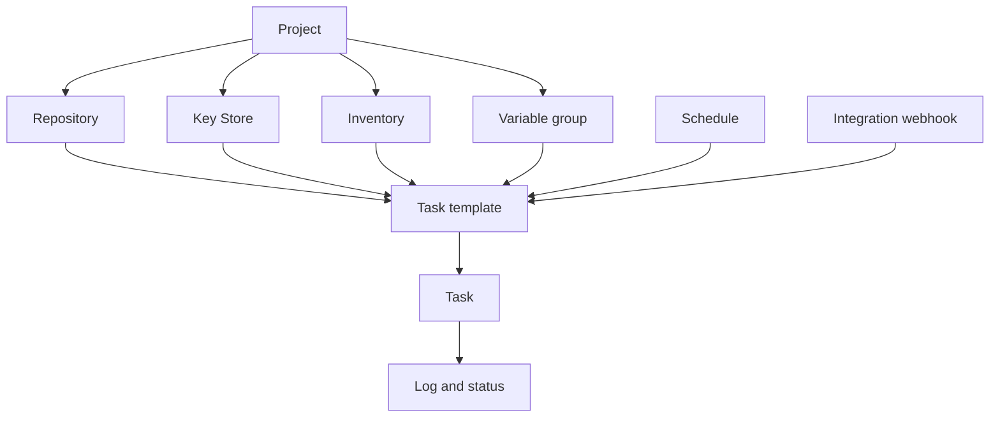

# Grundbegriffe

Semaphore hat eine zentrale Idee: Ein **Task Template** bündelt alles, was ein Lauf
benötigt, und seine Ausführung erzeugt einen **Task**. Zu lernen, wo die einzelnen
Bestandteile dieses „alles“ konfiguriert werden, ist der größte Teil davon, das Produkt
zu lernen.

## Das Objektmodell {#the-object-model}

### Projekte enthalten alles {#projects-hold-everything}

Ein [Projekt](/user-guide/projects) ist die Einheit der Abgrenzung. Repositories,
Schlüssel, Inventories, Variablengruppen, Templates und der Task-Verlauf gehören zu genau
einem Projekt, ebenso die Teammitgliedschaft. Zwei Projekte teilen nichts außer dem Server
und seinen Benutzern — genau das macht ein Projekt zur richtigen Grenze zwischen Teams,
Umgebungen oder Kunden.

### Ressourcen beschreiben die Eingaben {#resources-describe-the-inputs}

Es gibt vier Arten von Ressourcen, damit derselbe Wert von vielen Templates wiederverwendet
und an einer Stelle geändert werden kann:

- Ein [Repository](/user-guide/repositories) ist der Ort, an dem das Playbook oder Skript liegt.
- Der [Key Store](/user-guide/key-store) enthält die SSH-Schlüssel, Logins und Tokens, mit
  denen das Repository und die Zielhosts erreicht werden.
- Ein [Inventory](/user-guide/inventory) listet die Hosts auf, auf die ein Lauf zielt, und
  wie eine Verbindung zu ihnen aufgebaut wird.
- Eine [Variablengruppe](/user-guide/environment) bringt Variablen und Secrets in die
  Umgebung des Laufs.

### Templates definieren den Lauf {#templates-define-the-run}

Ein [Task Template](/user-guide/task-templates) wählt eine Anwendung (Ansible,
Terraform, ein Skript), ein Repository, das Playbook bzw. den Einstiegspunkt darin sowie
Inventory, Variablengruppe und Schlüssel aus. Es legt außerdem fest, was die Person, die
den Task startet, ändern darf: [Survey-Variablen](/user-guide/task-templates/survey-vars)
machen aus einem Template ein Formular, und [Prompts](/user-guide/task-templates/prompts)
erlauben Benutzern, Branch, Inventory oder zusätzliche Argumente zu überschreiben.

### Tasks sind die Läufe {#tasks-are-the-runs}

Das Starten eines Template erzeugt einen [Task](/user-guide/tasks). Der Task hat sein
eigenes Log, seinen Status, seine Dauer und den Namen der Person, die ihn gestartet hat,
und dieser Eintrag bleibt nach dem Lauf erhalten. Tasks starten aus der UI, über einen
[Zeitplan](/user-guide/schedules), über einen
[Integrations-Webhook](/user-guide/integrations), über die
[API](/reference/api) oder über ein anderes Template in einem
[Workflow](/user-guide/workflows).

## Glossar {#glossary}

| Begriff | Bedeutung |
|---|---|
| **Access Key** | Ein Eintrag im Key Store: ein SSH-Schlüssel, ein Login mit Passwort oder ein Token. Sein geheimer Teil wird verschlüsselt in der Datenbank abgelegt. |
| **Alert** | Eine Benachrichtigung, die versendet wird, wenn ein Task einen bestimmten Zustand erreicht. Kanäle werden auf dem Server konfiguriert und dann pro Projekt und pro Template aktiviert. |
| **App** | Das Werkzeug, das ein Template ausführt: Ansible, Terraform, OpenTofu, Terragrunt, Bash, PowerShell oder Python. |
| **Build-Template** | Ein Template-Typ, der ein versioniertes Artefakt erzeugt; jeder Lauf erhöht die Version. |
| **Deploy-Template** | Ein Template-Typ, der mit einem Build-Template verknüpft ist; beim Starten wird gefragt, welche Build-Version ausgeliefert werden soll. |
| **Executor** | Wie ein Runner einen Job startet: als lokaler Prozess, in einem Docker-Container oder in einem Kubernetes-Pod. |
| **Integration** | Ein eingehender Webhook, der ein Template startet, sobald ein externes System ihn aufruft. |
| **Inventory** | Die Hosts, auf die ein Task zielt, als statischer Text, als Datei im Repository oder als dynamisches Inventory-Skript. |
| **Key Store** | Die projektbezogene Sammlung von Access Keys. |
| **Projekt** | Der oberste Container: Ressourcen, Templates, Task-Verlauf und Teammitgliedschaft. |
| **Rolle** | Was ein Mitglied innerhalb eines Projekts tun darf. Die integrierten Rollen sind Owner, Manager, Task Runner und Guest. |
| **Runner** | Ein separater Prozess, der Tasks für den Server ausführt, statt dass der Server sie selbst ausführt. |
| **Zeitplan** | Ein Cron-Ausdruck, der ein Template ohne Zutun einer Person startet. |
| **Secret-Speicher** | Ein externes System wie HashiCorp Vault, das geheime Werte anstelle der Semaphore-Datenbank vorhält. |
| **Survey-Variable** | Ein Feld, das das Template definiert und das der Benutzer beim Starten eines Task ausfüllt; es wird zu einer Variablen des Laufs. |
| **Task** | Eine Ausführung eines Template, mit Log, Status und Urheber. |
| **Task Template** | Die wiederverwendbare Definition dessen, was womit ausgeführt wird. Oft einfach „Template“. |
| **Variablengruppe** | Ein benannter Satz von Variablen und Secrets, der an den Lauf übergeben wird. In älteren Versionen und in der API *Environment* genannt. |
| **View** | Ein Tab, der in der Template-Liste eine Teilmenge der Templates eines Projekts gruppiert. |
| **Workflow** | Ein Graph von Templates, die nacheinander ausgeführt werden, mit Verzweigungen, Freigaben und Verzögerungen. Eine Pro-Funktion. |

## Wie es weitergeht {#whats-next}

- [Erste Schritte](/getting-started) — die Begriffe der Reihe nach in die Praxis umsetzen.
- [Benutzerhandbuch](/user-guide) — eine Seite pro Begriff, mit jedem Feld.
- [Architektur](/introduction/architecture) — wie Server, Datenbank und Runner zusammenspielen.
