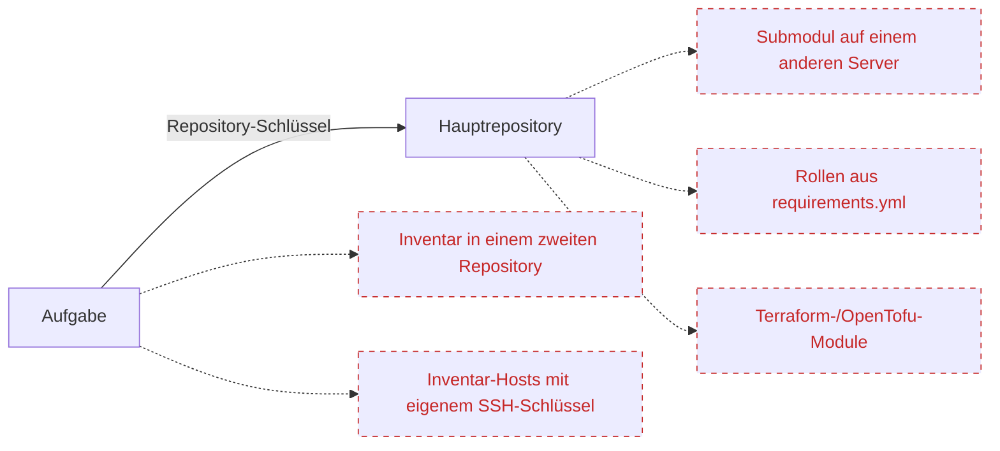
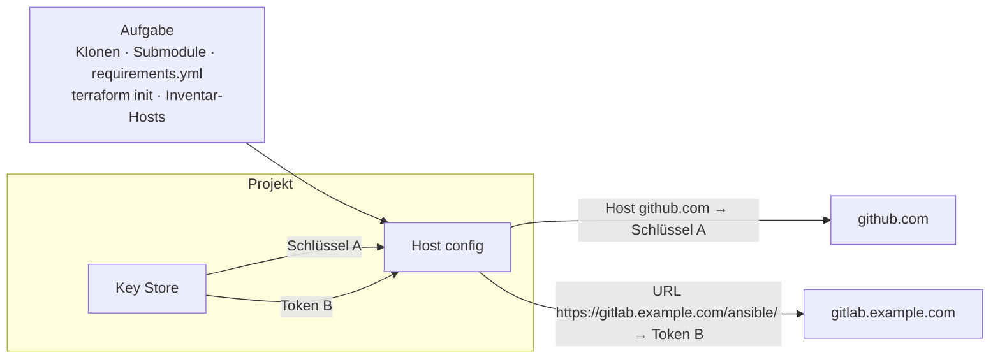

# Host config

## Warum Sie es brauchen {#why}

Ein [Repository](/user-guide/repositories) hat genau einen Schlüssel: den, mit dem Semaphore es klont. Das reicht aus, solange alles, was die Aufgabe benötigt, in diesem Repository liegt. In der Praxis greift eine Aufgabe auf weitere Orte zu, und jeder davon kann eigene Zugangsdaten verlangen:



Die gestrichelten Pfeile sind die Lücke: Der Repository-Schlüssel wird diesen Servern nicht angeboten, daher schlägt die Aufgabe mit **Permission denied** oder **Authentication failed** fehl, sobald sie einen davon berührt. Bisher gab es nur zwei Auswege: einem einzigen Schlüssel überall Zugriff zu gewähren oder Zugangsdaten in die Dateien des Repositories einzubauen.

**Host config** (Host-Konfiguration) löst das, ohne das Repository anzurühren. Sie sagen Semaphore *„Immer wenn das Projekt eine Verbindung zu diesem Host oder dieser URL aufbaut, verwende diesen Zugangsschlüssel aus dem [Key Store](/user-guide/key-store)“*. Die Zuordnung gilt für jede Git- und SSH-Verbindung der Aufgabe, ganz gleich, von wo sie gestartet wird.

| Sie haben | Was im Repository steht | Ohne Zuordnung | Mit Zuordnung |
|---|---|---|---|
| Ein **privates Submodul** auf einem anderen Git-Server | `.gitmodules` verweist auf `git@gitlab.example.com:infra/common.git` | `git submodule update` wird abgewiesen: Der Deploy-Key des Hauptrepositories ist dort nicht bekannt | Eine **Host**-Zuordnung für `gitlab.example.com` mit dem Schlüssel, der auf diesem Server zugelassen ist |
| **Private Rollen oder Collections** in Ansible-`requirements.yml` | `src: https://gitlab.example.com/ansible/role-nginx.git` | `ansible-galaxy install` verlangt eine Anmeldung und schlägt fehl | Eine **URL**-Zuordnung für `https://gitlab.example.com/ansible/` mit einem GitLab-Access-Token |
| **Private Terraform-/OpenTofu-Module**, die aus Git geladen werden | `source = "git::https://github.com/acme/tf-modules.git"` | `terraform init` kann das Modul nicht herunterladen | Eine **URL**-Zuordnung für `https://github.com/acme/` mit einem SSH-Schlüssel oder einem Token |
| Ein **Inventar**, dessen Hosts einen **anderen SSH-Schlüssel** als das Repository benötigen | Ein Inventar mit `db-01.internal`, `db-02.internal` | Das Inventar kann nur einen Schlüssel benennen, und der Repository-Schlüssel ist für diese Hosts der falsche | Eine **Host**-Zuordnung je Hostname oder eine einzige Zuordnung mit dem Inventarschlüssel für den Host, den sie gemeinsam haben |

Eine Zuordnung deckt all das auf einmal ab; Sie konfigurieren sie nicht pro Vorlage. Hat ein Projekt keine Zuordnungen, ändert sich nichts: Aufgaben verwenden weiterhin den Schlüssel des Repositories, genau wie zuvor.

## So funktioniert es {#how-it-works}

Eine Zuordnung ist eine Regel aus drei Teilen: **worauf** sie passt (ein Hostname oder ein URL-Präfix), **welchen** Zugangsschlüssel des Key Store sie verwendet, und sonst nichts. Semaphore richtet die Zuordnungen des Projekts vor dem ersten Git-Befehl einer Aufgabe ein und entfernt sie, wenn die Aufgabe endet. Jede Verbindung, die die Aufgabe öffnet, vom eigenen Klonen bis hin zu einem `git`-Modul innerhalb eines Playbooks, läuft über sie.



Die Seite befindet sich im Projektmenü unterhalb von **Repositories**. Zum Hinzufügen, Bearbeiten und Löschen von Zuordnungen ist die Berechtigung zum Verwalten von Projektressourcen erforderlich, dieselbe, die auch der Key Store benötigt.


## Zuordnungstypen {#mapping-types}

Klicken Sie auf **Add mapping** (Zuordnung hinzufügen) und wählen Sie aus, worauf die Zuordnung passen soll.

### Host {#host}

Eine Zuordnung vom Typ **Host** passt auf einen SSH-Hostnamen, zum Beispiel `github.com` oder `gitlab.example.com`, und benötigt einen **SSH**-Schlüssel. Immer wenn die Aufgabe eine SSH-Verbindung zu diesem Host öffnet, authentifiziert sie sich mit dem zugeordneten Schlüssel: bei einem über SSH geklonten Repository oder Submodul, bei einer `git@host:group/repo.git`-URL in `requirements.yml` und auch bei den Hosts eines Ansible-Inventars mit diesem Namen. Wenn der Schlüssel einen Login hat, wird dieser als SSH-Benutzer für den Host verwendet.

<div style={{maxWidth: 720}}>


</div>

### URL {#url}

Eine Zuordnung vom Typ **URL** passt auf eine `https://`- oder `http://`-Repository-URL. Sie kann ein einzelnes Repository benennen, `https://gitlab.example.com/infra/network.git`, oder mit `/` enden, um alle Repositories einer Gruppe abzudecken, `https://gitlab.example.com/ansible/`. Passen mehrere Zuordnungen, gewinnt die spezifischste URL; eine Zuordnung für ein einzelnes Repository überschreibt also die Zuordnung der Gruppe, die es enthält.

Der Zugangsschlüssel entscheidet, wie die URL erreicht wird:

| Zugangsschlüssel | Was passiert |
|---|---|
| **SSH**-Schlüssel | Die URL wird in ihre SSH-Form umgeschrieben und die Verbindung authentifiziert sich mit dem Schlüssel. Der Login des Schlüssels ist der SSH-Benutzer, `git`, wenn der Schlüssel keinen hat. |
| **Anmeldung mit Passwort** | Login und Passwort werden der URL hinzugefügt und über HTTPS gesendet. Lassen Sie den Login leer, um ein Personal Access Token zu verwenden. Nur eine `https://`-URL akzeptiert diesen Zugangsschlüssel, damit das Secret niemals im Klartext übertragen wird. |

Die URL darf keine eigenen Zugangsdaten, Leerzeichen, Anführungszeichen oder ein `=`-Zeichen enthalten.

<div style={{maxWidth: 720}}>


</div>

## Wo Zuordnungen gelten {#where-mappings-apply}

Die Zuordnungen eines Projekts werden vor dem ersten Git-Befehl einer Aufgabe eingerichtet und bleiben bis zu deren Ende wirksam. Sie gelten für:

- das Klonen und Aktualisieren des Repositories der Vorlage, einschließlich seiner Submodule;
- Rollen und Collections, die aus `requirements.yml` installiert werden, siehe [Galaxy-Anforderungen](/user-guide/apps/ansible#galaxy-requirements);
- Module, die `terraform init` oder `tofu init` herunterladen;
- Git-Befehle, die vom Playbook oder Skript selbst gestartet werden, zum Beispiel das Ansible-Modul `git`;
- das Repository eines in Git gespeicherten Inventars;
- die Hosts des Inventars, wenn eine **Host**-Zuordnung auf ihren Namen passt;
- das Durchsuchen von Branches und Playbooks eines Repositories im Vorlagenformular sowie das Polling von Zeitplänen, die bei einem neuen Commit starten.

Aufgaben, die an einen [entfernten Runner](/admin-guide/runners) gesendet werden, erhalten die Zuordnungen zusammen mit der Aufgabe und verhalten sich dort daher genauso.

Eine Zuordnung überschreibt den Eintrag für denselben Host in der serverweiten SSH-Konfiguration (`ssh.config_path` in der [Konfiguration](/reference/configuration)); alle anderen Einträge dieser Datei funktionieren weiterhin. Zuordnungen benötigen den Git-Client der Befehlszeile, also den Standard `git_client: cmd_git`; mit dem eingebauten Client `go_git` schlägt eine Aufgabe eines Projekts mit Zuordnungen mit einer erklärenden Fehlermeldung fehl, statt die falschen Zugangsdaten zu verwenden.

## Zugangsdaten {#credentials}

Private Schlüssel gelangen nie auf die Festplatte: Jede SSH-Zuordnung hält ihren Schlüssel in einem SSH-Agenten, der so lange lebt wie die Aufgabe, und die erzeugte SSH-Konfiguration verweist nur auf den Agenten. Eine Anmeldung mit Passwort wird Git über dessen Konfigurationsumgebung übergeben, nicht auf der Befehlszeile, und Git meldet im Aufgabenprotokoll die ursprüngliche URL, sodass das Secret an keiner der beiden Stellen erscheint.

Ein Schlüssel, auf den eine Zuordnung verweist, kann nicht gelöscht werden; der Bestätigungsdialog listet die Zuordnungen auf, die ihn verwenden. Auch das Ändern des Typs eines solchen Schlüssels in einen, den die Zuordnung nicht verwenden kann, zum Beispiel das Umwandeln des SSH-Schlüssels einer Host-Zuordnung in eine Anmeldung mit Passwort, wird abgelehnt.

## Beispiel {#example}

Ein Playbook liegt auf GitHub, verwendet ein Submodul aus einem selbst gehosteten GitLab und installiert über `requirements.yml` eine Rolle aus einer zweiten GitLab-Gruppe:

```yaml
# requirements.yml
- src: https://gitlab.example.com/ansible/role-nginx.git
  version: v2.1.0
```

Drei Zuordnungen lassen die Aufgabe ohne jede Änderung am Repository laufen:

| Typ | Host oder URL | Zugangsschlüssel |
|---|---|---|
| Host | `github.com` | Der Deploy-Key des GitHub-Repositories |
| URL | `https://gitlab.example.com/ansible/` | Ein GitLab-Access-Token als Anmeldung mit Passwort |
| URL | `https://gitlab.example.com/infra/network.git` | Der SSH-Schlüssel, der nur für dieses eine Repository zugelassen ist |

## Sicherungen {#backups}

Zuordnungen sind Teil der [Projektsicherung](./projects/settings#danger-zone). Sie verweisen über den Namen auf ihren Zugangsschlüssel, sodass ein wiederhergestelltes Projekt sie an die wiederhergestellten Schlüssel gebunden behält. Wie bei jedem Schlüssel wird der geheime Wert selbst nicht exportiert.
