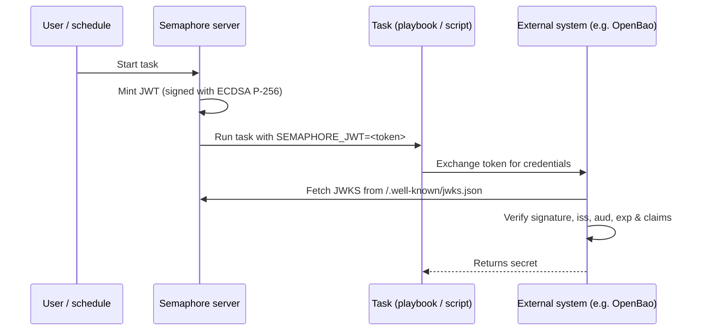

# Emisión de JWT para tareas

Semaphore puede emitir un [JSON Web Token (JWT)](https://datatracker.ietf.org/doc/html/rfc7519)
de corta duración para cada ejecución de tarea. El token está firmado por Semaphore y se expone al
playbook (o al script de shell/Terraform/PowerShell/Python) como la
variable de entorno `SEMAPHORE_JWT`.

Junto con el [endpoint JWKS](#jwks-endpoint) que publica Semaphore, el
token permite a los sistemas externos autenticar una tarea sin ningún secreto precompartido.

Esta página describe la **configuración del lado del servidor**. Para la configuración
por plantilla y el uso dentro de una tarea, consulte la
[página de la guía del usuario sobre JWT de tareas](/user-guide/task-templates/jwt).

______________________________________________________________________

## Cómo funciona {#how-it-works}



La firma usa un par de claves **ECDSA P-256**. La clave privada se genera en el primer
uso, se cifra con la misma clave `access_key_encryption` que protege los demás
secretos y se almacena en la base de datos de Semaphore. La clave pública se sirve a través del
endpoint JWKS.

______________________________________________________________________

## Configuración {#configuration}

La emisión de JWT está **desactivada de forma predeterminada**. Actívela en su `config.json`:

```json
{
    "jwt": {
        "enabled": true,
        "issuer": "https://semaphore.example.com",
        "default_ttl": "1h",
        "max_ttl": "24h"
    }
}
```

| Opción | Valor predeterminado | Descripción |
| ----------------- | ------- | --------------------------------------------------------------------------------------------------------------------------------------- |
| `jwt.enabled` | `false` | Cuando es `false`, no se emiten tokens y el endpoint JWKS devuelve `404`. |
| `jwt.issuer` | _ninguno_ | Valor emitido en el claim `iss`. Establézcalo en una URL estable que identifique su instancia de Semaphore; los sistemas externos lo usan como ancla de confianza. |
| `jwt.default_ttl` | `1h` | Duración del token usada cuando una plantilla no la sobrescribe. Acepta duraciones al estilo de Go (`30m`, `1h`, `90m`, ...). |
| `jwt.max_ttl` | `24h` | Duración máxima que puede tener un token. Las plantillas no pueden sobrescribir el TTL con un valor superior a este. |

:::tip
La clave de firma se cifra en reposo con la clave
[`access_key_encryption`](/admin-guide/configuration/config-file). Asegúrese
de que esta opción esté configurada **antes** de habilitar los JWT. La clave se
genera en el primer arranque y no puede volver a cifrarse después.
:::

______________________________________________________________________

## Endpoint JWKS {#jwks-endpoint}

Cuando la emisión de JWT está habilitada, Semaphore expone su clave pública de firma en:

```
GET /.well-known/jwks.json
```

La respuesta sigue la [RFC 7517](https://datatracker.ietf.org/doc/html/rfc7517)
y puede ser consumida directamente por el verificador de JWT:

```bash
curl https://semaphore.example.com/.well-known/jwks.json
```

```json
{
  "keys": [
    {
      "kty": "EC",
      "crv": "P-256",
      "kid": "...",
      "use": "sig",
      "alg": "ES256",
      "x": "...",
      "y": "..."
    }
  ]
}
```

______________________________________________________________________

## Rotación de claves {#key-rotation}

La clave de firma se crea automáticamente al iniciar Semaphore con la funcionalidad JWT habilitada.
Para rotarla, elimine la fila `jwt_signing_key` de la
tabla `option` y reinicie Semaphore.
Se creará automáticamente un nuevo par de claves.

Dado que la rotación invalida todos los tokens emitidos anteriormente, hágalo solo cuando
ya no haya ningún token existente en uso (p. ej., sin tareas en ejecución activas)
