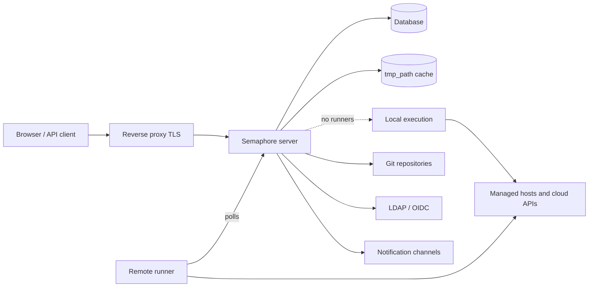

# Arquitectura

Una instalación de Semaphore tiene tres partes obligatorias: un **proceso servidor**, una
**base de datos** y un **lugar donde se ejecutan las tareas**. Todo lo demás — runners, Redis,
un proxy inverso, un proveedor de identidad — es opcional y se añade cuando aparece una
necesidad concreta.

## Las partes {#the-parts}

### Servidor {#server}

Un único binario de Go. Incorpora la interfaz web compilada, de modo que un solo proceso
sirve la interfaz, la API REST y un endpoint WebSocket en `/api/ws` que transmite la salida
de las tareas a los navegadores abiertos. Escucha en el puerto `3000` de forma predeterminada.

Dentro de ese proceso funcionan varias cosas a la vez:

| Parte | Responsabilidad |
|---|---|
| API HTTP e interfaz | Todo lo que llaman el navegador y los clientes de la API. |
| Pool de tareas | La cola de tareas, sus límites de concurrencia y su estado. |
| Planificador | Inicia plantillas según sus [horarios cron](/user-guide/schedules). |
| Ejecutor local | Ejecuta tareas en el propio servidor cuando ningún runner remoto se encarga de ellas. |
| Notificador | Envía [alertas](/admin-guide/notifications) cuando terminan las tareas. |

### Base de datos {#database}

SQLite, MySQL o PostgreSQL, elegida con la opción `dialect`. Contiene proyectos, plantillas,
inventarios, horarios, usuarios, roles, historial de tareas y el contenido cifrado del
almacén de claves. Es lo único que hay que respaldar: todo lo demás se puede reconstruir.

SQLite es la opción predeterminada y encaja con un único servidor. Usa PostgreSQL o MySQL
cuando varias personas dependan del servicio, y siempre que ejecutes más de un nodo.

### Caché de archivos {#file-cache}

El directorio indicado en `tmp_path` (`/tmp/semaphore` de forma predeterminada) contiene los
repositorios clonados y el directorio de trabajo de cada ejecución. Es una caché, no
almacenamiento: eliminarlo cuesta un clonado adicional por proyecto. **Limpiar caché**, en la
configuración del proyecto, hace exactamente eso.

La máquina que ejecuta una tarea es la que mantiene esta caché — el servidor cuando las
tareas se ejecutan localmente, y cada runner cuando no.

## Dónde se ejecutan las tareas {#where-tasks-execute}

De forma predeterminada, el servidor ejecuta las tareas él mismo, en su propio sistema de
archivos y con su propio acceso de red. Esa es la configuración más sencilla y la adecuada
para un equipo pequeño que gestiona hosts a los que el servidor ya llega.

Añadir [runners](/admin-guide/runners) separa ambas cosas. Un runner es el mismo binario
iniciado con `semaphore runner start`. No mantiene conexión con la base de datos ni abre
ningún puerto entrante: consulta al servidor por HTTPS con un token bearer, recibe un trabajo,
clona el repositorio, ejecuta la herramienta y devuelve la salida en streaming. Los runners
te permiten

- situar la ejecución dentro de una red a la que el servidor no puede llegar,
- mantener las credenciales de producción en una máquina que no sirve una interfaz web,
- repartir la carga entre varias máquinas y
- (en Pro) dirigir una tarea a un runner concreto mediante [etiquetas](/admin-guide/runners#runner-tags-pro).

Cada runner decide cómo lanza un trabajo con su `executor.type`:

| Ejecutor | El trabajo se ejecuta |
|---|---|
| `local` | Como un proceso en el host del runner, en `tmp_path`. |
| `docker` | En un contenedor que el runner arranca para ese trabajo y luego elimina. |
| `k8s` | En un Pod que el runner crea en tu clúster y luego elimina. |

### Puertos y direcciones {#ports-and-directions}

Todas las conexiones son salientes desde el componente que las inicia, que es lo que hace
que los runners se puedan usar a través de fronteras de red.

| Desde | Hacia | Propósito |
|---|---|---|
| Navegador, cliente de API | Servidor `:3000` | Interfaz, API REST, WebSocket. |
| Servidor | Base de datos | Todo el estado persistente. |
| Servidor, runner | Remotos Git | Clonado de repositorios. |
| Servidor, runner | Hosts gestionados, APIs de nube | La automatización propiamente dicha. |
| Runner | Servidor `:3000` | Consulta de trabajos, salida en streaming. |
| Servidor | LDAP, OIDC, SMTP, webhooks de chat | Inicio de sesión y notificaciones. |

## Escalado horizontal {#scaling-out}

Dos ejes escalan de forma independiente.

**Más ejecución** significa más runners. El servidor sigue siendo un único proceso y las
tareas se reparten entre los runners que estén conectados.

**Más disponibilidad** significa más servidores. Varios nodos funcionan contra una única base
de datos PostgreSQL o MySQL, con Redis para los bloqueos distribuidos, el estado compartido de
la cola y pub/sub, detrás de un balanceador de carga compatible con WebSocket. Esto es
[alta disponibilidad](/admin-guide/ha), una función Enterprise. SQLite no se puede usar
para ello.

## Qué sigue {#whats-next}

- [Conceptos básicos](/introduction/concepts) — el vocabulario que usa la interfaz.
- [Modelo de seguridad](/introduction/security-model) — fronteras de confianza y qué se cifra.
- [Instalación](/admin-guide/installation) — elige un método y arranca un servidor.
