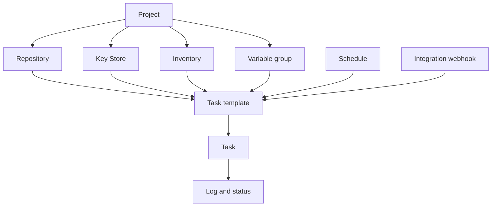

# Conceptos básicos

Semaphore tiene una idea central: una **plantilla de tarea** reúne todo lo que necesita
una ejecución, y al ejecutarla se produce una **tarea**. Aprender dónde se configura cada
pieza de ese "todo" es casi todo lo que hay que aprender del producto.

## El modelo de objetos {#the-object-model}

### Los proyectos lo contienen todo {#projects-hold-everything}

Un [proyecto](/user-guide/projects) es la unidad de aislamiento. Los repositorios, las claves,
los inventarios, los grupos de variables, las plantillas y el historial de tareas pertenecen
a un único proyecto, igual que la pertenencia al equipo. Dos proyectos no comparten nada
salvo el servidor y sus usuarios, que es lo que hace del proyecto la frontera adecuada entre
equipos, entornos o clientes.

### Los recursos describen las entradas {#resources-describe-the-inputs}

Existen cuatro tipos de recurso para que el mismo valor pueda reutilizarse en muchas
plantillas y cambiarse en un solo sitio:

- Un [repositorio](/user-guide/repositories) es donde vive el playbook o el script.
- El [almacén de claves](/user-guide/key-store) contiene las claves SSH, los inicios de sesión
  y los tokens que se usan para llegar al repositorio y a los hosts de destino.
- Un [inventario](/user-guide/inventory) enumera los hosts a los que se dirige una ejecución
  y cómo conectarse a ellos.
- Un [grupo de variables](/user-guide/environment) lleva variables y secretos al entorno de
  la ejecución.

### Las plantillas definen la ejecución {#templates-define-the-run}

Una [plantilla de tarea](/user-guide/task-templates) selecciona una aplicación (Ansible,
Terraform, un script), un repositorio, el playbook o punto de entrada dentro de él, y el
inventario, el grupo de variables y las claves que debe usar. También decide qué puede
cambiar la persona que inicia la tarea: las
[variables de encuesta](/user-guide/task-templates/survey-vars) convierten una plantilla en
un formulario, y las [peticiones](/user-guide/task-templates/prompts) permiten al usuario
sobrescribir la rama, el inventario o los argumentos adicionales.

### Las tareas son las ejecuciones {#tasks-are-the-runs}

Iniciar una plantilla crea una [tarea](/user-guide/tasks). La tarea tiene su propio registro,
estado, duración y el nombre de quien la inició, y ese registro permanece después de que
termine la ejecución. Las tareas se inician desde la interfaz, desde un
[horario](/user-guide/schedules), desde un
[webhook de integración](/user-guide/integrations), desde la
[API](/reference/api) o desde otra plantilla dentro de un
[flujo de trabajo](/user-guide/workflows).

## Glosario {#glossary}

| Término | Significado |
|---|---|
| **Clave de acceso** | Una entrada del almacén de claves: una clave SSH, un inicio de sesión con contraseña o un token. Su parte secreta se cifra en la base de datos. |
| **Alerta** | Una notificación enviada cuando una tarea alcanza un estado determinado. Los canales se configuran en el servidor y luego se activan por proyecto y por plantilla. |
| **App** | La herramienta que ejecuta una plantilla: Ansible, Terraform, OpenTofu, Terragrunt, Bash, PowerShell o Python. |
| **Plantilla de compilación** | Un tipo de plantilla que produce un artefacto versionado; cada ejecución incrementa la versión. |
| **Plantilla de despliegue** | Un tipo de plantilla vinculada a una plantilla de compilación; al iniciarla se pregunta qué versión de compilación se va a desplegar. |
| **Ejecutor** | Cómo lanza un trabajo un runner: como proceso local, en un contenedor Docker o en un Pod de Kubernetes. |
| **Integración** | Un webhook entrante que inicia una plantilla cuando lo llama un sistema externo. |
| **Inventario** | Los hosts a los que se dirige una tarea, como texto estático, un archivo del repositorio o un script de inventario dinámico. |
| **Almacén de claves** | El conjunto de claves de acceso de cada proyecto. |
| **Proyecto** | El contenedor de nivel superior: recursos, plantillas, historial de tareas y pertenencia al equipo. |
| **Rol** | Lo que un miembro puede hacer dentro de un proyecto. Los roles integrados son Owner, Manager, Task Runner y Guest. |
| **Runner** | Un proceso independiente que ejecuta tareas por cuenta del servidor en lugar de que sea el servidor quien las ejecute. |
| **Horario** | Una expresión cron que inicia una plantilla sin intervención de una persona. |
| **Almacenamiento de secretos** | Un sistema externo, como HashiCorp Vault, que guarda los valores secretos en lugar de la base de datos de Semaphore. |
| **Variable de encuesta** | Un campo que define la plantilla y que el usuario rellena al iniciar una tarea; se convierte en una variable de la ejecución. |
| **Tarea** | Una ejecución de una plantilla, con su registro, estado y autor. |
| **Plantilla de tarea** | La definición reutilizable de qué ejecutar y con qué. A menudo, simplemente "plantilla". |
| **Grupo de variables** | Un conjunto con nombre de variables y secretos que se pasa a la ejecución. Se llamaba *Environment* en versiones anteriores y en la API. |
| **Vista** | Una pestaña que agrupa un subconjunto de las plantillas de un proyecto en la lista de plantillas. |
| **Flujo de trabajo** | Un grafo de plantillas ejecutadas en secuencia con bifurcaciones, aprobaciones y esperas. Una función Pro. |

## Qué sigue {#whats-next}

- [Primeros pasos](/getting-started) — pon los conceptos en práctica, en orden.
- [Guía de usuario](/user-guide) — una página por concepto, con todos los campos.
- [Arquitectura](/introduction/architecture) — cómo encajan el servidor, la base de datos y los runners.
