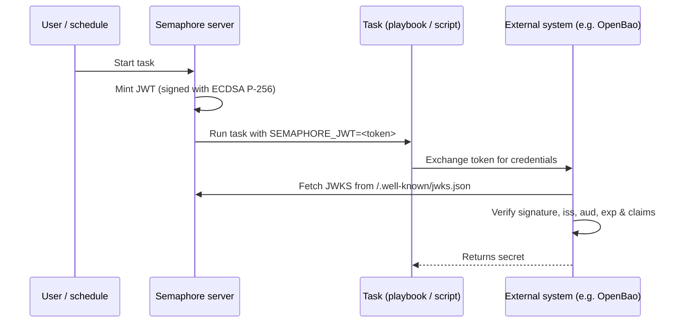

# Émission de JWT pour les tâches

Semaphore peut émettre un [JSON Web Token (JWT)](https://datatracker.ietf.org/doc/html/rfc7519)
de courte durée pour chaque exécution de tâche. Le token est signé par Semaphore et exposé au
playbook (ou au script shell/Terraform/PowerShell/Python) via la variable d'environnement
`SEMAPHORE_JWT`.

Associé au [point de terminaison JWKS](#jwks-endpoint) publié par Semaphore, le
token permet à des systèmes externes d'authentifier une tâche sans aucun secret pré-partagé.

Cette page décrit la **configuration côté serveur**. Pour la configuration par
modèle et l'utilisation à l'intérieur d'une tâche, consultez la
[page du guide utilisateur sur les JWT de tâches](/user-guide/task-templates/jwt).

______________________________________________________________________

## Fonctionnement {#how-it-works}



La signature utilise une paire de clés **ECDSA P-256**. La clé privée est générée à la première
utilisation, chiffrée avec la même clé `access_key_encryption` qui protège les autres
secrets, et stockée dans la base de données de Semaphore. La clé publique est servie via
le point de terminaison JWKS.

______________________________________________________________________

## Configuration {#configuration}

L'émission de JWT est **désactivée par défaut**. Activez-la dans votre `config.json` :

```json
{
    "jwt": {
        "enabled": true,
        "issuer": "https://semaphore.example.com",
        "default_ttl": "1h",
        "max_ttl": "24h"
    }
}
```

| Option | Par défaut | Description |
| ----------------- | ------- | --------------------------------------------------------------------------------------------------------------------------------------- |
| `jwt.enabled` | `false` | Lorsque la valeur est `false`, aucun token n'est émis et le point de terminaison JWKS renvoie `404`. |
| `jwt.issuer` | _aucun_ | Valeur émise dans le claim `iss`. Définissez-la sur une URL stable identifiant votre instance Semaphore : les systèmes externes l'utilisent comme ancre de confiance. |
| `jwt.default_ttl` | `1h` | Durée de vie du token utilisée lorsqu'un modèle ne la remplace pas. Accepte les durées au format Go (`30m`, `1h`, `90m`, ...). |
| `jwt.max_ttl` | `24h` | Durée de vie maximale d'un token. Les modèles ne peuvent pas définir un TTL supérieur à cette valeur. |

:::tip
La clé de signature est chiffrée au repos avec la clé
[`access_key_encryption`](/admin-guide/configuration/config-file). Assurez-vous
que cette option est configurée **avant** d'activer les JWT. La clé est
générée au premier démarrage et ne peut pas être rechiffrée par la suite.
:::

______________________________________________________________________

## Point de terminaison JWKS {#jwks-endpoint}

Lorsque l'émission de JWT est activée, Semaphore expose sa clé publique de signature à l'adresse :

```
GET /.well-known/jwks.json
```

La réponse est conforme à la [RFC 7517](https://datatracker.ietf.org/doc/html/rfc7517)
et peut être consommée directement par le vérificateur de JWT :

```bash
curl https://semaphore.example.com/.well-known/jwks.json
```

```json
{
  "keys": [
    {
      "kty": "EC",
      "crv": "P-256",
      "kid": "...",
      "use": "sig",
      "alg": "ES256",
      "x": "...",
      "y": "..."
    }
  ]
}
```

______________________________________________________________________

## Rotation de la clé {#key-rotation}

La clé de signature est créée automatiquement au démarrage de Semaphore lorsque la fonctionnalité JWT est activée.
Pour la faire tourner, supprimez la ligne `jwt_signing_key` de la
table `option` et redémarrez Semaphore.
Une nouvelle paire de clés sera créée automatiquement.

Comme la rotation invalide tous les tokens émis précédemment, ne le faites que lorsque
plus aucun token existant n'est utilisé (par exemple aucune tâche en cours d'exécution)
