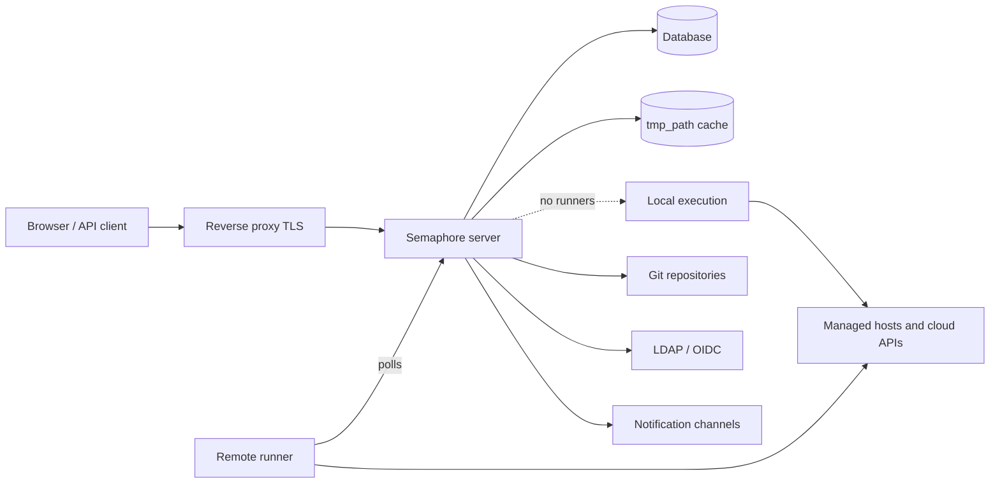

# Architecture

Un déploiement Semaphore comporte trois éléments obligatoires : un **processus serveur**, une
**base de données**, et un **endroit où les tâches s'exécutent**. Tout le reste — runners, Redis,
un reverse proxy, un fournisseur d'identité — est facultatif et s'ajoute lorsqu'un besoin précis
apparaît.

## Les éléments {#the-parts}

### Serveur {#server}

Un unique binaire Go. Il embarque l'interface web compilée : un seul processus sert donc
l'interface, l'API REST et un point de terminaison WebSocket sur `/api/ws` qui diffuse la sortie des
tâches vers les navigateurs ouverts. Il écoute sur le port `3000` par défaut.

Plusieurs composants fonctionnent simultanément dans ce processus :

| Composant | Responsabilité |
|---|---|
| API HTTP et interface | Tout ce que le navigateur et les clients API appellent. |
| Pool de tâches | La file des tâches, leurs limites de concurrence et leur état. |
| Planificateur | Démarre les modèles selon leurs [plannings cron](/user-guide/schedules). |
| Exécuteur local | Exécute les tâches sur le serveur lui-même lorsqu'aucun runner distant ne s'en charge. |
| Notificateur | Envoie les [alertes](/admin-guide/notifications) à la fin des tâches. |

### Base de données {#database}

SQLite, MySQL ou PostgreSQL, au choix via l'option `dialect`. Elle contient les projets,
les modèles, les inventaires, les plannings, les utilisateurs, les rôles, l'historique des tâches et
le contenu chiffré du magasin de clés. C'est la seule chose qui doit être sauvegardée : tout le
reste peut être reconstruit.

SQLite est la valeur par défaut et convient à un serveur unique. Utilisez PostgreSQL ou MySQL dès que
plusieurs personnes dépendent du service, et systématiquement lorsque vous exploitez plus d'un nœud.

### Cache de fichiers {#file-cache}

Le répertoire indiqué par `tmp_path` (`/tmp/semaphore` par défaut) contient les dépôts clonés
et le répertoire de travail de chaque exécution. C'est un cache, pas un stockage : le supprimer coûte
un clonage supplémentaire par projet. **Effacer le cache**, dans les paramètres du projet, fait exactement cela.

La machine qui exécute une tâche conserve ce cache — le serveur lorsque les tâches s'exécutent
localement, chaque runner dans le cas contraire.

## Où les tâches s'exécutent {#where-tasks-execute}

Par défaut, le serveur exécute lui-même les tâches, dans son propre système de fichiers et avec son
propre accès réseau. C'est la configuration la plus simple, et la bonne pour une petite équipe qui
administre des hôtes que le serveur peut déjà atteindre.

Ajouter des [runners](/admin-guide/runners) sépare les deux. Un runner est le même binaire
démarré avec `semaphore runner start`. Il ne détient aucune connexion à la base de données et n'ouvre
aucun port entrant : il interroge le serveur en HTTPS avec un jeton bearer, reçoit un travail,
clone le dépôt, exécute l'outil et renvoie la sortie en flux. Les runners vous permettent de

- placer l'exécution dans un réseau que le serveur ne peut pas atteindre,
- conserver les identifiants de production sur une machine qui n'expose pas d'interface web,
- répartir la charge sur plusieurs machines, et
- (avec Pro) router une tâche vers un runner précis à l'aide de [tags](/admin-guide/runners#runner-tags-pro).

Chaque runner choisit son mode de lancement des travaux via son `executor.type` :

| Exécuteur | Le travail s'exécute |
|---|---|
| `local` | Comme un processus sur l'hôte du runner, dans `tmp_path`. |
| `docker` | Dans un conteneur que le runner démarre pour ce travail, puis supprime. |
| `k8s` | Dans un Pod que le runner crée dans votre cluster, puis supprime. |

### Ports et sens des connexions {#ports-and-directions}

Chaque connexion est sortante depuis le composant qui l'initie, ce qui rend les
runners utilisables au-delà des frontières réseau.

| De | Vers | Objectif |
|---|---|---|
| Navigateur, client API | Serveur `:3000` | Interface, API REST, WebSocket. |
| Serveur | Base de données | Tout l'état persistant. |
| Serveur, runner | Dépôts Git distants | Clonage des dépôts. |
| Serveur, runner | Hôtes administrés, API cloud | L'automatisation proprement dite. |
| Runner | Serveur `:3000` | Interrogation pour des travaux, envoi de la sortie. |
| Serveur | LDAP, OIDC, SMTP, webhooks de messagerie | Connexion et notifications. |

## Montée en charge {#scaling-out}

Deux axes évoluent indépendamment.

**Plus d'exécution** signifie plus de runners. Le serveur reste un processus unique, et
les tâches sont réparties entre les runners connectés.

**Plus de disponibilité** signifie plus de serveurs. Plusieurs nœuds fonctionnent avec une seule base
PostgreSQL ou MySQL, avec Redis pour les verrous distribués, l'état partagé de la file et le pub/sub,
derrière un répartiteur de charge compatible WebSocket. C'est la
[haute disponibilité](/admin-guide/ha), une fonctionnalité Enterprise. SQLite ne peut pas être
utilisé dans ce cas.

## Et ensuite {#whats-next}

- [Concepts clés](/introduction/concepts) — le vocabulaire employé par l'interface.
- [Modèle de sécurité](/introduction/security-model) — frontières de confiance et éléments chiffrés.
- [Installation](/admin-guide/installation) — choisissez une méthode et démarrez un serveur.
