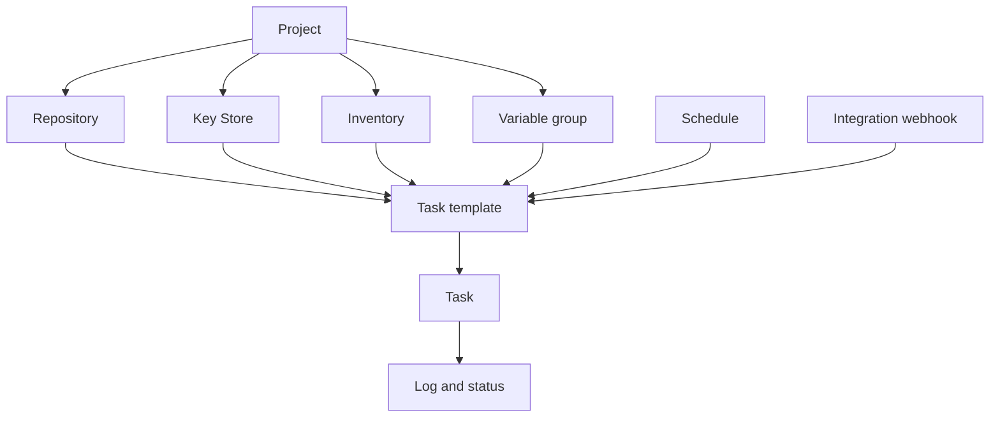

# Concepts clés

Semaphore repose sur une idée centrale : un **modèle de tâche** rassemble tout ce dont une exécution
a besoin, et l'exécuter produit une **tâche**. Apprendre où chaque partie de ce « tout »
se configure constitue l'essentiel de l'apprentissage du produit.

## Le modèle objet {#the-object-model}

### Les projets contiennent tout {#projects-hold-everything}

Un [projet](/user-guide/projects) est l'unité d'isolation. Dépôts, clés,
inventaires, groupes de variables, modèles et historique des tâches appartiennent à un seul
projet, tout comme les membres de l'équipe. Deux projets ne partagent rien, hormis le serveur
et ses utilisateurs, ce qui fait du projet la bonne frontière entre équipes,
environnements ou clients.

### Les ressources décrivent les entrées {#resources-describe-the-inputs}

Il existe quatre types de ressources, afin qu'une même valeur puisse être réutilisée par de nombreux
modèles et modifiée à un seul endroit :

- Un [dépôt](/user-guide/repositories) est l'endroit où vit le playbook ou le script.
- Le [magasin de clés](/user-guide/key-store) contient les clés SSH, les identifiants et les jetons
  utilisés pour accéder au dépôt et aux hôtes cibles.
- Un [inventaire](/user-guide/inventory) liste les hôtes visés par une exécution et la manière de
  s'y connecter.
- Un [groupe de variables](/user-guide/environment) transporte variables et secrets dans
  l'environnement de l'exécution.

### Les modèles définissent l'exécution {#templates-define-the-run}

Un [modèle de tâche](/user-guide/task-templates) sélectionne une application (Ansible,
Terraform, un script), un dépôt, le playbook ou point d'entrée qu'il contient, ainsi que
l'inventaire, le groupe de variables et les clés à utiliser. Il détermine aussi ce que la personne qui
démarre la tâche peut modifier : les [variables de questionnaire](/user-guide/task-templates/survey-vars) transforment
un modèle en formulaire, et les [invites](/user-guide/task-templates/prompts) permettent à un utilisateur
de remplacer la branche, l'inventaire ou les arguments supplémentaires.

### Les tâches sont les exécutions {#tasks-are-the-runs}

Démarrer un modèle crée une [tâche](/user-guide/tasks). La tâche possède son propre journal, son
statut, sa durée et le nom de la personne qui l'a lancée, et cet enregistrement subsiste après
la fin de l'exécution. Les tâches démarrent depuis l'interface, depuis un
[planning](/user-guide/schedules), depuis un
[webhook d'intégration](/user-guide/integrations), depuis l'
[API](/admin-guide/api), ou depuis un autre modèle dans un
[workflow](/user-guide/workflows).

## Glossaire {#glossary}

| Terme | Signification |
|---|---|
| **Clé d'accès** | Une entrée du magasin de clés : une clé SSH, un couple identifiant/mot de passe, ou un jeton. Sa partie secrète est chiffrée dans la base de données. |
| **Alerte** | Une notification envoyée lorsqu'une tâche atteint un certain état. Les canaux sont configurés sur le serveur, puis activés par projet et par modèle. |
| **App** | L'outil qu'exécute un modèle : Ansible, Terraform, OpenTofu, Terragrunt, Bash, PowerShell ou Python. |
| **Modèle de build** | Un type de modèle qui produit un artefact versionné ; chaque exécution incrémente la version. |
| **Modèle de déploiement** | Un type de modèle lié à un modèle de build ; le démarrer demande quelle version de build livrer. |
| **Exécuteur** | La manière dont un runner lance un travail : comme processus local, dans un conteneur Docker, ou dans un Pod Kubernetes. |
| **Intégration** | Un webhook entrant qui démarre un modèle lorsqu'un système externe l'appelle. |
| **Inventaire** | Les hôtes visés par une tâche, sous forme de texte statique, de fichier du dépôt, ou de script d'inventaire dynamique. |
| **Magasin de clés** | La collection de clés d'accès propre à un projet. |
| **Projet** | Le conteneur de premier niveau : ressources, modèles, historique des tâches et membres de l'équipe. |
| **Rôle** | Ce qu'un membre peut faire au sein d'un projet. Les rôles intégrés sont Owner, Manager, Task Runner et Guest. |
| **Runner** | Un processus distinct qui exécute les tâches à la place du serveur. |
| **Planning** | Une expression cron qui démarre un modèle sans intervention humaine. |
| **Stockage de secrets** | Un système externe tel que HashiCorp Vault qui conserve les valeurs secrètes à la place de la base de données Semaphore. |
| **Variable de questionnaire** | Un champ défini par le modèle et renseigné par l'utilisateur au démarrage d'une tâche ; il devient une variable de l'exécution. |
| **Tâche** | Une exécution d'un modèle, avec son journal, son statut et son auteur. |
| **Modèle de tâche** | La définition réutilisable de ce qu'il faut exécuter et avec quoi. Souvent simplement « modèle ». |
| **Groupe de variables** | Un ensemble nommé de variables et de secrets transmis à l'exécution. Appelé *Environment* dans les versions antérieures et dans l'API. |
| **Vue** | Un onglet qui regroupe un sous-ensemble des modèles d'un projet dans la liste des modèles. |
| **Workflow** | Un graphe de modèles exécutés en séquence avec branchements, approbations et délais. Une fonctionnalité Pro. |

## Et ensuite {#whats-next}

- [Premiers pas](/getting-started) — mettez les concepts en pratique dans l'ordre.
- [Guide de l'utilisateur](/user-guide) — une page par concept, avec tous les champs.
- [Architecture](/introduction/architecture) — comment le serveur, la base de données et les runners s'articulent.
