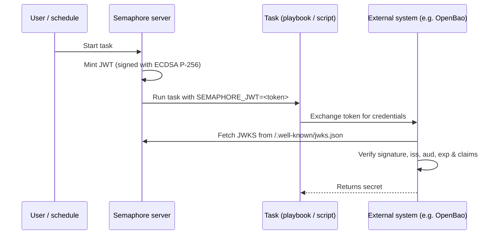

# Emissione di JWT per le attività

Semaphore può generare un [JSON Web Token (JWT)](https://datatracker.ietf.org/doc/html/rfc7519) di breve durata
per ogni esecuzione di un'attività. Il token è firmato da Semaphore ed esposto al
playbook (o allo script shell/Terraform/PowerShell/Python) tramite la
variabile d'ambiente `SEMAPHORE_JWT`.

Insieme all'[endpoint JWKS](#jwks-endpoint) pubblicato da Semaphore, il
token consente ai sistemi esterni di autenticare un'attività senza alcun segreto pre-condiviso.

Questa pagina descrive la **configurazione lato server**. Per la configurazione
per template e l'utilizzo all'interno di un'attività, vedere la
[pagina della guida utente sui JWT delle attività](/user-guide/task-templates/jwt).

______________________________________________________________________

## Come funziona {#how-it-works}



La firma utilizza una coppia di chiavi **ECDSA P-256**. La chiave privata viene generata al primo
utilizzo, cifrata con la stessa chiave `access_key_encryption` che protegge gli altri
segreti e memorizzata nel database di Semaphore. La chiave pubblica viene servita tramite
l'endpoint JWKS.

______________________________________________________________________

## Configurazione {#configuration}

L'emissione di JWT è **disabilitata per impostazione predefinita**. Abilitarla nel proprio `config.json`:

```json
{
    "jwt": {
        "enabled": true,
        "issuer": "https://semaphore.example.com",
        "default_ttl": "1h",
        "max_ttl": "24h"
    }
}
```

| Opzione | Predefinito | Descrizione |
| ----------------- | ------- | --------------------------------------------------------------------------------------------------------------------------------------- |
| `jwt.enabled` | `false` | Quando è `false`, non viene generato alcun token e l'endpoint JWKS restituisce `404`. |
| `jwt.issuer` | _nessuno_ | Valore emesso nel claim `iss`. Impostarlo a un URL stabile che identifichi la propria istanza di Semaphore: i sistemi esterni lo usano come trust anchor. |
| `jwt.default_ttl` | `1h` | Durata del token usata quando un template non la sovrascrive. Accetta durate in stile Go (`30m`, `1h`, `90m`, ...). |
| `jwt.max_ttl` | `24h` | Durata massima che un token può avere. I template non possono sovrascrivere il TTL con un valore superiore a questo. |

:::tip
La chiave di firma è cifrata a riposo con la chiave
[`access_key_encryption`](/admin-guide/configuration/config-file). Assicurarsi
che questa opzione sia configurata **prima** di abilitare i JWT. La chiave viene
generata al primo avvio e non può essere ricifrata in seguito.
:::

______________________________________________________________________

## Endpoint JWKS {#jwks-endpoint}

Quando l'emissione di JWT è abilitata, Semaphore espone la propria chiave pubblica di firma su:

```
GET /.well-known/jwks.json
```

La risposta segue la [RFC 7517](https://datatracker.ietf.org/doc/html/rfc7517)
e può essere utilizzata direttamente dal verificatore JWT:

```bash
curl https://semaphore.example.com/.well-known/jwks.json
```

```json
{
  "keys": [
    {
      "kty": "EC",
      "crv": "P-256",
      "kid": "...",
      "use": "sig",
      "alg": "ES256",
      "x": "...",
      "y": "..."
    }
  ]
}
```

______________________________________________________________________

## Rotazione della chiave {#key-rotation}

La chiave di firma viene creata automaticamente all'avvio di Semaphore con la funzionalità JWT abilitata.
Per ruotarla, rimuovere la riga `jwt_signing_key` dalla
tabella `option` e riavviare Semaphore.
Verrà creata automaticamente una nuova coppia di chiavi.

Poiché la rotazione invalida tutti i token emessi in precedenza, eseguirla solo quando
nessun token esistente è più in uso (ad esempio nessuna attività in esecuzione)
