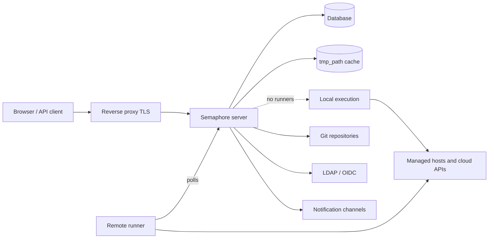

# Architettura

Un deployment di Semaphore ha tre parti obbligatorie: un **processo server**, un
**database** e un **luogo in cui i task vengono eseguiti**. Tutto il resto — runner, Redis,
un reverse proxy, un identity provider — è opzionale e si aggiunge quando emerge
un'esigenza specifica.

## Le parti {#the-parts}

### Server {#server}

Un singolo binario Go. Incorpora l'interfaccia web compilata, quindi un unico processo
serve la UI, l'API REST e un endpoint WebSocket su `/api/ws` che trasmette l'output dei
task ai browser aperti. Per impostazione predefinita è in ascolto sulla porta `3000`.

All'interno di quel processo convivono più componenti:

| Parte | Responsabilità |
|---|---|
| API HTTP e UI | Tutto ciò che il browser e i client API richiamano. |
| Task pool | La coda dei task, i loro limiti di concorrenza e il loro stato. |
| Scheduler | Avvia i template secondo le loro [pianificazioni cron](/user-guide/schedules). |
| Executor locale | Esegue i task sul server stesso quando nessun runner remoto se ne occupa. |
| Notificatore | Invia gli [avvisi](/admin-guide/notifications) al termine dei task. |

### Database {#database}

SQLite, MySQL o PostgreSQL, scelto con l'opzione `dialect`. Contiene progetti,
template, inventory, pianificazioni, utenti, ruoli, cronologia dei task e il contenuto
cifrato del Key Store. È l'unica cosa di cui devi fare il backup: tutto il resto può
essere ricostruito.

SQLite è la scelta predefinita ed è adatto a un singolo server. Usa PostgreSQL o MySQL
quando più persone dipendono dal servizio, e sempre quando esegui più di un nodo.

### Cache dei file {#file-cache}

La directory indicata da `tmp_path` (`/tmp/semaphore` per impostazione predefinita)
contiene i repository clonati e la directory di lavoro di ogni esecuzione. È una cache,
non un archivio: eliminarla costa un clone in più per progetto. **Clear cache** nelle
impostazioni del progetto fa esattamente questo.

La cache resta sulla macchina che esegue il task — il server quando i task girano
localmente, ciascun runner quando non è così.

## Dove vengono eseguiti i task {#where-tasks-execute}

Per impostazione predefinita è il server stesso a eseguire i task, nel proprio file
system e con il proprio accesso di rete. È la configurazione più semplice ed è quella
giusta per un piccolo team che gestisce host già raggiungibili dal server.

Aggiungere dei [runner](/admin-guide/runners) separa le due cose. Un runner è lo stesso
binario avviato con `semaphore runner start`. Non ha alcuna connessione al database e non
apre alcuna porta in ingresso: interroga il server via HTTPS con un bearer token, riceve
un job, clona il repository, esegue lo strumento e restituisce l'output in streaming. I
runner ti permettono di

- collocare l'esecuzione dentro una rete che il server non può raggiungere,
- tenere le credenziali di produzione su una macchina che non espone un'interfaccia web,
- distribuire il carico su più macchine e
- (in Pro) instradare un task verso un runner specifico con i [tag](/admin-guide/runners#runner-tags-pro).

Ogni runner sceglie come avviare un job tramite il proprio `executor.type`:

| Executor | Il job viene eseguito |
|---|---|
| `local` | Come processo sull'host del runner, in `tmp_path`. |
| `docker` | In un container che il runner avvia per quel job e poi rimuove. |
| `k8s` | In un Pod che il runner crea nel tuo cluster e poi rimuove. |

### Porte e direzioni {#ports-and-directions}

Ogni connessione è in uscita dal componente che la inizia, ed è questo che rende i
runner utilizzabili attraverso i confini di rete.

| Da | A | Scopo |
|---|---|---|
| Browser, client API | Server `:3000` | UI, API REST, WebSocket. |
| Server | Database | Tutto lo stato persistente. |
| Server, runner | Remote Git | Clonazione dei repository. |
| Server, runner | Host gestiti, API cloud | L'automazione vera e propria. |
| Runner | Server `:3000` | Polling dei job, streaming dell'output. |
| Server | LDAP, OIDC, SMTP, webhook di chat | Accesso e notifiche. |

## Scalare orizzontalmente {#scaling-out}

Due assi scalano in modo indipendente.

**Più capacità di esecuzione** significa più runner. Il server resta un singolo processo
e i task vengono distribuiti tra i runner connessi.

**Più disponibilità** significa più server. Più nodi lavorano su un unico database
PostgreSQL o MySQL con Redis per i lock distribuiti, lo stato condiviso della coda e il
pub/sub, dietro un load balancer che supporti i WebSocket. Questa è
l'[alta disponibilità](/admin-guide/ha), una funzionalità Enterprise. SQLite non può
essere usato in questo scenario.

## Prossimi passi {#whats-next}

- [Concetti fondamentali](/introduction/concepts) — il vocabolario usato dall'interfaccia.
- [Modello di sicurezza](/introduction/security-model) — i confini di fiducia e che cosa viene cifrato.
- [Installazione](/admin-guide/installation) — scegli un metodo e avvia un server.
