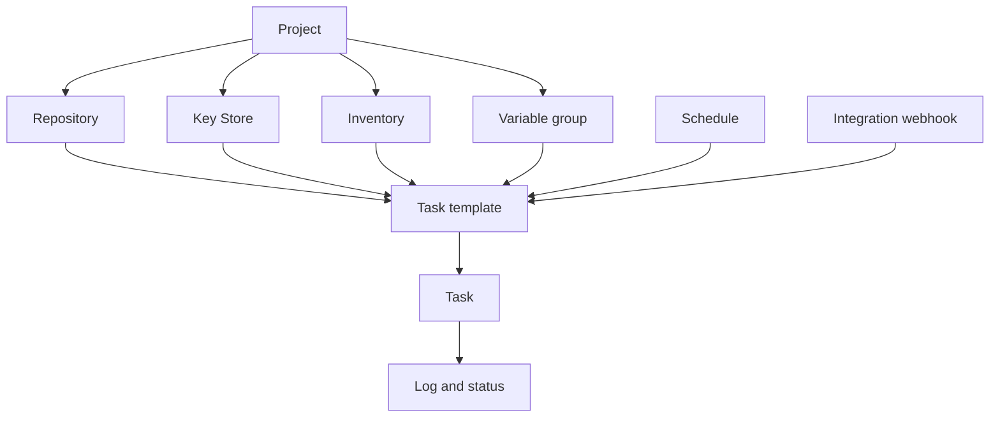

# Concetti fondamentali

Semaphore ha un'idea centrale: un **task template** raccoglie tutto ciò che serve a
un'esecuzione, e avviarlo produce un **task**. Imparare dove si configura ciascun pezzo
di quel "tutto" è gran parte dell'imparare il prodotto.

## Il modello a oggetti {#the-object-model}

### I progetti contengono tutto {#projects-hold-everything}

Un [progetto](/user-guide/projects) è l'unità di isolamento. Repository, chiavi,
inventory, gruppi di variabili, template e cronologia dei task appartengono a un solo
progetto, e così vale per l'appartenenza al team. Due progetti non condividono nulla,
tranne il server e i suoi utenti: è questo che rende il progetto il confine giusto tra
team, ambienti o clienti.

### Le risorse descrivono gli input {#resources-describe-the-inputs}

Esistono quattro tipi di risorsa, perché lo stesso valore possa essere riusato da molti
template e modificato in un solo punto:

- Un [repository](/user-guide/repositories) è il luogo in cui vive il playbook o lo script.
- Il [Key Store](/user-guide/key-store) contiene le chiavi SSH, le credenziali e i token usati
  per raggiungere il repository e gli host di destinazione.
- Un [inventory](/user-guide/inventory) elenca gli host a cui un'esecuzione si rivolge e come
  connettersi a essi.
- Un [gruppo di variabili](/user-guide/environment) porta variabili e segreti nell'ambiente
  dell'esecuzione.

### I template definiscono l'esecuzione {#templates-define-the-run}

Un [task template](/user-guide/task-templates) sceglie un'applicazione (Ansible,
Terraform, uno script), un repository, il playbook o il punto di ingresso al suo interno e
l'inventory, il gruppo di variabili e le chiavi da usare. Decide inoltre che cosa può
cambiare chi avvia il task: le [variabili di survey](/user-guide/task-templates/survey-vars)
trasformano un template in un modulo, mentre i [prompt](/user-guide/task-templates/prompts)
permettono all'utente di sovrascrivere branch, inventory o argomenti aggiuntivi.

### I task sono le esecuzioni {#tasks-are-the-runs}

Avviare un template crea un [task](/user-guide/tasks). Il task ha un proprio log,
stato, durata e il nome di chi lo ha avviato, e questa registrazione resta anche dopo
la fine dell'esecuzione. I task si avviano dalla UI, da una
[pianificazione](/user-guide/schedules), da un
[webhook di integrazione](/user-guide/integrations), dall'
[API](/reference/api) o da un altro template all'interno di un
[workflow](/user-guide/workflows).

## Glossario {#glossary}

| Termine | Significato |
|---|---|
| **Access key** | Una voce del Key Store: una chiave SSH, una coppia utente e password oppure un token. La sua parte segreta è cifrata nel database. |
| **Alert** | Una notifica inviata quando un task raggiunge un determinato stato. I canali si configurano sul server, poi si abilitano per progetto e per template. |
| **App** | Lo strumento che un template esegue: Ansible, Terraform, OpenTofu, Terragrunt, Bash, PowerShell o Python. |
| **Build template** | Un tipo di template che produce un artefatto versionato; ogni esecuzione incrementa la versione. |
| **Deploy template** | Un tipo di template collegato a un build template; avviandolo ti viene chiesto quale versione di build rilasciare. |
| **Executor** | Il modo in cui un runner avvia un job: come processo locale, in un container Docker o in un Pod Kubernetes. |
| **Integration** | Un webhook in ingresso che avvia un template quando un sistema esterno lo richiama. |
| **Inventory** | Gli host a cui un task si rivolge, come testo statico, file nel repository o script di inventory dinamico. |
| **Key Store** | La raccolta di access key propria di ciascun progetto. |
| **Project** | Il contenitore di primo livello: risorse, template, cronologia dei task e appartenenza al team. |
| **Role** | Ciò che un membro può fare all'interno di un progetto. I ruoli predefiniti sono Owner, Manager, Task Runner e Guest. |
| **Runner** | Un processo separato che esegue i task per conto del server, invece che il server stesso. |
| **Schedule** | Un'espressione cron che avvia un template senza l'intervento di una persona. |
| **Secret storage** | Un sistema esterno, come HashiCorp Vault, che conserva i valori segreti al posto del database di Semaphore. |
| **Survey variable** | Un campo che il template definisce e che l'utente compila all'avvio di un task; diventa una variabile per l'esecuzione. |
| **Task** | Una singola esecuzione di un template, con il suo log, il suo stato e il suo autore. |
| **Task template** | La definizione riutilizzabile di che cosa eseguire e con che cosa. Spesso chiamato semplicemente "template". |
| **Variable group** | Un insieme denominato di variabili e segreti passati all'esecuzione. Chiamato *Environment* nelle versioni precedenti e nell'API. |
| **View** | Una scheda che raggruppa un sottoinsieme dei template di un progetto nell'elenco dei template. |
| **Workflow** | Un grafo di template eseguiti in sequenza, con ramificazioni, approvazioni e attese. È una funzionalità Pro. |

## Prossimi passi {#whats-next}

- [Primi passi](/getting-started) — metti in pratica i concetti nell'ordine giusto.
- [Guida utente](/user-guide) — una pagina per concetto, con tutti i campi.
- [Architettura](/introduction/architecture) — come server, database e runner si incastrano.
