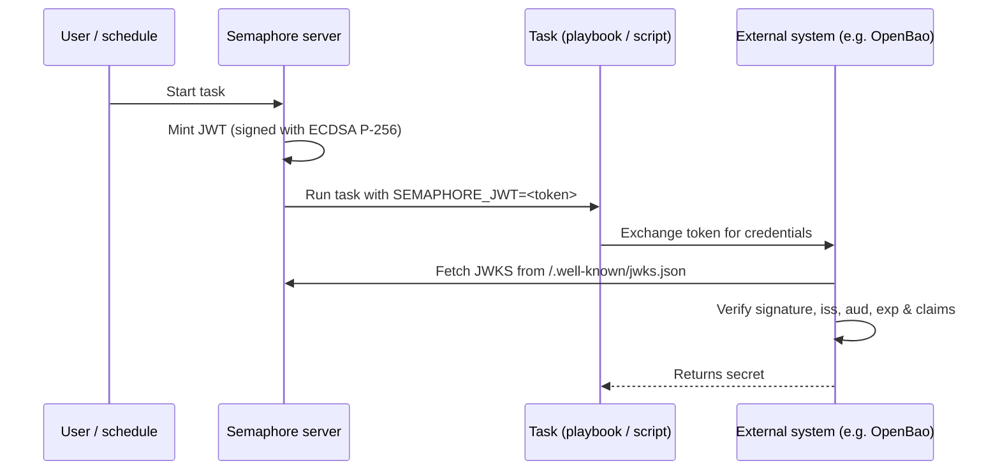

# タスク JWT の発行

Semaphore は、タスク実行ごとに短命な [JSON Web Token (JWT)](https://datatracker.ietf.org/doc/html/rfc7519)
を発行できます。トークンは Semaphore によって署名され、
playbook (または shell/Terraform/PowerShell/Python スクリプト) に
環境変数 `SEMAPHORE_JWT` として公開されます。

Semaphore が公開する [JWKS エンドポイント](#jwks-endpoint)と組み合わせることで、
このトークンにより外部システムは事前共有シークレットなしでタスクを認証できます。

このページでは**サーバー側の設定**について説明します。テンプレートごとの
設定とタスク内での利用方法については、
[タスク JWT に関するユーザーガイドのページ](/user-guide/task-templates/jwt)を参照してください。

______________________________________________________________________

## 仕組み {#how-it-works}



署名には **ECDSA P-256** キーペアを使用します。秘密鍵は初回使用時に
生成され、他のシークレットを保護するのと同じ `access_key_encryption` キーで
暗号化されて、Semaphore データベースに保存されます。公開鍵は
JWKS エンドポイント経由で提供されます。

______________________________________________________________________

## 設定 {#configuration}

JWT の発行は**デフォルトで無効**です。`config.json` で有効化します。

```json
{
    "jwt": {
        "enabled": true,
        "issuer": "https://semaphore.example.com",
        "default_ttl": "1h",
        "max_ttl": "24h"
    }
}
```

| オプション | デフォルト | 説明 |
| ----------------- | ------- | --------------------------------------------------------------------------------------------------------------------------------------- |
| `jwt.enabled` | `false` | `false` の場合、トークンは発行されず、JWKS エンドポイントは `404` を返します。 |
| `jwt.issuer` | _なし_ | `iss` クレームに出力される値。Semaphore インスタンスを識別する安定した URL を設定してください。外部システムはこれをトラストアンカーとして使用します。 |
| `jwt.default_ttl` | `1h` | テンプレートで上書きされない場合に使用されるトークンの有効期間。Go 形式の期間 (`30m`、`1h`、`90m` など) を受け付けます。 |
| `jwt.max_ttl` | `24h` | トークンが持てる最大の有効期間。テンプレートはこれより大きい値で TTL を上書きできません。 |

:::tip
署名キーは
[`access_key_encryption`](/admin-guide/configuration/config-file) キーで保存時に暗号化されます。JWT を有効にする**前に**、
このオプションが設定されていることを確認してください。キーは
初回起動時に生成され、後から再暗号化することはできません。
:::

______________________________________________________________________

## JWKS エンドポイント {#jwks-endpoint}

JWT の発行が有効な場合、Semaphore は公開署名キーを次の場所で公開します。

```
GET /.well-known/jwks.json
```

レスポンスは [RFC 7517](https://datatracker.ietf.org/doc/html/rfc7517)
に準拠しており、JWT の検証側でそのまま利用できます。

```bash
curl https://semaphore.example.com/.well-known/jwks.json
```

```json
{
  "keys": [
    {
      "kty": "EC",
      "crv": "P-256",
      "kid": "...",
      "use": "sig",
      "alg": "ES256",
      "x": "...",
      "y": "..."
    }
  ]
}
```

______________________________________________________________________

## キーのローテーション {#key-rotation}

署名キーは、JWT 機能を有効にした状態で Semaphore を起動すると自動的に作成されます。
ローテーションするには、`option` テーブルから `jwt_signing_key` 行を
削除して Semaphore を再起動します。
新しいキーペアが自動的に作成されます。

ローテーションにより以前に発行されたすべてのトークンが無効になるため、
既存のトークンがどこでも使用されていない場合 (実行中のタスクがないなど) にのみ実行してください。
