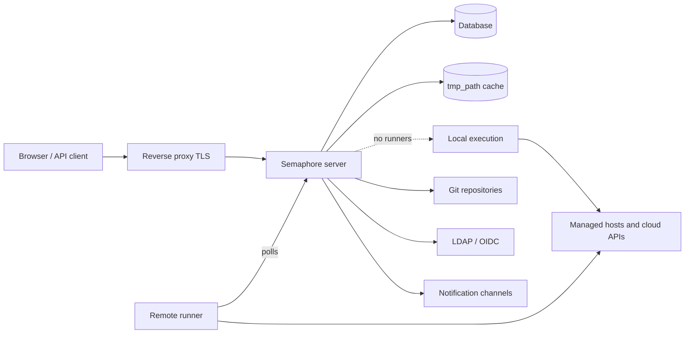

# アーキテクチャ

Semaphore のデプロイには、必須の要素が 3 つあります。1 つの **サーバープロセス**、1 つの **データベース**、そして **タスクが実行される場所** です。それ以外のもの（ランナー、Redis、リバースプロキシ、ID プロバイダー）はすべて任意で、具体的な必要が生じたときに追加します。

## 構成要素 {#the-parts}

### サーバー {#server}

単一の Go バイナリです。コンパイル済みの Web インターフェイスを内包しているため、1 つのプロセスが UI、REST API、そしてタスク出力を開いているブラウザーへ配信する `/api/ws` の WebSocket エンドポイントを提供します。既定ではポート `3000` で待ち受けます。

そのプロセスの内部では、いくつかの要素が同時に動いています。

| 要素 | 役割 |
|---|---|
| HTTP API と UI | ブラウザーと API クライアントが呼び出すすべて。 |
| タスクプール | タスクのキュー、同時実行数の制限、状態の管理。 |
| スケジューラー | テンプレートを [cron スケジュール](/user-guide/schedules) に従って開始します。 |
| ローカルエグゼキューター | リモートランナーが処理しないタスクを、サーバー自身の上で実行します。 |
| 通知機能 | タスク終了時に [アラート](/admin-guide/notifications) を送信します。 |

### データベース {#database}

SQLite、MySQL、PostgreSQL のいずれかを `dialect` オプションで選択します。ここにはプロジェクト、テンプレート、インベントリ、スケジュール、ユーザー、ロール、タスク履歴、そしてキーストアの暗号化された内容が保持されます。バックアップが必須なのはこれだけで、他はすべて再構築できます。

SQLite が既定であり、単一サーバーに適しています。複数の人がこのサービスに依存する場合は PostgreSQL か MySQL を使い、複数ノードで運用する場合は必ずそうしてください。

### ファイルキャッシュ {#file-cache}

`tmp_path`（既定では `/tmp/semaphore`）のディレクトリには、クローンされたリポジトリと各実行の作業ディレクトリが置かれます。これはストレージではなくキャッシュです。削除してもプロジェクトごとにクローンが 1 回余分に発生するだけです。プロジェクト設定の **キャッシュをクリア** はまさにそれを行います。

タスクを実行するマシンがこのキャッシュを保持します。ローカル実行ならサーバーが、そうでなければ各ランナーが保持します。

## タスクが実行される場所 {#where-tasks-execute}

既定では、サーバー自身が自分のファイルシステムと自分のネットワークアクセスを使ってタスクを実行します。これは最も単純な構成であり、サーバーからすでに到達できるホストを管理する小規模チームには最適です。

[ランナー](/admin-guide/runners) を追加すると、この 2 つが分離されます。ランナーは `semaphore runner start` で起動した同じバイナリです。データベース接続を持たず、受信ポートも開きません。ベアラートークンを使って HTTPS でサーバーをポーリングし、ジョブを受け取り、リポジトリをクローンし、ツールを実行し、出力をストリーミングで返します。ランナーによって次のことが可能になります。

- サーバーが到達できないネットワークの内側で実行する、
- 本番用の認証情報を、Web インターフェイスを提供しないマシンに置いておく、
- 複数のマシンに負荷を分散する、
- （Pro では）[タグ](/admin-guide/runners#runner-tags-pro) を使ってタスクを特定のランナーに振り分ける。

各ランナーは、`executor.type` によってジョブの起動方法を選びます。

| エグゼキューター | ジョブの実行場所 |
|---|---|
| `local` | ランナーのホスト上のプロセスとして、`tmp_path` の中で実行します。 |
| `docker` | ランナーがそのジョブのために起動し、終了後に削除するコンテナーの中で実行します。 |
| `k8s` | ランナーがクラスター内に作成し、終了後に削除する Pod の中で実行します。 |

### ポートと通信方向 {#ports-and-directions}

すべての接続は、それを開始したコンポーネントからの外向き接続です。これがランナーをネットワーク境界をまたいで利用できる理由です。

| 送信元 | 宛先 | 目的 |
|---|---|---|
| ブラウザー、API クライアント | サーバー `:3000` | UI、REST API、WebSocket。 |
| サーバー | データベース | すべての永続的な状態。 |
| サーバー、ランナー | Git リモート | リポジトリのクローン。 |
| サーバー、ランナー | 管理対象ホスト、クラウド API | 実際の自動化処理。 |
| ランナー | サーバー `:3000` | ジョブのポーリング、出力のストリーミング。 |
| サーバー | LDAP、OIDC、SMTP、チャットの Webhook | サインインと通知。 |

## スケールアウト {#scaling-out}

2 つの軸が独立してスケールします。

**実行能力を増やす** には、ランナーを増やします。サーバーは単一プロセスのままで、タスクは接続されているランナーへ分散されます。

**可用性を高める** には、サーバーを増やします。複数のノードが 1 つの PostgreSQL または MySQL データベースに対して動作し、分散ロック、共有キュー状態、pub/sub のために Redis を使い、WebSocket に対応したロードバランサーの背後に配置します。これが [高可用性](/admin-guide/ha) であり、Enterprise の機能です。SQLite は使用できません。

## 次のステップ {#whats-next}

- [中核となる概念](/introduction/concepts) — インターフェイスが使う用語。
- [セキュリティモデル](/introduction/security-model) — 信頼境界と、何が暗号化されるか。
- [インストール](/admin-guide/installation) — 方法を選んでサーバーを起動する。
