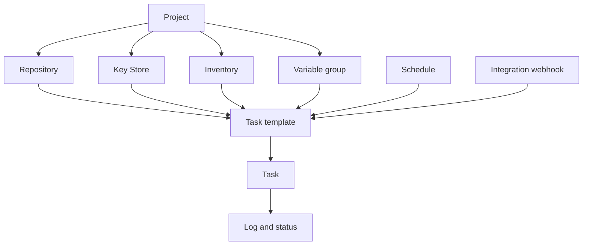

# 中核となる概念

Semaphore の中心にある考え方は 1 つです。**タスクテンプレート** が実行に必要なすべてをまとめ、それを実行すると **タスク** が生成されます。その「すべて」の各要素がどこで設定されるのかを学ぶことが、この製品を学ぶことのほとんどです。

## オブジェクトモデル {#the-object-model}

### プロジェクトがすべてを保持する {#projects-hold-everything}

[プロジェクト](/user-guide/projects) は分離の単位です。リポジトリ、キー、インベントリ、変数グループ、テンプレート、タスク履歴はいずれもただ 1 つのプロジェクトに属し、チームのメンバーシップも同様です。2 つのプロジェクトはサーバーとそのユーザー以外に何も共有しません。だからこそプロジェクトは、チーム、環境、顧客のあいだの適切な境界になります。

### リソースが入力を表す {#resources-describe-the-inputs}

同じ値を多数のテンプレートで再利用し、1 か所で変更できるように、4 種類のリソースがあります。

- [リポジトリ](/user-guide/repositories) は、プレイブックやスクリプトが置かれている場所です。
- [キーストア](/user-guide/key-store) は、リポジトリや対象ホストへ接続するための SSH キー、ログイン情報、トークンを保持します。
- [インベントリ](/user-guide/inventory) は、実行の対象となるホストと、その接続方法を列挙します。
- [変数グループ](/user-guide/environment) は、変数とシークレットを実行時の環境へ引き渡します。

### テンプレートが実行内容を定義する {#templates-define-the-run}

[タスクテンプレート](/user-guide/task-templates) は、アプリケーション（Ansible、Terraform、スクリプト）、リポジトリ 1 つ、その中のプレイブックやエントリーポイント、そして使用するインベントリ、変数グループ、キーを選択します。さらに、タスクを開始する人が何を変更できるかも決めます。[サーベイ変数](/user-guide/task-templates/survey-vars) はテンプレートをフォームに変え、[プロンプト](/user-guide/task-templates/prompts) はブランチ、インベントリ、追加引数をユーザーが上書きできるようにします。

### タスクが実行そのもの {#tasks-are-the-runs}

テンプレートを開始すると [タスク](/user-guide/tasks) が作成されます。タスクは固有のログ、ステータス、所要時間、開始した人の名前を持ち、その記録は実行終了後も残ります。タスクは UI、[スケジュール](/user-guide/schedules)、[インテグレーションの Webhook](/user-guide/integrations)、[API](/reference/api)、または [ワークフロー](/user-guide/workflows) 内の別のテンプレートから開始できます。

## 用語集 {#glossary}

| 用語 | 意味 |
|---|---|
| **アクセスキー** | キーストア内の 1 エントリー。SSH キー、ログインとパスワード、またはトークン。秘密の部分はデータベース内で暗号化されます。 |
| **アラート** | タスクが特定の状態に達したときに送られる通知。チャネルはサーバー側で設定し、プロジェクトごと、テンプレートごとに有効化します。 |
| **アプリ** | テンプレートが実行するツール。Ansible、Terraform、OpenTofu、Terragrunt、Bash、PowerShell、Python。 |
| **ビルドテンプレート** | バージョン付きの成果物を生成するテンプレート種別。実行のたびにバージョンが 1 つ上がります。 |
| **デプロイテンプレート** | ビルドテンプレートに紐づくテンプレート種別。開始時に、どのビルドバージョンを配布するかを尋ねられます。 |
| **エグゼキューター** | ランナーがジョブを起動する方法。ローカルプロセス、Docker コンテナー、Kubernetes Pod のいずれか。 |
| **インテグレーション** | 外部システムが呼び出したときにテンプレートを開始する受信 Webhook。 |
| **インベントリ** | タスクの対象となるホスト。静的なテキスト、リポジトリ内のファイル、またはダイナミックインベントリスクリプトとして指定します。 |
| **キーストア** | プロジェクトごとのアクセスキーの集合。 |
| **プロジェクト** | 最上位のコンテナー。リソース、テンプレート、タスク履歴、チームのメンバーシップを含みます。 |
| **ロール** | プロジェクト内でメンバーが行えること。組み込みのロールは Owner、Manager、Task Runner、Guest です。 |
| **ランナー** | サーバー自身が実行する代わりに、サーバーのためにタスクを実行する独立したプロセス。 |
| **スケジュール** | 人の操作なしにテンプレートを開始する cron 式。 |
| **シークレットストレージ** | Semaphore のデータベースの代わりに秘密の値を保持する、HashiCorp Vault などの外部システム。 |
| **サーベイ変数** | テンプレートが定義し、タスク開始時にユーザーが入力するフィールド。実行時の変数になります。 |
| **タスク** | テンプレートの 1 回の実行。ログ、ステータス、実行者を伴います。 |
| **タスクテンプレート** | 何をどのように実行するかの再利用可能な定義。単に「テンプレート」と呼ぶことも多いです。 |
| **変数グループ** | 実行に渡される、名前の付いた変数とシークレットの集合。以前のバージョンおよび API では *Environment* と呼ばれます。 |
| **ビュー** | テンプレート一覧で、プロジェクトのテンプレートの一部をまとめるタブ。 |
| **ワークフロー** | 分岐、承認、遅延を伴って順に実行されるテンプレートのグラフ。Pro の機能です。 |

## 次のステップ {#whats-next}

- [はじめ方](/getting-started) — 概念を順番に実践してみる。
- [ユーザーガイド](/user-guide) — 概念ごとに 1 ページ、すべての項目を解説。
- [アーキテクチャ](/introduction/architecture) — サーバー、データベース、ランナーがどう組み合わさるか。
