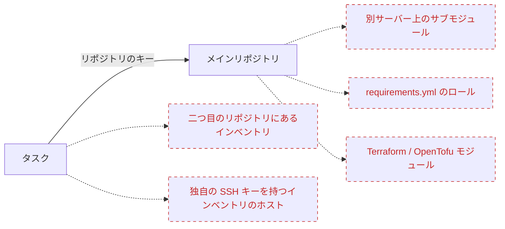
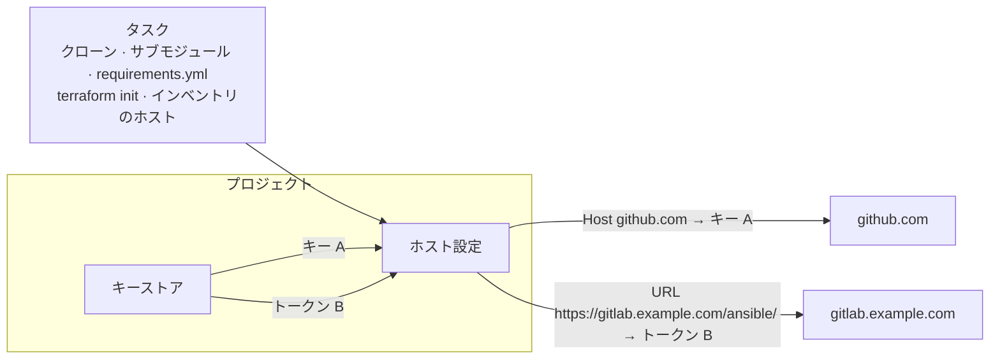

# ホスト設定

## なぜ必要か {#why}

[リポジトリ](/user-guide/repositories) が持つキーは一つだけで、Semaphore がそのリポジトリをクローンするために使うものです。タスクに必要なものがすべてそのリポジトリにある限り、それで十分です。しかし実際には、タスクは他の場所にもアクセスし、それぞれが別の認証情報を要求することがあります。



破線の矢印が隙間です。リポジトリのキーはそれらのサーバーには提示されないため、タスクはそれらに触れた時点で **Permission denied** または **Authentication failed** で失敗します。これまでの回避策は、一つのキーにあらゆる場所へのアクセス権を与えるか、リポジトリのファイルに認証情報を埋め込むことしかありませんでした。

**Host config**（ホスト設定）は、リポジトリに手を加えることなくこの問題を解決します。Semaphore に *「プロジェクトがこのホストまたはこの URL に接続するときは、常に [キーストア](/user-guide/key-store) のあの認証情報を使う」* と指示するだけです。マッピングは、どこから開始されたかにかかわらず、タスクのすべての Git 接続と SSH 接続に適用されます。

| 状況 | リポジトリにあるもの | マッピングなし | マッピングあり |
|---|---|---|---|
| 別の Git サーバー上の **プライベートなサブモジュール** | `git@gitlab.example.com:infra/common.git` を指す `.gitmodules` | `git submodule update` が拒否される。メインリポジトリのデプロイキーはそのサーバーでは知られていない | そのサーバーで許可されたキーを持つ `gitlab.example.com` の **Host** マッピング |
| Ansible の `requirements.yml` にある **プライベートなロールやコレクション** | `src: https://gitlab.example.com/ansible/role-nginx.git` | `ansible-galaxy install` がログインを求めて失敗する | GitLab のアクセストークンを持つ `https://gitlab.example.com/ansible/` の **URL** マッピング |
| Git から取得する **プライベートな Terraform / OpenTofu モジュール** | `source = "git::https://github.com/acme/tf-modules.git"` | `terraform init` がモジュールをダウンロードできない | SSH キーまたはトークンを持つ `https://github.com/acme/` の **URL** マッピング |
| ホストがリポジトリとは **別の SSH キー** を必要とする **インベントリ** | `db-01.internal`、`db-02.internal` を含むインベントリ | インベントリで指定できるキーは一つだけで、リポジトリのキーはそれらのホストには合わない | ホスト名ごとの **Host** マッピング、または共通するホストに対してインベントリのキーを持つ一つのマッピング |

一つのマッピングでこれらすべてに同時に対応でき、テンプレートごとに設定する必要はありません。プロジェクトにマッピングがない場合は何も変わらず、タスクはこれまでどおりリポジトリのキーを使い続けます。

## 仕組み {#how-it-works}

マッピングは三つの要素からなるルールです。**何に** 一致させるか（ホスト名または URL のプレフィックス）、キーストアの **どの** 認証情報を使うか、そしてそれ以外はありません。Semaphore は、タスクの最初の Git コマンドの前にプロジェクトのマッピングを設定し、タスクの終了時に取り除きます。タスクが開く接続はすべて、自身のクローンからプレイブック内の `git` モジュールに至るまで、このマッピングを通ります。




このページはプロジェクトメニューの **Repositories** の下にあります。マッピングの追加、編集、削除には、キーストアと同じくプロジェクトリソースを管理する権限が必要です。


## マッピングの種類 {#mapping-types}

**Add mapping**（マッピングを追加）を押して、マッピングが何に一致するかを選びます。

### ホスト {#host}

**Host**（ホスト）マッピングは、`github.com` や `gitlab.example.com` のような SSH ホスト名に一致し、**SSH** キーが必要です。タスクがそのホストへ SSH 接続を開くたびに、対応付けられたキーで認証します。SSH でクローンするリポジトリやサブモジュール、`requirements.yml` 内の `git@host:group/repo.git` 形式の URL、さらにその名前を持つ Ansible インベントリのホストも対象です。キーにログインが設定されている場合、そのホストの SSH ユーザーとして使われます。

<div style={{maxWidth: 720}}>


</div>

### URL {#url}

**URL** マッピングは、`https://` または `http://` のリポジトリ URL に一致します。`https://gitlab.example.com/infra/network.git` のように一つのリポジトリを指定することも、`https://gitlab.example.com/ansible/` のように `/` で終えてグループ配下のすべてのリポジトリを対象にすることもできます。複数のマッピングが一致する場合は最も具体的な URL が優先されるため、一つのリポジトリのマッピングは、それを含むグループのマッピングより優先されます。

URL へのアクセス方法は認証情報によって決まります。

| 認証情報 | 動作 |
|---|---|
| **SSH** キー | URL は SSH 形式に書き換えられ、接続はそのキーで認証します。キーのログインが SSH ユーザーになり、ログインがない場合は `git` になります。 |
| **Login with password**（パスワードによるログイン） | ログインとパスワードが URL に追加され、HTTPS で送信されます。パーソナルアクセストークンを使う場合はログインを空のままにします。この認証情報を受け付けるのは `https://` の URL だけなので、シークレットが平文で送られることはありません。 |

URL には、独自の認証情報、空白、引用符、`=` 文字を含めることはできません。

<div style={{maxWidth: 720}}>


</div>

## マッピングが適用される範囲 {#where-mappings-apply}

プロジェクトのマッピングは、タスクの最初の Git コマンドの前に設定され、タスクが終了するまで有効です。次の操作が対象です。

- テンプレートのリポジトリのクローンと更新（サブモジュールを含む）
- `requirements.yml` からインストールするロールとコレクション。[Galaxy の要件](/user-guide/apps/ansible#galaxy-requirements) を参照してください
- `terraform init` または `tofu init` が取得するモジュール
- プレイブックやスクリプト自体が開始する Git コマンド。たとえば Ansible の `git` モジュール
- Git に保管されたインベントリのリポジトリ
- インベントリのホスト（**Host** マッピングがその名前に一致する場合）
- テンプレートフォームでのリポジトリのブランチとプレイブックの参照、および新しいコミットで開始するスケジュールのポーリング

[リモートランナー](/admin-guide/runners) に送られるタスクは、タスクと一緒にマッピングを受け取るため、ランナー上でも同じように動作します。

マッピングは、サーバー全体の SSH 設定（[設定](/reference/configuration) の `ssh.config_path`）にある同じホストのエントリを上書きします。そのファイルの他のエントリはそのまま機能します。マッピングにはコマンドラインの Git クライアント（既定の `git_client: cmd_git`）が必要です。組み込みの `go_git` クライアントでは、マッピングを持つプロジェクトのタスクは、誤った認証情報を使う代わりに説明付きのエラーで失敗します。

## 認証情報 {#credentials}

秘密鍵がディスクに書き込まれることはありません。各 SSH マッピングは、タスクと同じ期間だけ存在する SSH エージェントにキーを保持し、生成される SSH 設定はエージェントを指すだけです。パスワードによるログインは、コマンドラインではなく Git の設定用環境変数を通じて Git に渡され、Git はタスクログに元の URL を出力するため、シークレットはどちらにも現れません。

マッピングが参照しているキーは削除できません。確認ダイアログに、そのキーを使っているマッピングが一覧表示されます。そのようなキーの種類を、マッピングが使えない種類に変更すること、たとえば Host マッピングの SSH キーをパスワードによるログインに変えることも拒否されます。

## 例 {#example}

プレイブックは GitHub にあり、セルフホストの GitLab のサブモジュールを使い、`requirements.yml` を通じて二つ目の GitLab グループからロールをインストールします。

```yaml
# requirements.yml
- src: https://gitlab.example.com/ansible/role-nginx.git
  version: v2.1.0
```

次の三つのマッピングにより、リポジトリを一切変更せずにタスクを実行できます。

| 種類 | ホストまたは URL | 認証情報 |
|---|---|---|
| Host | `github.com` | GitHub リポジトリのデプロイキー |
| URL | `https://gitlab.example.com/ansible/` | パスワードによるログインとしての GitLab アクセストークン |
| URL | `https://gitlab.example.com/infra/network.git` | そのリポジトリだけに許可された SSH キー |

## バックアップ {#backups}

マッピングは [プロジェクトのバックアップ](./projects/settings#danger-zone) に含まれます。認証情報を名前で参照するため、復元したプロジェクトでも復元したキーとの紐付けが保たれます。他のキーと同様、シークレットの値自体はエクスポートされません。
