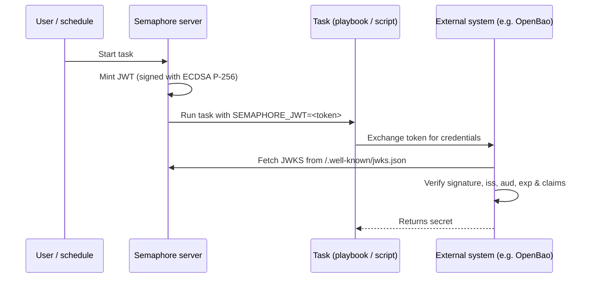

# 작업 JWT 발급

Semaphore는 모든 작업 실행에 대해 수명이 짧은 [JSON Web Token (JWT)](https://datatracker.ietf.org/doc/html/rfc7519)을
발급할 수 있습니다. 이 token은 Semaphore가 서명하며,
playbook(또는 셸/Terraform/PowerShell/Python 스크립트)에
`SEMAPHORE_JWT` 환경 변수로 노출됩니다.

Semaphore가 게시하는 [JWKS 엔드포인트](#jwks-endpoint)와 함께 사용하면, 이
token을 통해 외부 시스템이 사전 공유 비밀 없이 작업을 인증할 수 있습니다.

이 페이지에서는 **서버 측 구성**을 설명합니다. 템플릿별
구성과 작업 내부에서의 사용 방법은
[작업 JWT에 관한 사용자 가이드 페이지](/user-guide/task-templates/jwt)를 참조하십시오.

______________________________________________________________________

## 동작 방식 {#how-it-works}



서명에는 **ECDSA P-256** 키 쌍이 사용됩니다. 개인 키는 처음 사용할 때
생성되며, 다른 비밀 정보를 보호하는 것과 동일한 `access_key_encryption` 키로
암호화되어 Semaphore 데이터베이스에 저장됩니다. 공개 키는
JWKS 엔드포인트를 통해 제공됩니다.

______________________________________________________________________

## 구성 {#configuration}

JWT 발급은 **기본적으로 비활성화**되어 있습니다. `config.json`에서 활성화하십시오:

```json
{
    "jwt": {
        "enabled": true,
        "issuer": "https://semaphore.example.com",
        "default_ttl": "1h",
        "max_ttl": "24h"
    }
}
```

| 옵션 | 기본값 | 설명 |
| ----------------- | ------- | --------------------------------------------------------------------------------------------------------------------------------------- |
| `jwt.enabled` | `false` | `false`이면 token이 발급되지 않으며 JWKS 엔드포인트는 `404`를 반환합니다. |
| `jwt.issuer` | _없음_ | `iss` 클레임에 포함되는 값입니다. Semaphore 인스턴스를 식별하는 안정적인 URL로 설정하십시오. 외부 시스템은 이를 신뢰 앵커로 사용합니다. |
| `jwt.default_ttl` | `1h` | 템플릿이 재정의하지 않을 때 사용되는 token 수명입니다. Go 스타일 기간(`30m`, `1h`, `90m`, ...)을 사용할 수 있습니다. |
| `jwt.max_ttl` | `24h` | token이 가질 수 있는 최대 수명입니다. 템플릿은 이 값보다 큰 TTL로 재정의할 수 없습니다. |

:::tip
서명 키는
[`access_key_encryption`](/admin-guide/configuration/config-file) 키로 저장 시 암호화됩니다. JWT를
활성화하기 **전에** 이 옵션이 구성되어 있는지 확인하십시오. 키는
처음 시작할 때 생성되며 이후에 다시 암호화할 수 없습니다.
:::

______________________________________________________________________

## JWKS 엔드포인트 {#jwks-endpoint}

JWT 발급이 활성화되면 Semaphore는 다음 경로에서 공개 서명 키를 노출합니다:

```
GET /.well-known/jwks.json
```

응답은 [RFC 7517](https://datatracker.ietf.org/doc/html/rfc7517)을
따르며 JWT 검증기에서 직접 사용할 수 있습니다:

```bash
curl https://semaphore.example.com/.well-known/jwks.json
```

```json
{
  "keys": [
    {
      "kty": "EC",
      "crv": "P-256",
      "kid": "...",
      "use": "sig",
      "alg": "ES256",
      "x": "...",
      "y": "..."
    }
  ]
}
```

______________________________________________________________________

## 키 교체 {#key-rotation}

서명 키는 JWT 기능이 활성화된 상태로 Semaphore를 시작할 때 자동으로 생성됩니다.
키를 교체하려면 `option` 테이블에서 `jwt_signing_key` 행을
제거하고 Semaphore를 재시작하십시오.
새 키 쌍이 자동으로 생성됩니다.

키 교체는 이전에 발급된 모든 token을 무효화하므로, 기존 token이
더 이상 사용되지 않을 때(예: 실행 중인 작업이 없을 때)에만 수행하십시오.
