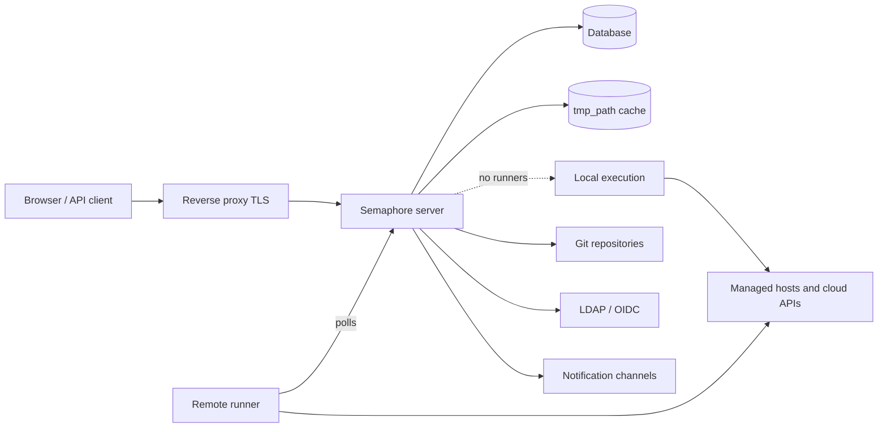

# 아키텍처

Semaphore 배포에는 반드시 필요한 세 가지 요소가 있습니다. **서버 프로세스** 하나,
**데이터베이스** 하나, 그리고 **태스크가 실행되는 장소**입니다. 러너, Redis, 리버스
프록시, ID 공급자 등 나머지는 모두 선택 사항이며 구체적인 필요가 생겼을 때 추가합니다.

## 구성 요소 {#the-parts}

### 서버 {#server}

단일 Go 바이너리입니다. 컴파일된 웹 인터페이스가 함께 포함되어 있으므로, 하나의
프로세스가 UI, REST API, 그리고 열려 있는 브라우저로 태스크 출력을 스트리밍하는
`/api/ws` WebSocket 엔드포인트를 모두 제공합니다. 기본적으로 `3000` 포트를 사용합니다.

이 프로세스 안에서는 여러 가지가 동시에 동작합니다.

| 구성 요소 | 역할 |
|---|---|
| HTTP API와 UI | 브라우저와 API 클라이언트가 호출하는 모든 것. |
| 태스크 풀 | 태스크 큐, 동시 실행 제한, 상태 관리. |
| 스케줄러 | [cron 스케줄](/user-guide/schedules)에 따라 템플릿을 시작합니다. |
| 로컬 실행기 | 원격 러너가 처리하지 않는 태스크를 서버 자체에서 실행합니다. |
| 알림 발송기 | 태스크가 끝나면 [알림](/admin-guide/notifications)을 보냅니다. |

### 데이터베이스 {#database}

`dialect` 옵션으로 SQLite, MySQL, PostgreSQL 중 하나를 선택합니다. 프로젝트, 템플릿,
인벤토리, 스케줄, 사용자, 역할, 태스크 기록, 그리고 키 저장소의 암호화된 내용이 여기에
저장됩니다. 반드시 백업해야 하는 유일한 대상이며, 나머지는 모두 다시 만들 수 있습니다.

SQLite가 기본값이며 서버 한 대에 적합합니다. 여러 사람이 서비스를 사용하는 경우에는
PostgreSQL이나 MySQL을 쓰고, 노드를 두 대 이상 운영할 때는 반드시 그렇게 하세요.

### 파일 캐시 {#file-cache}

`tmp_path`가 가리키는 디렉터리(기본값 `/tmp/semaphore`)에는 복제된 저장소와 각 실행의
작업 디렉터리가 보관됩니다. 이것은 저장소가 아니라 캐시입니다. 삭제해도 프로젝트마다
한 번 더 복제하는 비용이 들 뿐입니다. 프로젝트 설정의 **캐시 지우기**가 바로 그 일을
합니다.

태스크를 실행하는 쪽이 이 캐시를 보관합니다. 태스크가 로컬에서 실행되면 서버가,
그렇지 않으면 각 러너가 보관합니다.

## 태스크가 실행되는 위치 {#where-tasks-execute}

기본적으로 서버는 자체 파일 시스템과 자체 네트워크 접근 권한으로 태스크를 직접
실행합니다. 가장 단순한 구성이며, 서버가 이미 도달할 수 있는 호스트를 관리하는 소규모
팀에게 알맞습니다.

[러너](/admin-guide/runners)를 추가하면 이 둘이 분리됩니다. 러너는 동일한 바이너리를
`semaphore runner start`로 시작한 것입니다. 데이터베이스 연결을 유지하지 않고 인바운드
포트도 열지 않습니다. 베어러 토큰으로 HTTPS를 통해 서버를 폴링하고, 작업을 받고,
저장소를 복제하고, 도구를 실행한 뒤 출력을 되돌려 보냅니다. 러너를 사용하면 다음이
가능합니다.

- 서버가 도달할 수 없는 네트워크 안에서 실행하기,
- 운영 환경 자격 증명을 웹 인터페이스를 제공하지 않는 머신에 보관하기,
- 여러 머신에 부하를 분산하기,
- (Pro에서) [태그](/admin-guide/runners#runner-tags-pro)로 특정 러너에 태스크를 배정하기.

각 러너는 `executor.type`으로 작업을 실행하는 방식을 선택합니다.

| 실행기 | 작업 실행 방식 |
|---|---|
| `local` | 러너 호스트에서 프로세스로, `tmp_path` 안에서 실행합니다. |
| `docker` | 러너가 해당 작업을 위해 시작한 컨테이너에서 실행한 뒤 제거합니다. |
| `k8s` | 러너가 클러스터에 생성한 Pod에서 실행한 뒤 제거합니다. |

### 포트와 연결 방향 {#ports-and-directions}

모든 연결은 연결을 시작하는 구성 요소에서 바깥으로 나가는 아웃바운드 연결입니다.
덕분에 러너를 네트워크 경계 너머에서도 사용할 수 있습니다.

| 출발지 | 목적지 | 용도 |
|---|---|---|
| 브라우저, API 클라이언트 | 서버 `:3000` | UI, REST API, WebSocket. |
| 서버 | 데이터베이스 | 모든 영구 상태. |
| 서버, 러너 | Git 원격 저장소 | 저장소 복제. |
| 서버, 러너 | 관리 대상 호스트, 클라우드 API | 실제 자동화 작업. |
| 러너 | 서버 `:3000` | 작업 폴링, 출력 스트리밍. |
| 서버 | LDAP, OIDC, SMTP, 채팅 웹훅 | 로그인과 알림. |

## 확장하기 {#scaling-out}

두 가지 축은 서로 독립적으로 확장됩니다.

**실행 능력을 늘리려면** 러너를 늘립니다. 서버는 단일 프로세스로 유지되고, 태스크는
연결된 러너들에 분산됩니다.

**가용성을 높이려면** 서버를 늘립니다. 여러 노드가 하나의 PostgreSQL 또는 MySQL
데이터베이스를 함께 사용하고, 분산 잠금과 공유 큐 상태, pub/sub를 위해 Redis를 두며,
WebSocket을 지원하는 로드 밸런서 뒤에 배치합니다. 이것이
[고가용성](/admin-guide/ha)이며 Enterprise 기능입니다. SQLite는 사용할 수 없습니다.

## 다음 단계 {#whats-next}

- [핵심 개념](/introduction/concepts) — 인터페이스가 사용하는 용어.
- [보안 모델](/introduction/security-model) — 신뢰 경계와 암호화 대상.
- [설치](/admin-guide/installation) — 방법을 고르고 서버를 시작하기.
