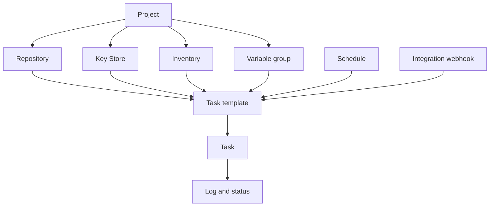

# 핵심 개념

Semaphore의 중심 아이디어는 하나입니다. **태스크 템플릿**이 실행에 필요한 모든 것을
모아 두고, 그것을 실행하면 **태스크**가 만들어집니다. 그 "모든 것"의 각 조각이 어디에서
설정되는지 익히는 것이 이 제품을 배우는 일의 대부분입니다.

## 객체 모델 {#the-object-model}

### 프로젝트가 모든 것을 담는다 {#projects-hold-everything}

[프로젝트](/user-guide/projects)는 격리의 단위입니다. 저장소, 키, 인벤토리, 변수 그룹,
템플릿, 태스크 기록은 정확히 하나의 프로젝트에 속하며, 팀 구성원도 마찬가지입니다.
두 프로젝트는 서버와 그 사용자 외에는 아무것도 공유하지 않습니다. 그래서 프로젝트가
팀, 환경, 고객사를 나누는 올바른 경계가 됩니다.

### 리소스가 입력을 정의한다 {#resources-describe-the-inputs}

동일한 값을 여러 템플릿에서 재사용하고 한곳에서만 변경할 수 있도록, 네 가지 종류의
리소스가 존재합니다.

- [저장소](/user-guide/repositories)는 플레이북이나 스크립트가 있는 곳입니다.
- [키 저장소](/user-guide/key-store)는 저장소와 대상 호스트에 접근하는 데 사용하는 SSH
  키, 로그인 정보, 토큰을 보관합니다.
- [인벤토리](/user-guide/inventory)는 실행 대상 호스트와 그 호스트에 연결하는 방법을
  나열합니다.
- [변수 그룹](/user-guide/environment)은 변수와 시크릿을 실행 환경으로 전달합니다.

### 템플릿이 실행 내용을 정의한다 {#templates-define-the-run}

[태스크 템플릿](/user-guide/task-templates)은 애플리케이션(Ansible, Terraform, 스크립트),
저장소 하나, 그 안의 플레이북이나 진입점, 그리고 사용할 인벤토리, 변수 그룹, 키를
선택합니다. 또한 태스크를 시작하는 사람이 무엇을 바꿀 수 있는지도 결정합니다.
[설문 변수](/user-guide/task-templates/survey-vars)는 템플릿을 입력 양식으로 바꾸고,
[프롬프트](/user-guide/task-templates/prompts)는 사용자가 브랜치, 인벤토리, 추가 인수를
재정의할 수 있게 합니다.

### 태스크가 곧 실행이다 {#tasks-are-the-runs}

템플릿을 시작하면 [태스크](/user-guide/tasks)가 생성됩니다. 태스크는 자체 로그, 상태,
소요 시간, 시작한 사람의 이름을 가지며, 이 기록은 실행이 끝난 뒤에도 남습니다. 태스크는
UI에서, [스케줄](/user-guide/schedules)에서,
[통합 웹훅](/user-guide/integrations)에서, [API](/admin-guide/api)에서, 또는
[워크플로](/user-guide/workflows) 안의 다른 템플릿에서 시작할 수 있습니다.

## 용어 사전 {#glossary}

| 용어 | 의미 |
|---|---|
| **접근 키** | 키 저장소의 항목 하나로, SSH 키, 로그인과 비밀번호, 또는 토큰입니다. 비밀 부분은 데이터베이스에 암호화되어 저장됩니다. |
| **알림** | 태스크가 특정 상태에 도달했을 때 전송되는 통지입니다. 채널은 서버에서 설정한 뒤 프로젝트별, 템플릿별로 활성화합니다. |
| **앱** | 템플릿이 실행하는 도구로, Ansible, Terraform, OpenTofu, Terragrunt, Bash, PowerShell, Python 중 하나입니다. |
| **빌드 템플릿** | 버전이 매겨진 아티팩트를 생성하는 템플릿 유형으로, 실행할 때마다 버전이 올라갑니다. |
| **배포 템플릿** | 빌드 템플릿에 연결된 템플릿 유형으로, 시작할 때 어떤 빌드 버전을 배포할지 묻습니다. |
| **실행기** | 러너가 작업을 실행하는 방식으로, 로컬 프로세스, Docker 컨테이너, Kubernetes Pod 중 하나입니다. |
| **통합** | 외부 시스템이 호출하면 템플릿을 시작하는 인바운드 웹훅입니다. |
| **인벤토리** | 태스크의 대상 호스트로, 정적 텍스트, 저장소의 파일, 또는 동적 인벤토리 스크립트로 지정합니다. |
| **키 저장소** | 프로젝트별 접근 키 모음입니다. |
| **프로젝트** | 최상위 컨테이너로, 리소스, 템플릿, 태스크 기록, 팀 구성원을 담습니다. |
| **역할** | 구성원이 프로젝트 안에서 할 수 있는 일입니다. 기본 제공 역할은 Owner, Manager, Task Runner, Guest입니다. |
| **러너** | 서버가 직접 태스크를 실행하는 대신 서버를 대신해 태스크를 실행하는 별도의 프로세스입니다. |
| **스케줄** | 사람 없이 템플릿을 시작하는 cron 표현식입니다. |
| **시크릿 저장소** | Semaphore 데이터베이스 대신 비밀 값을 보관하는 HashiCorp Vault 같은 외부 시스템입니다. |
| **설문 변수** | 템플릿이 정의하고 사용자가 태스크를 시작할 때 채우는 입력 항목으로, 실행의 변수가 됩니다. |
| **태스크** | 템플릿의 한 번의 실행으로, 로그, 상태, 실행자를 가집니다. |
| **태스크 템플릿** | 무엇을 무엇으로 실행할지에 대한 재사용 가능한 정의입니다. 흔히 그냥 "템플릿"이라고 부릅니다. |
| **변수 그룹** | 실행에 전달되는 이름이 붙은 변수와 시크릿의 모음입니다. 이전 버전과 API에서는 *Environment*라고 부릅니다. |
| **뷰** | 템플릿 목록에서 프로젝트 템플릿의 일부를 묶어 보여 주는 탭입니다. |
| **워크플로** | 분기, 승인, 지연을 포함해 순서대로 실행되는 템플릿의 그래프입니다. Pro 기능입니다. |

## 다음 단계 {#whats-next}

- [시작하기](/getting-started) — 개념을 순서대로 실제로 적용해 보기.
- [사용자 가이드](/user-guide) — 개념마다 한 페이지씩, 모든 항목을 설명합니다.
- [아키텍처](/introduction/architecture) — 서버, 데이터베이스, 러너가 어떻게 맞물리는지.
