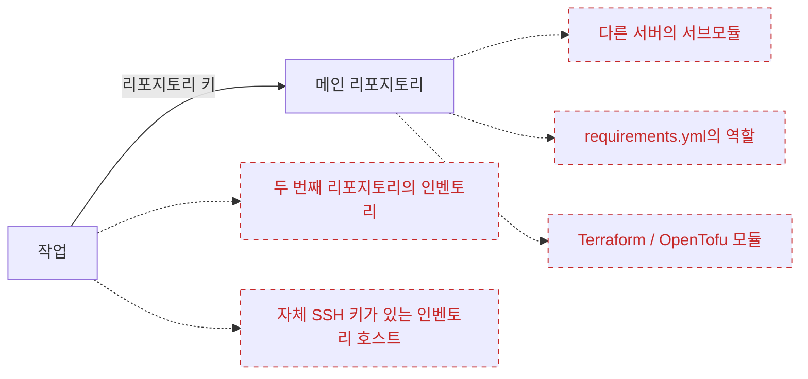
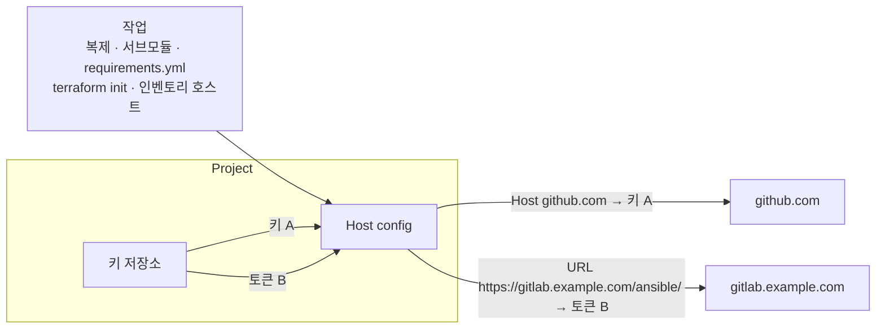

# Host config

## 왜 필요한가 {#why}

[리포지토리](/user-guide/repositories)에는 키가 정확히 하나, 즉 Semaphore가 복제할 때 사용하는 키만 있습니다. 작업에 필요한 모든 것이 그 리포지토리 안에 있는 한 이것으로 충분합니다. 하지만 실제로는 작업이 다른 곳에도 접근하며, 그 각각은 서로 다른 자격 증명을 요구할 수 있습니다:



점선 화살표가 바로 빈틈입니다. 리포지토리 키는 그 서버들에 제공되지 않으므로, 작업이 그곳에 접근하는 즉시 **Permission denied** 또는 **Authentication failed**로 실패합니다. 지금까지의 유일한 해결책은 키 하나에 모든 곳의 접근 권한을 주거나, 자격 증명을 리포지토리 파일에 직접 넣는 것이었습니다.

**Host config**(호스트 설정)는 리포지토리를 건드리지 않고 이 문제를 해결합니다. Semaphore에 *"프로젝트가 이 호스트나 이 URL에 연결할 때마다 [키 저장소](/user-guide/key-store)의 저 자격 증명을 사용하라"*고 알려 주면 됩니다. 매핑은 어디에서 시작되었든 작업의 모든 Git 및 SSH 연결에 적용됩니다.

| 상황 | 리포지토리에 있는 것 | 매핑이 없을 때 | 매핑이 있을 때 |
|---|---|---|---|
| 다른 Git 서버의 **비공개 서브모듈** | `git@gitlab.example.com:infra/common.git`을 가리키는 `.gitmodules` | `git submodule update`가 거부됩니다. 메인 리포지토리의 배포 키가 그곳에는 알려져 있지 않기 때문입니다 | 해당 서버에서 허용된 키를 사용하는 `gitlab.example.com`의 **Host** 매핑 |
| Ansible `requirements.yml`의 **비공개 역할 또는 컬렉션** | `src: https://gitlab.example.com/ansible/role-nginx.git` | `ansible-galaxy install`이 로그인을 요구하고 실패합니다 | GitLab 액세스 토큰을 사용하는 `https://gitlab.example.com/ansible/`의 **URL** 매핑 |
| Git에서 가져오는 **비공개 Terraform / OpenTofu 모듈** | `source = "git::https://github.com/acme/tf-modules.git"` | `terraform init`이 모듈을 내려받지 못합니다 | SSH 키 또는 토큰을 사용하는 `https://github.com/acme/`의 **URL** 매핑 |
| 호스트에 리포지토리와 **다른 SSH 키**가 필요한 **인벤토리** | `db-01.internal`, `db-02.internal`이 있는 인벤토리 | 인벤토리는 키를 하나만 지정할 수 있고, 리포지토리 키는 그 호스트들에 맞지 않습니다 | 호스트 이름마다 **Host** 매핑 하나씩, 또는 호스트들이 공유하는 인벤토리 키로 매핑 하나 |

매핑 하나로 이 모든 경우를 한 번에 처리하며, 템플릿마다 설정할 필요가 없습니다. 프로젝트에 매핑이 없으면 아무것도 바뀌지 않습니다. 작업은 이전과 똑같이 리포지토리의 키를 계속 사용합니다.

## 동작 방식 {#how-it-works}

매핑은 세 부분으로 이루어진 규칙입니다. **무엇**과 일치시킬지(호스트 이름 또는 URL 접두사), 키 저장소의 **어떤** 자격 증명을 사용할지, 그리고 그 밖에는 아무것도 없습니다. Semaphore는 작업의 첫 Git 명령 전에 프로젝트의 매핑을 설치하고 작업이 끝나면 제거합니다. 작업이 여는 모든 연결은, 자체 복제부터 플레이북 안의 `git` 모듈까지, 이 매핑을 거칩니다.



이 페이지는 프로젝트 메뉴의 **Repositories** 아래에 있습니다. 매핑을 추가, 편집, 삭제하려면 키 저장소와 마찬가지로 프로젝트 리소스 관리 권한이 필요합니다.


## 매핑 유형 {#mapping-types}

**Add mapping**(매핑 추가)을 누르고 매핑이 무엇과 일치할지 선택합니다.

### Host {#host}

**Host** 매핑은 `github.com`이나 `gitlab.example.com` 같은 SSH 호스트 이름과 일치하며 **SSH** 키가 필요합니다. 작업이 해당 호스트로 SSH 연결을 열 때마다 매핑된 키로 인증합니다. SSH로 복제하는 리포지토리나 서브모듈, `requirements.yml`의 `git@host:group/repo.git` URL, 그리고 그 이름을 가진 Ansible 인벤토리의 호스트도 여기에 해당합니다. 키에 로그인이 있으면 해당 호스트의 SSH 사용자로 사용됩니다.

<div style={{maxWidth: 720}}>


</div>

### URL {#url}

**URL** 매핑은 `https://` 또는 `http://` 리포지토리 URL과 일치합니다. `https://gitlab.example.com/infra/network.git`처럼 리포지토리 하나를 지정할 수도 있고, `https://gitlab.example.com/ansible/`처럼 `/`로 끝내 그룹 아래의 모든 리포지토리를 포함할 수도 있습니다. 여러 매핑이 일치하면 가장 구체적인 URL이 우선하므로, 리포지토리 하나의 매핑이 그것을 포함하는 그룹의 매핑을 덮어씁니다.

자격 증명에 따라 URL에 접근하는 방식이 결정됩니다:

| 자격 증명 | 동작 |
|---|---|
| **SSH** 키 | URL이 SSH 형식으로 다시 쓰이고 연결이 키로 인증됩니다. 키의 로그인이 SSH 사용자가 되며, 로그인이 없으면 `git`을 사용합니다. |
| **비밀번호 로그인** | 로그인과 비밀번호가 URL에 추가되어 HTTPS로 전송됩니다. 개인 액세스 토큰을 사용하려면 로그인을 비워 두세요. 비밀이 평문으로 전송되지 않도록 `https://` URL만 이 자격 증명을 허용합니다. |

URL에는 자체 자격 증명, 공백, 따옴표, `=` 문자가 들어 있으면 안 됩니다.

<div style={{maxWidth: 720}}>


</div>

## 매핑이 적용되는 곳 {#where-mappings-apply}

프로젝트의 매핑은 작업의 첫 Git 명령 전에 설치되어 작업이 끝날 때까지 유지됩니다. 다음에 적용됩니다:

- 서브모듈을 포함한 템플릿 리포지토리의 복제와 업데이트
- `requirements.yml`에서 설치하는 역할과 컬렉션, [Galaxy 요구 사항](/user-guide/apps/ansible#galaxy-requirements) 참조
- `terraform init` 또는 `tofu init`이 가져오는 모듈
- 플레이북이나 스크립트 자체가 시작하는 Git 명령, 예를 들어 Ansible `git` 모듈
- Git에 저장된 인벤토리의 리포지토리
- **Host** 매핑이 이름과 일치하는 인벤토리의 호스트
- 템플릿 양식에서 리포지토리의 브랜치와 플레이북 탐색, 그리고 새 커밋에 시작되는 스케줄의 폴링

[원격 러너](/admin-guide/runners)로 전송된 작업은 매핑을 작업과 함께 받으므로 그곳에서도 동일하게 동작합니다.

매핑은 서버 전체 SSH 설정([설정](/reference/configuration)의 `ssh.config_path`)에 있는 같은 호스트의 항목을 덮어쓰며, 그 파일의 다른 항목은 계속 동작합니다. 매핑에는 명령줄 Git 클라이언트가 필요하며 이것이 기본값인 `git_client: cmd_git`입니다. 내장 `go_git` 클라이언트를 사용하면 매핑이 있는 프로젝트의 작업은 잘못된 자격 증명을 사용하는 대신 원인을 설명하는 오류와 함께 실패합니다.

## 자격 증명 {#credentials}

개인 키는 디스크에 기록되지 않습니다. 각 SSH 매핑은 작업이 지속되는 동안만 살아 있는 SSH 에이전트에 키를 보관하며, 생성된 SSH 설정에는 에이전트만 지정됩니다. 비밀번호 로그인은 명령줄이 아니라 Git의 설정 환경을 통해 전달되고, Git은 작업 로그에 원래 URL을 기록하므로 비밀이 어디에도 나타나지 않습니다.

매핑이 참조하는 키는 삭제할 수 없으며, 확인 대화 상자에 그 키를 사용하는 매핑이 표시됩니다. 그런 키의 유형을 매핑이 사용할 수 없는 유형으로 바꾸는 것, 예를 들어 Host 매핑의 SSH 키를 비밀번호 로그인으로 바꾸는 것도 거부됩니다.

## 예시 {#example}

플레이북은 GitHub에 있고, 자체 호스팅 GitLab의 서브모듈을 사용하며, `requirements.yml`을 통해 두 번째 GitLab 그룹의 역할을 설치합니다:

```yaml
# requirements.yml
- src: https://gitlab.example.com/ansible/role-nginx.git
  version: v2.1.0
```

매핑 세 개로 리포지토리를 전혀 바꾸지 않고 작업을 실행할 수 있습니다:

| 유형 | 호스트 또는 URL | 자격 증명 |
|---|---|---|
| Host | `github.com` | GitHub 리포지토리의 배포 키 |
| URL | `https://gitlab.example.com/ansible/` | 비밀번호 로그인 형태의 GitLab 액세스 토큰 |
| URL | `https://gitlab.example.com/infra/network.git` | 해당 리포지토리 하나에만 허용된 SSH 키 |

## 백업 {#backups}

매핑은 [프로젝트 백업](./projects/settings#danger-zone)에 포함됩니다. 매핑은 자격 증명을 이름으로 참조하므로 복원된 프로젝트에서도 복원된 키에 연결된 상태를 유지합니다. 다른 모든 키와 마찬가지로 비밀 값 자체는 내보내지지 않습니다.
