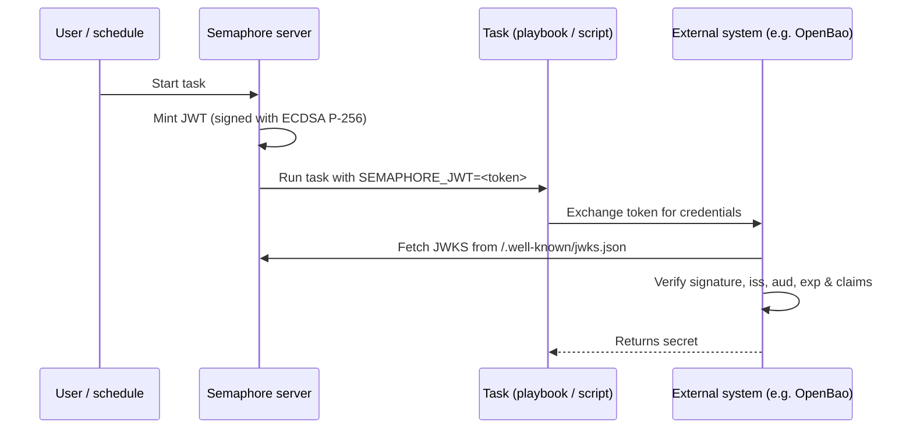

# Emissão de JWT para tarefas

O Semaphore pode emitir um [JSON Web Token (JWT)](https://datatracker.ietf.org/doc/html/rfc7519) de curta duração
para cada execução de tarefa. O token é assinado pelo Semaphore e exposto ao
playbook (ou script shell/Terraform/PowerShell/Python) como a
variável de ambiente `SEMAPHORE_JWT`.

Junto com o [endpoint JWKS](#jwks-endpoint) que o Semaphore publica, o
token permite que sistemas externos autentiquem uma tarefa sem nenhum segredo pré-compartilhado.

Esta página descreve a **configuração do lado do servidor**. Para a configuração
por template e o consumo dentro de uma tarefa, consulte a
[página do guia do usuário sobre JWTs de tarefas](/user-guide/task-templates/jwt).

______________________________________________________________________

## Como funciona {#how-it-works}



A assinatura usa um par de chaves **ECDSA P-256**. A chave privada é gerada no primeiro
uso, criptografada com a mesma chave `access_key_encryption` que protege os outros
segredos e armazenada no banco de dados do Semaphore. A chave pública é disponibilizada por meio
do endpoint JWKS.

______________________________________________________________________

## Configuração {#configuration}

A emissão de JWT está **desabilitada por padrão**. Habilite-a no seu `config.json`:

```json
{
    "jwt": {
        "enabled": true,
        "issuer": "https://semaphore.example.com",
        "default_ttl": "1h",
        "max_ttl": "24h"
    }
}
```

| Opção | Padrão | Descrição |
| ----------------- | ------- | --------------------------------------------------------------------------------------------------------------------------------------- |
| `jwt.enabled` | `false` | Quando `false`, nenhum token é emitido e o endpoint JWKS retorna `404`. |
| `jwt.issuer` | _nenhum_ | Valor emitido na claim `iss`. Defina-o como uma URL estável que identifique a sua instância do Semaphore - os sistemas externos o usam como âncora de confiança. |
| `jwt.default_ttl` | `1h` | Tempo de vida do token usado quando um template não o sobrescreve. Aceita durações no estilo Go (`30m`, `1h`, `90m`, ...). |
| `jwt.max_ttl` | `24h` | Tempo de vida máximo que um token pode ter. Os templates não podem sobrescrever o TTL com um valor maior que este. |

:::tip
A chave de assinatura é criptografada em repouso com a chave
[`access_key_encryption`](/admin-guide/configuration/config-file). Certifique-se
de que essa opção esteja configurada **antes** de habilitar os JWTs. A chave é
gerada na primeira inicialização e não pode ser recriptografada posteriormente.
:::

______________________________________________________________________

## Endpoint JWKS {#jwks-endpoint}

Quando a emissão de JWT está habilitada, o Semaphore expõe sua chave pública de assinatura em:

```
GET /.well-known/jwks.json
```

A resposta segue a [RFC 7517](https://datatracker.ietf.org/doc/html/rfc7517)
e pode ser consumida diretamente pelo verificador de JWT:

```bash
curl https://semaphore.example.com/.well-known/jwks.json
```

```json
{
  "keys": [
    {
      "kty": "EC",
      "crv": "P-256",
      "kid": "...",
      "use": "sig",
      "alg": "ES256",
      "x": "...",
      "y": "..."
    }
  ]
}
```

______________________________________________________________________

## Rotação de chaves {#key-rotation}

A chave de assinatura é criada automaticamente ao iniciar o Semaphore com o recurso de JWT habilitado.
Para rotacioná-la, remova a linha `jwt_signing_key` da
tabela `option` e reinicie o Semaphore.
Um novo par de chaves será criado automaticamente.

Como a rotação invalida todos os tokens emitidos anteriormente, faça isso somente quando
nenhum token existente estiver mais em uso (por exemplo, nenhuma tarefa em execução)
