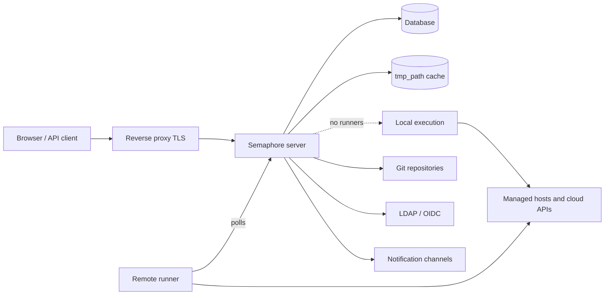

# Arquitetura

Uma instalação do Semaphore tem três partes obrigatórias: um **processo de servidor**, um
**banco de dados** e um **lugar onde as tarefas são executadas**. Todo o resto — runners, Redis,
um proxy reverso, um provedor de identidade — é opcional e adicionado quando surge uma
necessidade específica.

## As partes {#the-parts}

### Servidor {#server}

Um único binário Go. Ele embute a interface web compilada, de modo que um processo serve a
interface, a API REST e um endpoint WebSocket em `/api/ws` que transmite a saída das tarefas para os
navegadores abertos. Por padrão, ele escuta na porta `3000`.

Dentro desse processo, várias coisas rodam ao mesmo tempo:

| Parte | Responsabilidade |
|---|---|
| API HTTP e interface | Tudo o que o navegador e os clientes de API chamam. |
| Pool de tarefas | A fila de tarefas, seus limites de concorrência e seu estado. |
| Agendador | Inicia templates nos seus [agendamentos cron](/user-guide/schedules). |
| Executor local | Executa tarefas no próprio servidor quando nenhum runner remoto as atende. |
| Notificador | Envia [alertas](/admin-guide/notifications) quando as tarefas terminam. |

### Banco de dados {#database}

SQLite, MySQL ou PostgreSQL, escolhido com a opção `dialect`. Ele guarda projetos,
templates, inventários, agendamentos, usuários, papéis, histórico de tarefas e o conteúdo
criptografado do Armazenamento de Chaves. É a única coisa que precisa ter backup: todo o
resto pode ser reconstruído.

O SQLite é o padrão e é adequado para um único servidor. Use PostgreSQL ou MySQL quando
várias pessoas dependerem do serviço, e sempre que você executar mais de um nó.

### Cache de arquivos {#file-cache}

O diretório em `tmp_path` (`/tmp/semaphore` por padrão) guarda os repositórios clonados
e o diretório de trabalho de cada execução. É um cache, não armazenamento: apagá-lo custa
um clone extra por projeto. **Limpar cache**, nas configurações do projeto, faz exatamente isso.

A máquina que executa uma tarefa é a que mantém esse cache — o servidor quando as tarefas rodam
localmente, cada runner quando não.

## Onde as tarefas são executadas {#where-tasks-execute}

Por padrão, o servidor executa as tarefas ele mesmo, no seu próprio sistema de arquivos e com o seu próprio
acesso de rede. Essa é a configuração mais simples e a mais adequada para uma equipe pequena que gerencia
hosts que o servidor já consegue alcançar.

Adicionar [runners](/admin-guide/runners) separa as duas coisas. Um runner é o mesmo binário
iniciado com `semaphore runner start`. Ele não mantém conexão com o banco de dados e não abre nenhuma
porta de entrada: ele consulta o servidor por HTTPS com um token bearer, recebe um job,
clona o repositório, executa a ferramenta e transmite a saída de volta. Os runners permitem que você

- coloque a execução dentro de uma rede que o servidor não consegue alcançar,
- mantenha as credenciais de produção em uma máquina que não serve uma interface web,
- distribua a carga entre várias máquinas e
- (no Pro) direcione uma tarefa a um runner específico com [tags](/admin-guide/runners#runner-tags-pro).

Cada runner escolhe como inicia um job por meio do seu `executor.type`:

| Executor | O job é executado |
|---|---|
| `local` | Como um processo no host do runner, em `tmp_path`. |
| `docker` | Em um contêiner que o runner inicia para aquele job e depois remove. |
| `k8s` | Em um Pod que o runner cria no seu cluster e depois remove. |

### Portas e direções {#ports-and-directions}

Toda conexão é de saída a partir do componente que a inicia, o que é o que torna
os runners utilizáveis através de fronteiras de rede.

| De | Para | Finalidade |
|---|---|---|
| Navegador, cliente de API | Servidor `:3000` | Interface, API REST, WebSocket. |
| Servidor | Banco de dados | Todo o estado persistente. |
| Servidor, runner | Remotos Git | Clonagem de repositórios. |
| Servidor, runner | Hosts gerenciados, APIs de nuvem | A automação em si. |
| Runner | Servidor `:3000` | Consulta por jobs, transmissão da saída. |
| Servidor | LDAP, OIDC, SMTP, webhooks de chat | Login e notificações. |

## Escalando {#scaling-out}

Dois eixos escalam de forma independente.

**Mais execução** significa mais runners. O servidor continua sendo um único processo, e as
tarefas são distribuídas entre os runners que estão conectados.

**Mais disponibilidade** significa mais servidores. Vários nós rodam contra um único banco de dados
PostgreSQL ou MySQL com Redis para bloqueios distribuídos, estado de fila compartilhado e pub/sub,
atrás de um balanceador de carga com suporte a WebSocket. Isso é
[alta disponibilidade](/admin-guide/ha), um recurso Enterprise. O SQLite não pode ser usado
para isso.

## Próximos passos {#whats-next}

- [Conceitos principais](/introduction/concepts) — o vocabulário que a interface usa.
- [Modelo de segurança](/introduction/security-model) — fronteiras de confiança e o que é criptografado.
- [Instalação](/admin-guide/installation) — escolha um método e inicie um servidor.
