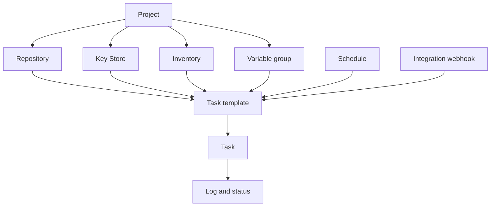

# Conceitos principais

O Semaphore tem uma ideia central: um **template de tarefa** reúne tudo o que uma execução precisa,
e executá-lo produz uma **tarefa**. Aprender onde cada peça desse "tudo"
é configurada já é a maior parte de aprender o produto.

## O modelo de objetos {#the-object-model}

### Os projetos contêm tudo {#projects-hold-everything}

Um [projeto](/user-guide/projects) é a unidade de isolamento. Repositórios, chaves,
inventários, grupos de variáveis, templates e histórico de tarefas pertencem a exatamente um
projeto, e o mesmo vale para a composição da equipe. Dois projetos não compartilham nada além do servidor
e dos seus usuários, o que é o que faz de um projeto a fronteira certa entre equipes,
ambientes ou clientes.

### Os recursos descrevem as entradas {#resources-describe-the-inputs}

Existem quatro tipos de recurso para que o mesmo valor possa ser reutilizado por muitos templates
e alterado em um único lugar:

- Um [repositório](/user-guide/repositories) é onde fica o playbook ou o script.
- O [Armazenamento de Chaves](/user-guide/key-store) guarda as chaves SSH, os logins e os tokens usados
  para alcançar o repositório e os hosts de destino.
- Um [inventário](/user-guide/inventory) lista os hosts que uma execução tem como alvo e como
  se conectar a eles.
- Um [grupo de variáveis](/user-guide/environment) leva variáveis e segredos para o
  ambiente da execução.

### Os templates definem a execução {#templates-define-the-run}

Um [template de tarefa](/user-guide/task-templates) seleciona um aplicativo (Ansible,
Terraform, um script), um repositório, o playbook ou ponto de entrada dentro dele, e o
inventário, o grupo de variáveis e as chaves a usar. Ele também decide o que a pessoa que inicia
a tarefa pode alterar: as [variáveis de survey](/user-guide/task-templates/survey-vars) transformam
um template em um formulário, e os [prompts](/user-guide/task-templates/prompts) permitem que um usuário
substitua a branch, o inventário ou argumentos extras.

### As tarefas são as execuções {#tasks-are-the-runs}

Iniciar um template cria uma [tarefa](/user-guide/tasks). A tarefa tem o seu próprio log,
status, duração e o nome de quem a iniciou, e esse registro permanece depois que
a execução termina. As tarefas começam pela interface, por um
[agendamento](/user-guide/schedules), por um
[webhook de integração](/user-guide/integrations), pela
[API](/admin-guide/api) ou por outro template em um
[workflow](/user-guide/workflows).

## Glossário {#glossary}

| Termo | Significado |
|---|---|
| **Chave de acesso** | Uma entrada do Armazenamento de Chaves: uma chave SSH, um login e senha, ou um token. Sua parte secreta é criptografada no banco de dados. |
| **Alerta** | Uma notificação enviada quando uma tarefa atinge determinado estado. Os canais são configurados no servidor e depois habilitados por projeto e por template. |
| **Aplicativo** | A ferramenta que um template executa: Ansible, Terraform, OpenTofu, Terragrunt, Bash, PowerShell ou Python. |
| **Template de build** | Um tipo de template que produz um artefato versionado; cada execução incrementa a versão. |
| **Template de deploy** | Um tipo de template ligado a um template de build; iniciá-lo pergunta qual versão de build entregar. |
| **Executor** | Como um runner inicia um job: como processo local, em um contêiner Docker ou em um Pod do Kubernetes. |
| **Integração** | Um webhook de entrada que inicia um template quando um sistema externo o chama. |
| **Inventário** | Os hosts que uma tarefa tem como alvo, como texto estático, um arquivo no repositório ou um script de inventário dinâmico. |
| **Armazenamento de Chaves** | A coleção de chaves de acesso de cada projeto. |
| **Projeto** | O contêiner de nível superior: recursos, templates, histórico de tarefas e composição da equipe. |
| **Papel** | O que um membro pode fazer dentro de um projeto. Os papéis integrados são Owner, Manager, Task Runner e Guest. |
| **Runner** | Um processo separado que executa tarefas para o servidor, em vez de o próprio servidor executá-las. |
| **Agendamento** | Uma expressão cron que inicia um template sem a ação de uma pessoa. |
| **Armazenamento de segredos** | Um sistema externo, como o HashiCorp Vault, que guarda valores secretos em vez do banco de dados do Semaphore. |
| **Variável de survey** | Um campo que o template define e que o usuário preenche ao iniciar uma tarefa; ele se torna uma variável da execução. |
| **Tarefa** | Uma única execução de um template, com seu log, status e autor. |
| **Template de tarefa** | A definição reutilizável do que executar e com o quê. Muitas vezes chamado apenas de "template". |
| **Grupo de variáveis** | Um conjunto nomeado de variáveis e segredos passado para a execução. Chamado de *Environment* em versões mais antigas e na API. |
| **View** | Uma aba que agrupa um subconjunto dos templates de um projeto na lista de templates. |
| **Workflow** | Um grafo de templates executados em sequência com ramificações, aprovações e atrasos. Um recurso Pro. |

## Próximos passos {#whats-next}

- [Primeiros passos](/getting-started) — coloque os conceitos em prática na ordem.
- [Guia do Usuário](/user-guide) — uma página por conceito, com todos os campos.
- [Arquitetura](/introduction/architecture) — como o servidor, o banco de dados e os runners se encaixam.
