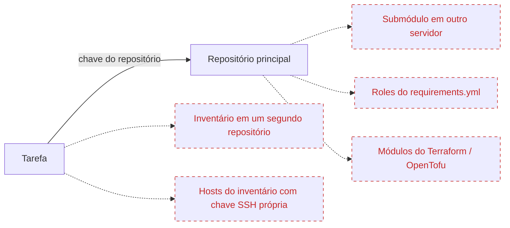
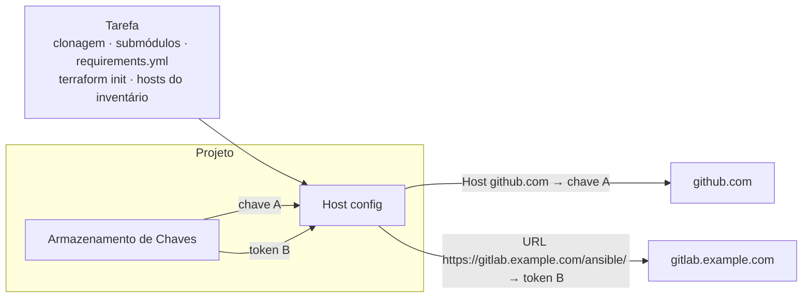

# Configuração de hosts

## Por que você precisa disso {#why}

Um [Repositório](/user-guide/repositories) tem exatamente uma chave: aquela que o Semaphore usa para cloná-lo. Isso basta enquanto tudo o que a tarefa precisa está nesse repositório. Na prática, uma tarefa alcança outros lugares, e cada um deles pode exigir uma credencial diferente:



As setas tracejadas são a lacuna: a chave do repositório não é oferecida a esses servidores, então a tarefa falha com **Permission denied** ou **Authentication failed** assim que os alcança. Até agora, as únicas soluções eram dar a uma única chave acesso a tudo, ou embutir credenciais nos arquivos do repositório.

**Host config** (configuração de hosts) resolve isso sem tocar no repositório. Você diz ao Semaphore *"sempre que o projeto se conectar a este host ou a esta URL, use aquela credencial do [Armazenamento de Chaves](/user-guide/key-store)"*. O mapeamento é aplicado a toda conexão Git e SSH da tarefa, de onde quer que ela seja iniciada.

| Você tem | O que há no repositório | Sem mapeamento | Com mapeamento |
|---|---|---|---|
| Um **submódulo privado** em outro servidor Git | `.gitmodules` apontando para `git@gitlab.example.com:infra/common.git` | `git submodule update` é rejeitado: a deploy key do repositório principal não é conhecida lá | Um mapeamento **Host** para `gitlab.example.com` com a chave permitida nesse servidor |
| **Roles ou collections privadas** no `requirements.yml` do Ansible | `src: https://gitlab.example.com/ansible/role-nginx.git` | `ansible-galaxy install` pede um login e falha | Um mapeamento **URL** para `https://gitlab.example.com/ansible/` com um token de acesso do GitLab |
| **Módulos privados do Terraform / OpenTofu** buscados do Git | `source = "git::https://github.com/acme/tf-modules.git"` | `terraform init` não consegue baixar o módulo | Um mapeamento **URL** para `https://github.com/acme/` com uma chave SSH ou um token |
| Um **inventário** cujos hosts precisam de uma **chave SSH diferente** da do repositório | Um inventário com `db-01.internal`, `db-02.internal` | O inventário só pode nomear uma chave, e a chave do repositório é a errada para esses hosts | Um mapeamento **Host** para cada nome de host, ou um único mapeamento com a chave do inventário para o host que eles compartilham |

Um mapeamento atende a todos esses casos de uma vez; você não os configura por modelo. Quando um projeto não tem mapeamentos, nada muda: as tarefas continuam usando a chave do repositório, exatamente como antes.

## Como funciona {#how-it-works}

Um mapeamento é uma regra com três partes: **o que** corresponder (um nome de host ou um prefixo de URL), **qual** credencial do Armazenamento de Chaves usar, e nada mais. O Semaphore instala os mapeamentos do projeto antes do primeiro comando Git de uma tarefa e os remove quando a tarefa termina. Toda conexão que a tarefa abre, da sua própria clonagem até um módulo `git` dentro de um playbook, passa por eles.



A página fica no menu do projeto, abaixo de **Repositories**. Adicionar, editar e excluir mapeamentos exige a permissão de gerenciar recursos do projeto, a mesma que o Armazenamento de Chaves precisa.


## Tipos de mapeamento {#mapping-types}

Pressione **Add mapping** (adicionar mapeamento) e escolha a que o mapeamento deve corresponder.

### Host {#host}

Um mapeamento **Host** corresponde a um nome de host SSH, por exemplo `github.com` ou `gitlab.example.com`, e precisa de uma chave **SSH**. Sempre que a tarefa abre uma conexão SSH com esse host, ela se autentica com a chave mapeada: um repositório ou submódulo clonado por SSH, uma URL `git@host:group/repo.git` no `requirements.yml` e também os hosts de um inventário do Ansible com esse nome. Quando a chave tem um login, ele é usado como usuário SSH do host.

<div style={{maxWidth: 720}}>


</div>

### URL {#url}

Um mapeamento **URL** corresponde a uma URL de repositório `https://` ou `http://`. Ela pode nomear um único repositório, `https://gitlab.example.com/infra/network.git`, ou terminar com `/` para cobrir todos os repositórios de um grupo, `https://gitlab.example.com/ansible/`. Quando vários mapeamentos correspondem, a URL mais específica vence, então o mapeamento de um repositório sobrepõe o mapeamento do grupo que o contém.

A credencial decide como a URL é alcançada:

| Credencial | O que acontece |
|---|---|
| Chave **SSH** | A URL é reescrita na sua forma SSH e a conexão se autentica com a chave. O login da chave é o usuário SSH, `git` quando a chave não tem nenhum. |
| **Login com Senha** | O login e a senha são adicionados à URL e enviados por HTTPS. Deixe o login vazio para usar um personal access token. Somente uma URL `https://` aceita essa credencial, então o segredo nunca trafega em texto claro. |

A URL não pode conter credenciais próprias, espaços, aspas ou o caractere `=`.

<div style={{maxWidth: 720}}>


</div>

## Onde os mapeamentos se aplicam {#where-mappings-apply}

Os mapeamentos de um projeto são instalados antes do primeiro comando Git de uma tarefa e permanecem em vigor até ela terminar. Eles cobrem:

- a clonagem e a atualização do repositório do modelo, incluindo seus submódulos;
- roles e collections instaladas a partir do `requirements.yml`, veja [Requisitos do Galaxy](/user-guide/apps/ansible#galaxy-requirements);
- módulos buscados por `terraform init` ou `tofu init`;
- comandos Git iniciados pelo próprio playbook ou script, por exemplo o módulo `git` do Ansible;
- o repositório de um inventário armazenado no Git;
- os hosts do inventário, quando um mapeamento **Host** corresponde ao nome deles;
- a navegação por branches e playbooks de um repositório no formulário do modelo e a verificação periódica dos agendamentos que iniciam em um novo commit.

Tarefas enviadas a um [runner remoto](/admin-guide/runners) recebem os mapeamentos junto com a tarefa, então se comportam da mesma forma lá.

Um mapeamento sobrepõe a entrada do mesmo host na configuração SSH global do servidor (`ssh.config_path` na [configuração](/reference/configuration)); todas as outras entradas desse arquivo continuam funcionando. Os mapeamentos precisam do cliente Git de linha de comando, que é o padrão `git_client: cmd_git`; com o cliente embutido `go_git`, uma tarefa de um projeto com mapeamentos falha com um erro explicativo em vez de usar a credencial errada.

## Credenciais {#credentials}

Chaves privadas nunca tocam o disco: cada mapeamento SSH mantém sua chave em um agente SSH que vive enquanto a tarefa durar, e a configuração SSH gerada apenas aponta para o agente. Um Login com Senha é passado ao Git pelo ambiente de configuração dele, não na linha de comando, e o Git reporta a URL original no log da tarefa, então o segredo não aparece em nenhum dos dois.

Uma chave referenciada por um mapeamento não pode ser excluída; a caixa de diálogo de confirmação lista os mapeamentos que a usam. Mudar o tipo de uma chave dessas para um que o mapeamento não pode usar, por exemplo transformar a chave SSH de um mapeamento Host em um Login com Senha, também é rejeitado.

## Exemplo {#example}

Um playbook está no GitHub, usa um submódulo de um GitLab auto-hospedado e instala uma role de um segundo grupo do GitLab por meio do `requirements.yml`:

```yaml
# requirements.yml
- src: https://gitlab.example.com/ansible/role-nginx.git
  version: v2.1.0
```

Três mapeamentos fazem a tarefa rodar sem nenhuma alteração no repositório:

| Tipo | Host ou URL | Credencial |
|---|---|---|
| Host | `github.com` | A deploy key do repositório do GitHub |
| URL | `https://gitlab.example.com/ansible/` | Um token de acesso do GitLab, como Login com Senha |
| URL | `https://gitlab.example.com/infra/network.git` | A chave SSH permitida somente nesse repositório |

## Backups {#backups}

Os mapeamentos fazem parte do [backup do projeto](./projects/settings#danger-zone). Eles referenciam sua credencial pelo nome, então um projeto restaurado os mantém vinculados às chaves restauradas. Como em toda chave, o valor secreto em si não é exportado.
