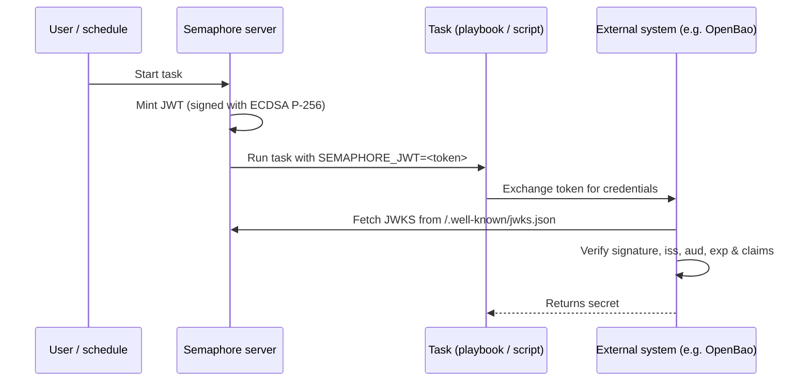

# Выпуск JWT для задач

Semaphore может выпускать краткоживущий [JSON Web Token (JWT)](https://datatracker.ietf.org/doc/html/rfc7519)
для каждого выполнения задачи. Токен подписывается Semaphore и передаётся
playbook’у (или shell/Terraform/PowerShell/Python-скрипту) через переменную
окружения `SEMAPHORE_JWT`.

Вместе с [конечной точкой JWKS](#jwks-endpoint), которую публикует Semaphore,
токен позволяет внешним системам аутентифицировать задачу без какого-либо заранее разделённого секрета.

На этой странице описана **серверная конфигурация**. О настройке на уровне
шаблона и использовании токена внутри задачи см.
[страницу руководства пользователя о JWT для задач](/user-guide/task-templates/jwt).

______________________________________________________________________

## Как это работает {#how-it-works}



Для подписи используется пара ключей **ECDSA P-256**. Закрытый ключ генерируется при первом
использовании, шифруется тем же ключом `access_key_encryption`, который защищает остальные
секреты, и сохраняется в базе данных Semaphore. Открытый ключ публикуется через
конечную точку JWKS.

______________________________________________________________________

## Настройка {#configuration}

Выпуск JWT **по умолчанию отключён**. Включите его в `config.json`:

```json
{
    "jwt": {
        "enabled": true,
        "issuer": "https://semaphore.example.com",
        "default_ttl": "1h",
        "max_ttl": "24h"
    }
}
```

| Параметр | По умолчанию | Описание |
| ----------------- | ------- | --------------------------------------------------------------------------------------------------------------------------------------- |
| `jwt.enabled` | `false` | Если `false`, токены не выпускаются, а конечная точка JWKS возвращает `404`. |
| `jwt.issuer` | _нет_ | Значение, записываемое в claim `iss`. Укажите здесь стабильный URL, идентифицирующий ваш экземпляр Semaphore, — внешние системы используют его как якорь доверия. |
| `jwt.default_ttl` | `1h` | Время жизни токена, если шаблон его не переопределяет. Принимает длительности в формате Go (`30m`, `1h`, `90m`, ...). |
| `jwt.max_ttl` | `24h` | Максимальное время жизни токена. Шаблоны не могут переопределить TTL значением выше этого. |

:::tip
Ключ подписи шифруется при хранении ключом
[`access_key_encryption`](/admin-guide/configuration/config-file). Убедитесь,
что этот параметр настроен **до** включения JWT. Ключ генерируется
при первом запуске и впоследствии не может быть перешифрован.
:::

______________________________________________________________________

## Конечная точка JWKS {#jwks-endpoint}

Когда выпуск JWT включён, Semaphore публикует свой открытый ключ подписи по адресу:

```
GET /.well-known/jwks.json
```

Ответ соответствует [RFC 7517](https://datatracker.ietf.org/doc/html/rfc7517)
и может напрямую использоваться верификатором JWT:

```bash
curl https://semaphore.example.com/.well-known/jwks.json
```

```json
{
  "keys": [
    {
      "kty": "EC",
      "crv": "P-256",
      "kid": "...",
      "use": "sig",
      "alg": "ES256",
      "x": "...",
      "y": "..."
    }
  ]
}
```

______________________________________________________________________

## Ротация ключа {#key-rotation}

Ключ подписи создаётся автоматически при запуске Semaphore с включённой функцией JWT.
Чтобы выполнить ротацию, удалите строку `jwt_signing_key` из
таблицы `option` и перезапустите Semaphore.
Новая пара ключей будет создана автоматически.

Поскольку ротация делает недействительными все ранее выпущенные токены, выполняйте её только тогда,
когда ни один существующий токен больше не используется (например, нет активных выполняющихся задач)
