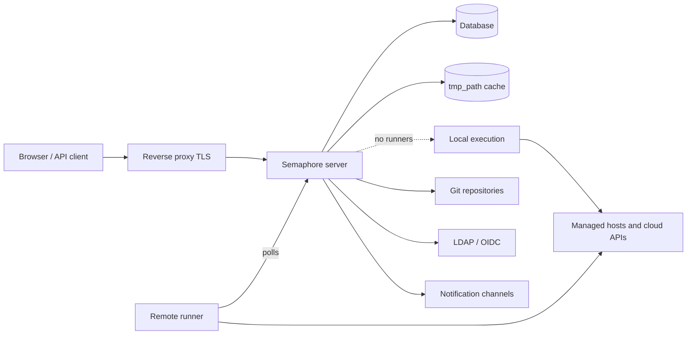

# Архитектура

У установки Semaphore есть три обязательные части: один **серверный процесс**, одна
**база данных** и **место, где выполняются задачи**. Всё остальное — раннеры, Redis,
обратный прокси, провайдер идентификации — необязательно и добавляется, когда
появляется конкретная потребность.

## Составные части {#the-parts}

### Сервер {#server}

Один бинарный файл на Go. В него встроен собранный веб-интерфейс, поэтому один процесс
обслуживает UI, REST API и WebSocket-эндпоинт `/api/ws`, который передаёт вывод задач в
открытые браузеры. По умолчанию он слушает порт `3000`.

Внутри этого процесса одновременно работает несколько подсистем:

| Часть | За что отвечает |
|---|---|
| HTTP API и UI | Всё, к чему обращаются браузер и API-клиенты. |
| Пул задач | Очередь задач, ограничения параллельности и их состояние. |
| Планировщик | Запускает шаблоны по их [cron-расписаниям](/user-guide/schedules). |
| Локальный исполнитель | Выполняет задачи на самом сервере, когда их не берёт удалённый раннер. |
| Нотификатор | Отправляет [оповещения](/admin-guide/notifications) по завершении задач. |

### База данных {#database}

SQLite, MySQL или PostgreSQL — выбирается опцией `dialect`. В ней хранятся проекты,
шаблоны, инвентари, расписания, пользователи, роли, история задач и зашифрованное
содержимое Хранилища ключей. Это единственное, что обязательно резервировать: всё
остальное можно восстановить заново.

SQLite используется по умолчанию и подходит для одного сервера. Выбирайте PostgreSQL или
MySQL, когда от сервиса зависит несколько человек, и обязательно — когда узлов больше
одного.

### Файловый кеш {#file-cache}

Каталог из `tmp_path` (по умолчанию `/tmp/semaphore`) хранит склонированные репозитории и
рабочий каталог каждого запуска. Это кеш, а не хранилище: его удаление стоит одного
дополнительного клонирования на проект. Кнопка **Clear cache** в настройках проекта
делает именно это.

Этот кеш держит та машина, которая выполняет задачу, — сервер, когда задачи выполняются
локально, и каждый раннер, когда нет.

## Где выполняются задачи {#where-tasks-execute}

По умолчанию сервер выполняет задачи сам — в своей файловой системе и со своим сетевым
доступом. Это самая простая схема и правильный выбор для небольшой команды, управляющей
хостами, до которых сервер и так дотягивается.

Добавление [раннеров](/admin-guide/runners) разделяет эти роли. Раннер — это тот же
бинарный файл, запущенный командой `semaphore runner start`. У него нет подключения к
базе данных и он не открывает входящих портов: он опрашивает сервер по HTTPS с
bearer-токеном, получает задание, клонирует репозиторий, запускает инструмент и передаёт
вывод обратно. Раннеры позволяют

- разместить выполнение внутри сети, до которой сервер не дотягивается,
- держать учётные данные для продуктива на машине, которая не обслуживает веб-интерфейс,
- распределить нагрузку между несколькими машинами и
- (в Pro) направить задачу на конкретный раннер с помощью [меток](/admin-guide/runners#runner-tags-pro).

Каждый раннер выбирает способ запуска задания в своей опции `executor.type`:

| Исполнитель | Где выполняется задание |
|---|---|
| `local` | Как процесс на хосте раннера, в `tmp_path`. |
| `docker` | В контейнере, который раннер запускает для этого задания, а затем удаляет. |
| `k8s` | В Pod'е, который раннер создаёт в вашем кластере, а затем удаляет. |

### Порты и направления {#ports-and-directions}

Каждое соединение исходящее — от того компонента, который его инициирует, и именно это
позволяет использовать раннеры через сетевые границы.

| Откуда | Куда | Зачем |
|---|---|---|
| Браузер, API-клиент | Сервер `:3000` | UI, REST API, WebSocket. |
| Сервер | База данных | Всё постоянное состояние. |
| Сервер, раннер | Git-удалённые репозитории | Клонирование репозиториев. |
| Сервер, раннер | Управляемые хосты, облачные API | Собственно автоматизация. |
| Раннер | Сервер `:3000` | Опрос заданий, передача вывода. |
| Сервер | LDAP, OIDC, SMTP, чат-вебхуки | Вход и уведомления. |

## Масштабирование {#scaling-out}

Две оси масштабируются независимо.

**Больше выполнения** — больше раннеров. Сервер остаётся одним процессом, а задачи
распределяются между подключёнными раннерами.

**Больше доступности** — больше серверов. Несколько узлов работают с одной базой данных
PostgreSQL или MySQL и с Redis для распределённых блокировок, общего состояния очереди и
pub/sub, за балансировщиком нагрузки с поддержкой WebSocket. Это
[высокая доступность](/admin-guide/ha), возможность редакции Enterprise. SQLite для неё
использовать нельзя.

## Что дальше {#whats-next}

- [Ключевые понятия](/introduction/concepts) — словарь, которым пользуется интерфейс.
- [Модель безопасности](/introduction/security-model) — границы доверия и что шифруется.
- [Установка](/admin-guide/installation) — выберите способ и запустите сервер.
