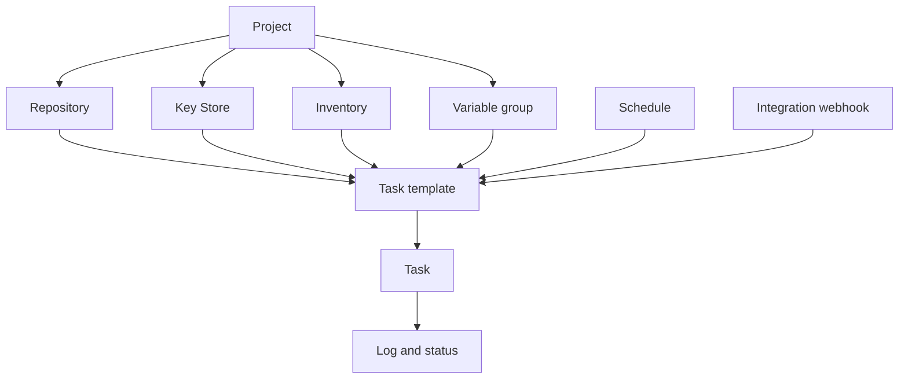

# Ключевые понятия

В основе Semaphore лежит одна главная идея: **шаблон задачи** собирает всё, что нужно
для запуска, а его запуск порождает **задачу**. Понять, где настраивается каждая часть
этого «всего», — значит почти полностью освоить продукт.

## Объектная модель {#the-object-model}

### Проекты содержат всё {#projects-hold-everything}

[Проект](/user-guide/projects) — это единица изоляции. Репозитории, ключи, инвентари,
группы переменных, шаблоны и история задач принадлежат ровно одному проекту, как и
состав команды. Два проекта не разделяют между собой ничего, кроме сервера и его
пользователей, — именно поэтому проект является правильной границей между командами,
средами или заказчиками.

### Ресурсы описывают входные данные {#resources-describe-the-inputs}

Существует четыре вида ресурсов, чтобы одно и то же значение можно было переиспользовать
во многих шаблонах и менять в одном месте:

- [Репозиторий](/user-guide/repositories) — место, где лежит playbook или скрипт.
- [Хранилище ключей](/user-guide/key-store) хранит SSH-ключи, логины и токены, которые
  нужны для доступа к репозиторию и целевым хостам.
- [Инвентарь](/user-guide/inventory) перечисляет хосты, на которые нацелен запуск, и то,
  как к ним подключаться.
- [Группа переменных](/user-guide/environment) передаёт переменные и секреты в окружение
  запуска.

### Шаблоны определяют запуск {#templates-define-the-run}

[Шаблон задачи](/user-guide/task-templates) выбирает приложение (Ansible, Terraform,
скрипт), один репозиторий, playbook или точку входа в нём, а также инвентарь, группу
переменных и ключи. Он же решает, что может изменить человек, запускающий задачу:
[survey-переменные](/user-guide/task-templates/survey-vars) превращают шаблон в форму, а
[prompts](/user-guide/task-templates/prompts) позволяют пользователю переопределить
ветку, инвентарь или дополнительные аргументы.

### Задачи — это запуски {#tasks-are-the-runs}

Запуск шаблона создаёт [задачу](/user-guide/tasks). У задачи есть собственный лог,
статус, длительность и имя того, кто её запустил, и эта запись сохраняется после
завершения запуска. Задачи запускаются из UI, по
[расписанию](/user-guide/schedules), по
[вебхуку интеграции](/user-guide/integrations), через
[API](/reference/api) или из другого шаблона в
[рабочем процессе](/user-guide/workflows).

## Глоссарий {#glossary}

| Термин | Значение |
|---|---|
| **Ключ доступа** | Одна запись в Хранилище ключей: SSH-ключ, логин с паролем или токен. Его секретная часть шифруется в базе данных. |
| **Оповещение** | Уведомление, отправляемое, когда задача достигает определённого состояния. Каналы настраиваются на сервере, а затем включаются для проекта и для шаблона. |
| **Приложение** | Инструмент, который запускает шаблон: Ansible, Terraform, OpenTofu, Terragrunt, Bash, PowerShell или Python. |
| **Шаблон сборки** | Тип шаблона, который создаёт версионированный артефакт; каждый запуск увеличивает версию. |
| **Шаблон развёртывания** | Тип шаблона, связанный с шаблоном сборки; при запуске спрашивает, какую версию сборки доставлять. |
| **Исполнитель** | Способ, которым раннер запускает задание: как локальный процесс, в контейнере Docker или в Pod'е Kubernetes. |
| **Интеграция** | Входящий вебхук, который запускает шаблон, когда его вызывает внешняя система. |
| **Инвентарь** | Хосты, на которые нацелена задача: статический текст, файл в репозитории или скрипт динамического инвентаря. |
| **Хранилище ключей** | Набор ключей доступа в рамках проекта. |
| **Проект** | Контейнер верхнего уровня: ресурсы, шаблоны, история задач и состав команды. |
| **Роль** | То, что участник может делать внутри проекта. Встроенные роли: Owner, Manager, Task Runner и Guest. |
| **Раннер** | Отдельный процесс, который выполняет задачи вместо сервера. |
| **Расписание** | Cron-выражение, запускающее шаблон без участия человека. |
| **Хранилище секретов** | Внешняя система, например HashiCorp Vault, которая хранит секретные значения вместо базы данных Semaphore. |
| **Survey-переменная** | Поле, которое определяет шаблон и заполняет пользователь при запуске задачи; становится переменной запуска. |
| **Задача** | Одно выполнение шаблона с его логом, статусом и автором. |
| **Шаблон задачи** | Переиспользуемое определение того, что и с чем запускать. Часто просто «шаблон». |
| **Группа переменных** | Именованный набор переменных и секретов, передаваемых в запуск. В старых версиях и в API называется *Environment*. |
| **Представление** | Вкладка, которая группирует часть шаблонов проекта в списке шаблонов. |
| **Рабочий процесс** | Граф шаблонов, выполняемых последовательно, с ветвлениями, согласованиями и задержками. Возможность Pro. |

## Что дальше {#whats-next}

- [Начало работы](/getting-started) — примените понятия на практике по порядку.
- [Руководство пользователя](/user-guide) — по странице на каждое понятие, со всеми полями.
- [Архитектура](/introduction/architecture) — как связаны сервер, база данных и раннеры.
