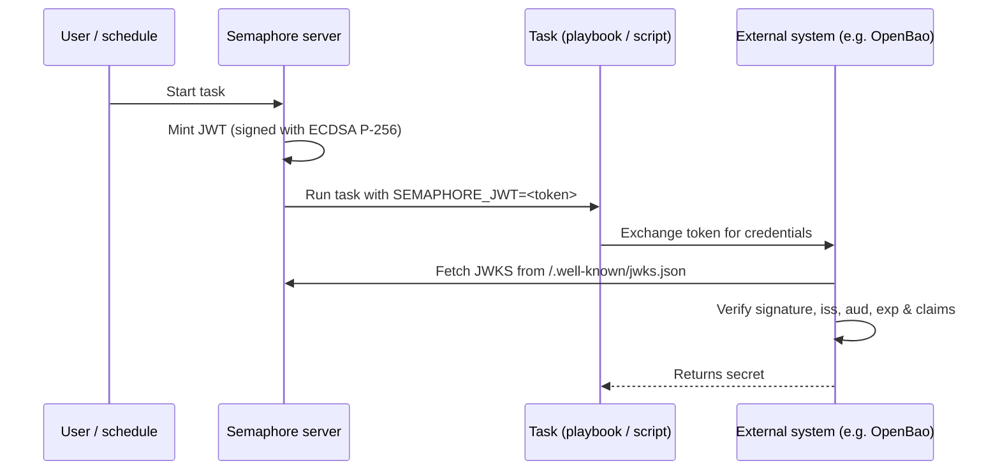

# Izdavanje JWT-a za zadatke

Semaphore može da izda kratkotrajni [JSON Web Token (JWT)](https://datatracker.ietf.org/doc/html/rfc7519)
za svako izvršavanje zadatka (Task). Token potpisuje Semaphore i izlaže ga
playbook-u (ili shell/Terraform/PowerShell/Python skripti) kao promenljivu
okruženja `SEMAPHORE_JWT`.

Zajedno sa [JWKS krajnjom tačkom](#jwks-endpoint) koju Semaphore objavljuje, token
omogućava spoljnim sistemima da autentifikuju zadatak bez unapred podeljene tajne.

Ova stranica opisuje **konfiguraciju na strani servera**. Za konfiguraciju po
šablonu zadatka (Task Template) i korišćenje unutar zadatka pogledajte
[stranicu vodiča za korisnike o JWT-ovima zadataka](/user-guide/task-templates/jwt).

______________________________________________________________________

## Kako radi {#how-it-works}



Za potpisivanje se koristi par ključeva **ECDSA P-256**. Privatni ključ se generiše
pri prvoj upotrebi, šifruje istim ključem `access_key_encryption` koji štiti ostale
tajne i čuva u Semaphore bazi podataka. Javni ključ se objavljuje preko JWKS
krajnje tačke.

______________________________________________________________________

## Konfiguracija {#configuration}

Izdavanje JWT-a je **podrazumevano isključeno**. Uključite ga u svom `config.json`:

```json
{
    "jwt": {
        "enabled": true,
        "issuer": "https://semaphore.example.com",
        "default_ttl": "1h",
        "max_ttl": "24h"
    }
}
```

| Opcija | Podrazumevano | Opis |
| ----------------- | ------- | --------------------------------------------------------------------------------------------------------------------------------------- |
| `jwt.enabled` | `false` | Kada je `false`, tokeni se ne izdaju, a JWKS krajnja tačka vraća `404`. |
| `jwt.issuer` | _nema_ | Vrednost koja se upisuje u `iss` tvrdnju. Postavite je na stabilan URL koji identifikuje vašu Semaphore instancu - spoljni sistemi je koriste kao tačku poverenja. |
| `jwt.default_ttl` | `1h` | Trajanje tokena koje se koristi kada ga šablon ne prepiše. Prihvata trajanja u Go stilu (`30m`, `1h`, `90m`, ...). |
| `jwt.max_ttl` | `24h` | Najduže trajanje koje token može imati. Šabloni ne mogu da prepišu TTL vrednošću većom od ove. |

:::tip
Ključ za potpisivanje je šifrovan u stanju mirovanja ključem
[`access_key_encryption`](/admin-guide/configuration/config-file). Obavezno
konfigurišite ovu opciju **pre** nego što uključite JWT-ove. Ključ se generiše pri
prvom pokretanju i kasnije se ne može ponovo šifrovati.
:::

______________________________________________________________________

## JWKS krajnja tačka {#jwks-endpoint}

Kada je izdavanje JWT-a uključeno, Semaphore izlaže svoj javni ključ za potpisivanje na:

```
GET /.well-known/jwks.json
```

Odgovor prati [RFC 7517](https://datatracker.ietf.org/doc/html/rfc7517)
i JWT verifikator ga može direktno koristiti:

```bash
curl https://semaphore.example.com/.well-known/jwks.json
```

```json
{
  "keys": [
    {
      "kty": "EC",
      "crv": "P-256",
      "kid": "...",
      "use": "sig",
      "alg": "ES256",
      "x": "...",
      "y": "..."
    }
  ]
}
```

______________________________________________________________________

## Rotacija ključa {#key-rotation}

Ključ za potpisivanje se automatski kreira pri pokretanju Semaphore-a sa uključenom JWT funkcijom.
Da biste ga rotirali, uklonite red `jwt_signing_key` iz tabele
`option` i ponovo pokrenite Semaphore.
Novi par ključeva biće automatski kreiran.

Pošto rotacija poništava sve prethodno izdate tokene, uradite to samo kada
nijedan postojeći token više nije u upotrebi (npr. nema aktivnih zadataka koji se izvršavaju)
