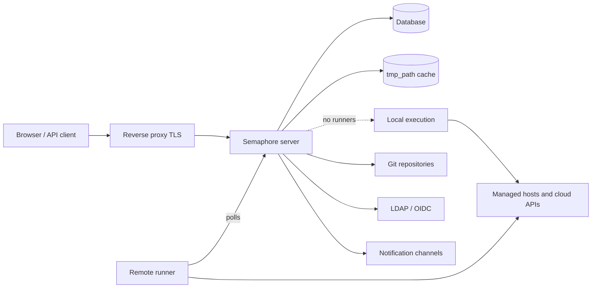

# Arhitektura

Semaphore instalacija ima tri obavezna dela: jedan **serverski proces**, jednu
**bazu podataka** i **mesto na kom se zadaci izvršavaju**. Sve ostalo — runner-i, Redis,
obrnuti proksi, provajder identiteta — opciono je i dodaje se kada se pojavi
konkretna potreba.

## Delovi {#the-parts}

### Server {#server}

Jedna Go binarna datoteka. U sebi sadrži kompajlirani veb interfejs, pa jedan proces opslužuje
korisnički interfejs, REST API i WebSocket endpoint na `/api/ws` koji izlaz zadatka prenosi
otvorenim pregledačima. Podrazumevano sluša na portu `3000`.

Unutar tog procesa istovremeno radi više stvari:

| Deo | Odgovornost |
|---|---|
| HTTP API i korisnički interfejs | Sve što pozivaju pregledač i API klijenti. |
| Skup zadataka (task pool) | Red zadataka, njihova ograničenja konkurentnosti i njihovo stanje. |
| Planer (scheduler) | Pokreće šablone po njihovim [cron rasporedima](/user-guide/schedules). |
| Lokalni izvršilac | Pokreće zadatke na samom serveru kada njima ne upravlja udaljeni runner. |
| Notifikator | Šalje [obaveštenja](/admin-guide/notifications) kada se zadaci završe. |

### Baza podataka {#database}

SQLite, MySQL ili PostgreSQL, odabrani opcijom `dialect`. Čuva projekte,
šablone, inventare, rasporede, korisnike, uloge, istoriju zadataka i šifrovani
sadržaj Skladišta ključeva. To je jedina stvar koja mora da se rezervno kopira: sve
ostalo može ponovo da se izgradi.

SQLite je podrazumevani izbor i pogodan je za jedan server. Koristite PostgreSQL ili MySQL kada
se više ljudi oslanja na servis, i uvek kada pokrećete više od jednog čvora.

### Keš datoteka {#file-cache}

Direktorijum u `tmp_path` (podrazumevano `/tmp/semaphore`) sadrži klonirane repozitorijume
i radni direktorijum svakog pokretanja. To je keš, a ne skladište: njegovo brisanje košta
jedno dodatno kloniranje po projektu. **Clear cache** u podešavanjima projekta radi upravo to.

Ovaj keš čuva mašina koja izvršava zadatak — server kada se zadaci izvršavaju
lokalno, a svaki runner kada nije tako.

## Gde se zadaci izvršavaju {#where-tasks-execute}

Podrazumevano server sam izvršava zadatke, u sopstvenom sistemu datoteka i sa sopstvenim
mrežnim pristupom. To je najjednostavnija postavka i prava je za mali tim koji upravlja
hostovima do kojih server već može da dopre.

Dodavanje [runner-a](/admin-guide/runners) razdvaja to dvoje. Runner je ista binarna datoteka
pokrenuta komandom `semaphore runner start`. Ne drži konekciju ka bazi podataka i ne otvara nijedan
dolazni port: anketira server preko HTTPS-a pomoću bearer tokena, prima posao,
klonira repozitorijum, pokreće alat i vraća izlaz nazad u toku. Runner-i vam omogućavaju da

- smestite izvršavanje unutar mreže do koje server ne može da dopre,
- držite kredencijale za produkciju na mašini koja ne opslužuje veb interfejs,
- raspodelite opterećenje na više mašina i
- (u Pro izdanju) usmerite zadatak na određeni runner pomoću [oznaka](/admin-guide/runners#runner-tags-pro).

Svaki runner bira način pokretanja posla pomoću svog `executor.type`:

| Izvršilac | Posao se izvršava |
|---|---|
| `local` | Kao proces na hostu runner-a, u `tmp_path`. |
| `docker` | U kontejneru koji runner pokrene za taj posao, a zatim ukloni. |
| `k8s` | U Pod-u koji runner kreira u vašem klasteru, a zatim ukloni. |

### Portovi i smerovi {#ports-and-directions}

Svaka konekcija je odlazna iz komponente koja je započinje, što runner-e čini
upotrebljivim preko granica mreže.

| Od | Do | Svrha |
|---|---|---|
| Pregledač, API klijent | Server `:3000` | Korisnički interfejs, REST API, WebSocket. |
| Server | Baza podataka | Celokupno trajno stanje. |
| Server, runner | Git remote repozitorijumi | Kloniranje repozitorijuma. |
| Server, runner | Hostovi kojima se upravlja, cloud API-ji | Sama automatizacija. |
| Runner | Server `:3000` | Anketiranje za poslove, prenos izlaza. |
| Server | LDAP, OIDC, SMTP, chat webhook-ovi | Prijava i obaveštenja. |

## Skaliranje {#scaling-out}

Dve ose se skaliraju nezavisno.

**Više izvršavanja** znači više runner-a. Server ostaje jedan proces, a
zadaci se raspodeljuju na runner-e koji su povezani.

**Više dostupnosti** znači više servera. Nekoliko čvorova radi nad jednom PostgreSQL
ili MySQL bazom podataka uz Redis za distribuirane brave, deljeno stanje reda i pub/sub,
iza balansera opterećenja koji podržava WebSocket. To je
[visoka dostupnost](/admin-guide/ha), Enterprise funkcionalnost. SQLite se za nju
ne može koristiti.

## Šta sledi {#whats-next}

- [Osnovni pojmovi](/introduction/concepts) — pojmovi koje interfejs koristi.
- [Bezbednosni model](/introduction/security-model) — granice poverenja i šta je šifrovano.
- [Instalacija](/admin-guide/installation) — izaberite metod i pokrenite server.
