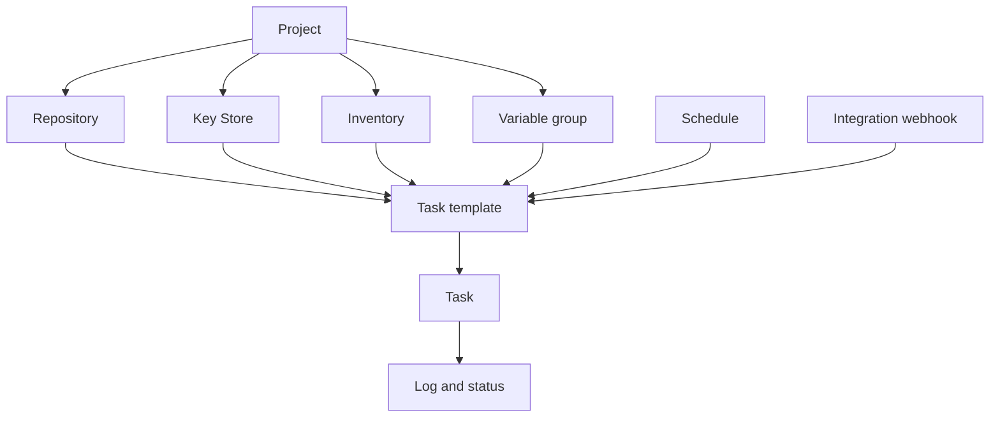

# Osnovni pojmovi

Semaphore ima jednu centralnu ideju: **šablon zadatka** okuplja sve što je pokretanju potrebno,
a njegovo pokretanje proizvodi **zadatak**. Naučiti gde se svaki deo tog „svega”
podešava predstavlja najveći deo učenja ovog proizvoda.

## Model objekata {#the-object-model}

### Projekti sadrže sve {#projects-hold-everything}

[Projekat](/user-guide/projects) je jedinica izolacije. Repozitorijumi, ključevi,
inventari, grupe promenljivih, šabloni i istorija zadataka pripadaju tačno jednom
projektu, a isto važi i za članstvo u timu. Dva projekta ne dele ništa osim servera
i njegovih korisnika, što projekat čini pravom granicom između timova,
okruženja ili klijenata.

### Resursi opisuju ulaze {#resources-describe-the-inputs}

Postoje četiri vrste resursa kako bi ista vrednost mogla da se ponovo koristi u više šablona
i menja na jednom mestu:

- [Repozitorijum](/user-guide/repositories) je mesto gde se nalazi playbook ili skripta.
- [Skladište ključeva](/user-guide/key-store) sadrži SSH ključeve, prijave i tokene koji se koriste
  za pristup repozitorijumu i ciljnim hostovima.
- [Inventar](/user-guide/inventory) navodi hostove na koje pokretanje cilja i kako da
  se poveže sa njima.
- [Grupa promenljivih](/user-guide/environment) unosi promenljive i tajne u
  okruženje pokretanja.

### Šabloni definišu pokretanje {#templates-define-the-run}

[Šablon zadatka](/user-guide/task-templates) bira aplikaciju (Ansible,
Terraform, skriptu), jedan repozitorijum, playbook ili ulaznu tačku unutar njega, kao i
inventar, grupu promenljivih i ključeve koji će se koristiti. On takođe određuje šta osoba koja pokreće
zadatak sme da promeni: [survey promenljive](/user-guide/task-templates/survey-vars) pretvaraju
šablon u formular, a [upiti](/user-guide/task-templates/prompts) omogućavaju korisniku
da zameni granu, inventar ili dodatne argumente.

### Zadaci su pokretanja {#tasks-are-the-runs}

Pokretanje šablona kreira [zadatak](/user-guide/tasks). Zadatak ima sopstveni log,
status, trajanje i ime onoga ko ga je pokrenuo, a taj zapis ostaje i nakon
završetka pokretanja. Zadaci se pokreću iz korisničkog interfejsa, iz
[rasporeda](/user-guide/schedules), iz
[integracionog webhook-a](/user-guide/integrations), iz
[API-ja](/reference/api) ili iz drugog šablona u okviru
[toka rada](/user-guide/workflows).

## Rečnik pojmova {#glossary}

| Pojam | Značenje |
|---|---|
| **Pristupni ključ** (Access key) | Jedan unos u Skladištu ključeva: SSH ključ, prijava sa lozinkom ili token. Njegov tajni deo je šifrovan u bazi podataka. |
| **Obaveštenje** (Alert) | Obaveštenje koje se šalje kada zadatak dostigne određeno stanje. Kanali se konfigurišu na serveru, a zatim se uključuju po projektu i po šablonu. |
| **Aplikacija** (App) | Alat koji šablon pokreće: Ansible, Terraform, OpenTofu, Terragrunt, Bash, PowerShell ili Python. |
| **Build šablon** | Tip šablona koji proizvodi verzionisani artefakt; svako pokretanje uvećava verziju. |
| **Deploy šablon** | Tip šablona povezan sa build šablonom; njegovo pokretanje pita koju verziju build-a treba isporučiti. |
| **Izvršilac** (Executor) | Način na koji runner pokreće posao: kao lokalni proces, u Docker kontejneru ili u Kubernetes Pod-u. |
| **Integracija** (Integration) | Dolazni webhook koji pokreće šablon kada ga pozove spoljni sistem. |
| **Inventar** (Inventory) | Hostovi na koje zadatak cilja, kao statični tekst, datoteka u repozitorijumu ili skripta dinamičkog inventara. |
| **Skladište ključeva** (Key Store) | Skup pristupnih ključeva na nivou projekta. |
| **Projekat** (Project) | Kontejner najvišeg nivoa: resursi, šabloni, istorija zadataka i članstvo u timu. |
| **Uloga** (Role) | Šta član sme da radi unutar projekta. Ugrađene uloge su Owner, Manager, Task Runner i Guest. |
| **Runner** | Poseban proces koji izvršava zadatke umesto servera, koji ih tada ne izvršava sam. |
| **Raspored** (Schedule) | Cron izraz koji pokreće šablon bez učešća osobe. |
| **Skladište tajni** (Secret storage) | Spoljni sistem kao što je HashiCorp Vault koji čuva tajne vrednosti umesto Semaphore baze podataka. |
| **Survey promenljiva** (Survey variable) | Polje koje šablon definiše, a korisnik popunjava pri pokretanju zadatka; ono postaje promenljiva za to pokretanje. |
| **Zadatak** (Task) | Jedno izvršavanje šablona, sa svojim logom, statusom i autorom. |
| **Šablon zadatka** (Task template) | Definicija za ponovnu upotrebu koja opisuje šta se pokreće i sa čime. Često samo „šablon”. |
| **Grupa promenljivih** (Variable group) | Imenovani skup promenljivih i tajni koji se prosleđuje pokretanju. U starijim verzijama i u API-ju se zove *Environment*. |
| **Prikaz** (View) | Kartica koja u listi šablona grupiše podskup šablona jednog projekta. |
| **Tok rada** (Workflow) | Graf šablona koji se pokreću u nizu sa grananjem, odobrenjima i odlaganjima. Pro funkcionalnost. |

## Šta sledi {#whats-next}

- [Prvi koraci](/getting-started) — primenite pojmove redom u praksi.
- [Korisničko uputstvo](/user-guide) — jedna stranica po pojmu, sa svim poljima.
- [Arhitektura](/introduction/architecture) — kako se server, baza podataka i runner-i uklapaju.
