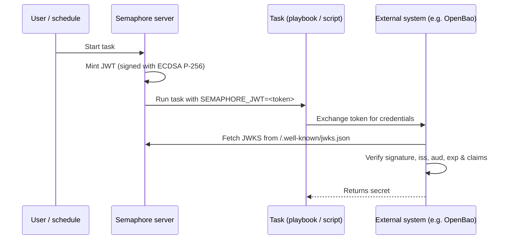

# 任务 JWT 签发

Semaphore 可以为每次任务（Task）执行签发一个短期有效的
[JSON Web Token（JWT）](https://datatracker.ietf.org/doc/html/rfc7519)。
该令牌由 Semaphore 签名，并通过 `SEMAPHORE_JWT` 环境变量暴露给
playbook（或 Shell/Terraform/PowerShell/Python 脚本）。

结合 Semaphore 发布的 [JWKS 端点](#jwks-endpoint)，该令牌让外部系统无需任何预共享密钥
即可对任务进行身份验证。

本页描述的是**服务器端配置**。关于按模板进行的配置以及在任务内部如何使用，请参阅
[用户指南中的任务 JWT 页面](/user-guide/task-templates/jwt)。

______________________________________________________________________

## 工作原理 {#how-it-works}



签名使用 **ECDSA P-256** 密钥对。私钥在首次使用时生成，使用与保护其他机密数据相同的
`access_key_encryption` 密钥加密，并存储在 Semaphore 数据库中。公钥通过 JWKS 端点对外提供。

______________________________________________________________________

## 配置 {#configuration}

JWT 签发**默认禁用**。在 `config.json` 中启用它：

```json
{
    "jwt": {
        "enabled": true,
        "issuer": "https://semaphore.example.com",
        "default_ttl": "1h",
        "max_ttl": "24h"
    }
}
```

| 选项 | 默认值 | 说明 |
| ----------------- | ------- | --------------------------------------------------------------------------------------------------------------------------------------- |
| `jwt.enabled` | `false` | 为 `false` 时，不签发任何令牌，且 JWKS 端点返回 `404`。 |
| `jwt.issuer` | _无_ | 写入 `iss` 声明的值。请将其设置为一个能标识您的 Semaphore 实例的稳定 URL——外部系统将其用作信任锚。 |
| `jwt.default_ttl` | `1h` | 模板未覆盖时使用的令牌有效期。接受 Go 风格的时长（`30m`、`1h`、`90m` 等）。 |
| `jwt.max_ttl` | `24h` | 令牌可拥有的最长有效期。模板无法将 TTL 覆盖为高于此值。 |

:::tip
签名密钥使用 [`access_key_encryption`](/admin-guide/configuration/config-file)
密钥静态加密。请确保在启用 JWT **之前**已配置该选项。密钥在首次启动时生成，
之后无法重新加密。
:::

______________________________________________________________________

## JWKS 端点 {#jwks-endpoint}

启用 JWT 签发后，Semaphore 会在以下地址公开其签名公钥：

```
GET /.well-known/jwks.json
```

响应遵循 [RFC 7517](https://datatracker.ietf.org/doc/html/rfc7517)，
可直接供 JWT 验证器使用：

```bash
curl https://semaphore.example.com/.well-known/jwks.json
```

```json
{
  "keys": [
    {
      "kty": "EC",
      "crv": "P-256",
      "kid": "...",
      "use": "sig",
      "alg": "ES256",
      "x": "...",
      "y": "..."
    }
  ]
}
```

______________________________________________________________________

## 密钥轮换 {#key-rotation}

在启用 JWT 功能的情况下启动 Semaphore 时，签名密钥会自动创建。
要轮换它，请从 `option` 表中删除 `jwt_signing_key` 行，然后重启 Semaphore。
系统会自动创建一个新的密钥对。

由于轮换会使之前签发的所有令牌失效，请仅在没有任何现有令牌仍在使用时
（例如没有正在运行的任务）执行此操作。
