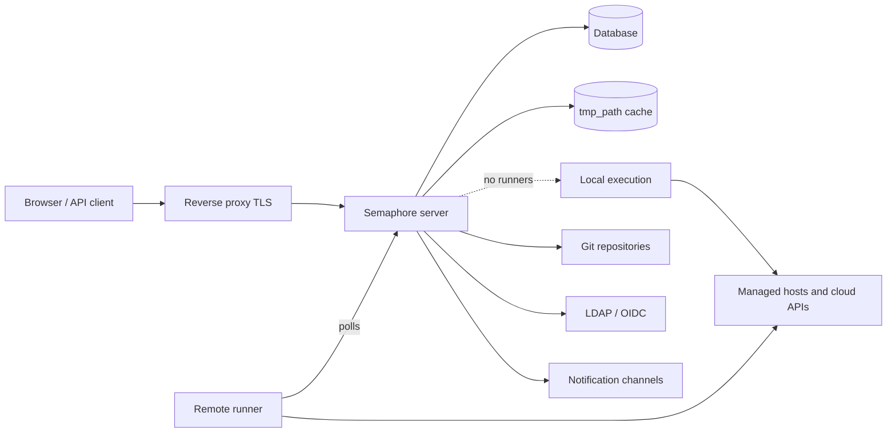

# 架构

一套 Semaphore 部署有三个必需的部分：一个**服务器进程**、一个**数据库**，
以及**任务执行的地方**。其余的一切——运行器、Redis、反向代理、身份提供方——
都是可选的，只在出现特定需求时才加入。

## 组成部分 {#the-parts}

### 服务器 {#server}

一个单独的 Go 二进制文件。它内嵌了编译好的 Web 界面，因此一个进程同时提供
UI、REST API，以及位于 `/api/ws` 的 WebSocket 端点，用于把任务输出推送到已打开的浏览器。
它默认监听 `3000` 端口。

在这个进程内部同时运行着若干部分：

| 部分 | 职责 |
|---|---|
| HTTP API 与 UI | 浏览器和 API 客户端调用的一切。 |
| 任务池 | 任务队列、并发限制及其状态。 |
| 调度器 | 按[定时计划](/user-guide/schedules)启动模板。 |
| 本地执行器 | 当没有远程运行器接管时，在服务器本身上运行任务。 |
| 通知器 | 任务结束时发送[告警](/admin-guide/notifications)。 |

### 数据库 {#database}

SQLite、MySQL 或 PostgreSQL，通过 `dialect` 选项选择。它保存项目、模板、清单、
定时计划、用户、角色、任务历史，以及密钥库的加密内容。它是唯一必须备份的东西：
其余一切都可以重建。

SQLite 是默认选项，适合单台服务器。当有多个人依赖该服务时请使用 PostgreSQL 或 MySQL，
运行多于一个节点时则必须使用它们。

### 文件缓存 {#file-cache}

`tmp_path` 指向的目录（默认为 `/tmp/semaphore`）保存克隆下来的仓库和每次运行的工作目录。
它是缓存，不是存储：删除它的代价只是每个项目多克隆一次。项目设置中的**清除缓存**
做的正是这件事。

执行任务的那台机器会保留这份缓存——任务在本地运行时是服务器，否则就是各个运行器。

## 任务在哪里执行 {#where-tasks-execute}

默认情况下，服务器自己执行任务，使用它自己的文件系统和自己的网络访问权限。
这是最简单的部署方式，也适合管理服务器本来就能访问的主机的小团队。

加入[运行器](/admin-guide/runners)可以把两者分开。运行器就是同一个二进制文件，
以 `semaphore runner start` 启动。它不持有数据库连接，也不开放入站端口：
它通过 HTTPS 使用 bearer token 轮询服务器，接收作业、克隆仓库、运行工具，
并把输出流式传回。运行器让你可以

- 把执行放在服务器无法访问的网络内部，
- 把生产环境的凭据保存在不提供 Web 界面的机器上，
- 把负载分散到多台机器上，以及
- （在 Pro 中）用[标签](/admin-guide/runners#runner-tags-pro)把任务路由到特定的运行器。

每个运行器通过其 `executor.type` 决定如何启动作业：

| 执行器 | 作业的运行方式 |
|---|---|
| `local` | 作为运行器主机上的一个进程，在 `tmp_path` 中运行。 |
| `docker` | 在运行器为该作业启动的容器中运行，随后删除容器。 |
| `k8s` | 在运行器于你的集群中创建的 Pod 中运行，随后删除该 Pod。 |

### 端口与连接方向 {#ports-and-directions}

每条连接都由发起它的组件向外发出，正是这一点让运行器可以跨网络边界使用。

| 从 | 到 | 用途 |
|---|---|---|
| 浏览器、API 客户端 | 服务器 `:3000` | UI、REST API、WebSocket。 |
| 服务器 | 数据库 | 所有持久化状态。 |
| 服务器、运行器 | Git 远程仓库 | 克隆仓库。 |
| 服务器、运行器 | 被管理主机、云 API | 实际的自动化操作。 |
| 运行器 | 服务器 `:3000` | 轮询作业、流式传输输出。 |
| 服务器 | LDAP、OIDC、SMTP、聊天 Webhook | 登录与通知。 |

## 横向扩展 {#scaling-out}

有两个可以独立扩展的维度。

**更多执行能力**意味着更多运行器。服务器仍然是单个进程，
任务会分发到已连接的各个运行器上。

**更高可用性**意味着更多服务器。多个节点连接同一个 PostgreSQL 或 MySQL 数据库，
并使用 Redis 提供分布式锁、共享队列状态和发布/订阅，前面是一个支持 WebSocket 的负载均衡器。
这就是[高可用](/admin-guide/ha)，属于 Enterprise 功能。SQLite 无法用于此场景。

## 下一步 {#whats-next}

- [核心概念](/introduction/concepts) —— 界面使用的术语。
- [安全模型](/introduction/security-model) —— 信任边界以及哪些内容被加密。
- [安装](/admin-guide/installation) —— 选择一种方式并启动服务器。
