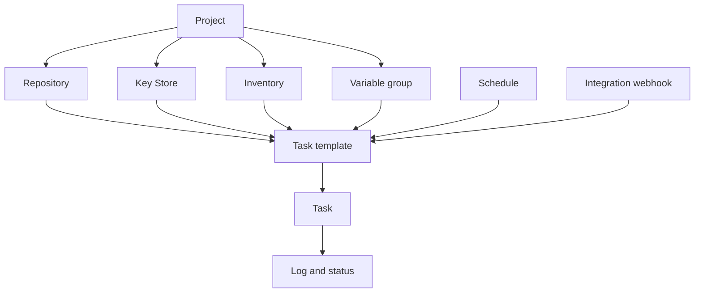

# 核心概念

Semaphore 只有一个核心思想：**任务模板**汇集了一次运行所需的一切，
运行它则产生一个**任务**。学会这"一切"中的每个部分在哪里配置，
基本上就学会了这个产品。

## 对象模型 {#the-object-model}

### 项目承载一切 {#projects-hold-everything}

[项目](/user-guide/projects)是隔离的单位。仓库、密钥、清单、变量组、模板和任务历史
都只属于某一个项目，团队成员关系也是如此。两个项目之间除了服务器及其用户之外不共享任何东西，
正因如此，项目才是团队、环境或客户之间恰当的边界。

### 资源描述输入 {#resources-describe-the-inputs}

存在四类资源，使得同一个值可以被多个模板复用，并且只需在一个地方修改：

- [仓库](/user-guide/repositories)是 playbook 或脚本所在的位置。
- [密钥库](/user-guide/key-store)保存用于访问仓库和目标主机的 SSH 密钥、登录信息和令牌。
- [清单](/user-guide/inventory)列出一次运行的目标主机以及如何连接它们。
- [变量组](/user-guide/environment)把变量和密钥带入运行的环境中。

### 模板定义运行内容 {#templates-define-the-run}

[任务模板](/user-guide/task-templates)选择一种应用（Ansible、Terraform、脚本）、
一个仓库、仓库内的 playbook 或入口点，以及要使用的清单、变量组和密钥。
它还决定启动任务的人可以修改什么：[调查变量](/user-guide/task-templates/survey-vars)
把模板变成一张表单，而[提示](/user-guide/task-templates/prompts)让用户可以覆盖分支、
清单或额外参数。

### 任务就是运行本身 {#tasks-are-the-runs}

启动一个模板会创建一个[任务](/user-guide/tasks)。任务拥有自己的日志、
状态、时长以及启动者的名字，这条记录在运行结束后依然保留。任务可以从 UI、
从[定时计划](/user-guide/schedules)、从
[集成 Webhook](/user-guide/integrations)、从
[API](/reference/api)，或者从[工作流](/user-guide/workflows)中的另一个模板启动。

## 词汇表 {#glossary}

| 术语 | 含义 |
|---|---|
| **访问密钥** | 密钥库中的一条记录：一个 SSH 密钥、一组登录名和密码，或一个令牌。它的密文部分在数据库中是加密的。 |
| **告警** | 任务达到某种状态时发送的通知。渠道在服务器上配置，然后按项目和按模板启用。 |
| **应用** | 模板运行的工具：Ansible、Terraform、OpenTofu、Terragrunt、Bash、PowerShell 或 Python。 |
| **构建模板** | 一种模板类型，产生带版本的产物；每次运行都会递增版本号。 |
| **部署模板** | 一种与构建模板关联的模板类型；启动它时会询问要发布哪个构建版本。 |
| **执行器** | 运行器启动作业的方式：作为本地进程、在 Docker 容器中，或在 Kubernetes Pod 中。 |
| **集成** | 一个入站 Webhook，当外部系统调用它时启动某个模板。 |
| **清单** | 任务的目标主机，形式可以是静态文本、仓库中的文件，或动态清单脚本。 |
| **密钥库** | 每个项目各自的访问密钥集合。 |
| **项目** | 顶层容器：资源、模板、任务历史和团队成员关系。 |
| **角色** | 成员在项目内可以做什么。内置角色为 Owner、Manager、Task Runner 和 Guest。 |
| **运行器** | 一个独立的进程，代替服务器为其执行任务。 |
| **定时计划** | 一个 cron 表达式，无需人工即可启动模板。 |
| **密钥存储** | 诸如 HashiCorp Vault 这样的外部系统，用来保存密文值，而不是存放在 Semaphore 数据库中。 |
| **调查变量** | 由模板定义、由用户在启动任务时填写的字段；它会成为本次运行的一个变量。 |
| **任务** | 模板的一次执行，带有日志、状态和发起人。 |
| **任务模板** | 关于运行什么、用什么运行的可复用定义。通常简称为"模板"。 |
| **变量组** | 传入运行过程的一组具名变量和密钥。在旧版本和 API 中称为 *Environment*。 |
| **视图** | 模板列表中的一个标签页，用于对项目中的部分模板进行分组。 |
| **工作流** | 由多个模板按顺序运行组成的图，支持分支、审批和延迟。属于 Pro 功能。 |

## 下一步 {#whats-next}

- [快速上手](/getting-started) —— 按顺序把这些概念用起来。
- [用户指南](/user-guide) —— 每个概念一页，涵盖所有字段。
- [架构](/introduction/architecture) —— 服务器、数据库和运行器如何组合在一起。
