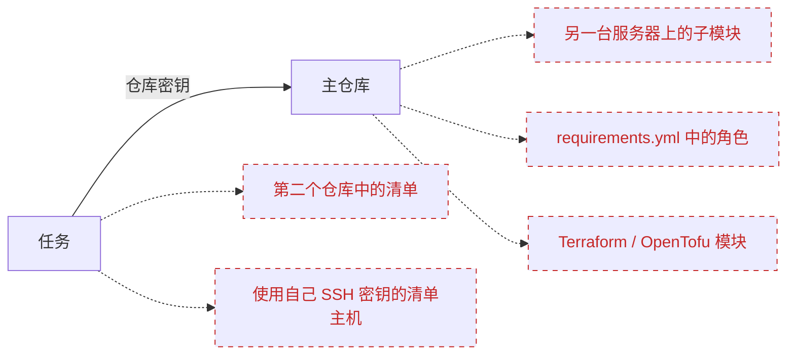
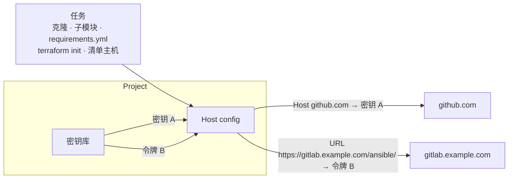

# Host config

## 为什么需要它 {#why}

一个[仓库](/user-guide/repositories)只有一个密钥：Semaphore 用来克隆它的那个。只要任务所需的一切都在该仓库中，这就足够了。但实际上，任务还会访问其他地方，而每个地方可能需要不同的凭据：



虚线箭头就是那个空缺：仓库密钥不会提供给这些服务器，因此任务一旦触及它们，就会因 **Permission denied** 或 **Authentication failed** 而失败。在此之前，唯一的变通办法是让一个密钥在所有地方都拥有访问权限，或者把凭据写死在仓库的文件里。

**Host config**（主机配置）无需改动仓库即可解决这个问题。你告诉 Semaphore *"每当项目连接到这个主机或这个 URL 时，就使用[密钥库](/user-guide/key-store)中的那个凭据"*。该映射会应用于任务的每一次 Git 和 SSH 连接，无论它从何处发起。

| 你有 | 仓库中的内容 | 没有映射时 | 有映射时 |
|---|---|---|---|
| 另一台 Git 服务器上的**私有子模块** | 指向 `git@gitlab.example.com:infra/common.git` 的 `.gitmodules` | `git submodule update` 被拒绝：主仓库的部署密钥在那里不被识别 | 为 `gitlab.example.com` 添加一条 **Host** 映射，使用在该服务器上被允许的密钥 |
| Ansible `requirements.yml` 中的**私有角色或集合** | `src: https://gitlab.example.com/ansible/role-nginx.git` | `ansible-galaxy install` 要求登录并失败 | 为 `https://gitlab.example.com/ansible/` 添加一条 **URL** 映射，使用 GitLab 访问令牌 |
| 从 Git 获取的**私有 Terraform / OpenTofu 模块** | `source = "git::https://github.com/acme/tf-modules.git"` | `terraform init` 无法下载模块 | 为 `https://github.com/acme/` 添加一条 **URL** 映射，使用 SSH 密钥或令牌 |
| 一个**清单**，其主机需要与仓库**不同的 SSH 密钥** | 包含 `db-01.internal`、`db-02.internal` 的清单 | 清单只能指定一个密钥，而仓库密钥对这些主机来说是错误的 | 为每个主机名添加一条 **Host** 映射，或为它们共用的主机添加一条使用清单密钥的映射 |

一条映射同时服务于以上所有场景；你无需按模板逐一配置。当项目没有任何映射时，一切照旧：任务继续使用仓库的密钥，与之前完全相同。

## 工作原理 {#how-it-works}

一条映射是一条由三部分组成的规则：**匹配什么**（主机名或 URL 前缀）、**使用密钥库中的哪个**凭据，仅此而已。Semaphore 在任务的第一条 Git 命令之前安装项目的映射，并在任务结束时将其移除。任务打开的每一个连接，从它自己的克隆到 playbook 内部的 `git` 模块，都会经过这些映射。



该页面位于项目菜单中的 **Repositories** 下方。添加、编辑和删除映射需要管理项目资源的权限，与密钥库所需的权限相同。


## 映射类型 {#mapping-types}

点击 **Add mapping**（添加映射），选择映射匹配的对象。

### Host {#host}

**Host** 映射匹配一个 SSH 主机名，例如 `github.com` 或 `gitlab.example.com`，并且需要一个 **SSH** 密钥。任务每次打开到该主机的 SSH 连接时，都会使用映射的密钥进行认证：通过 SSH 克隆的仓库或子模块、`requirements.yml` 中的 `git@host:group/repo.git` URL，以及 Ansible 清单中使用该名称的主机。如果密钥带有登录名，它会被用作该主机的 SSH 用户。

<div style={{maxWidth: 720}}>


</div>

### URL {#url}

**URL** 映射匹配一个 `https://` 或 `http://` 仓库 URL。它可以指定单个仓库，如 `https://gitlab.example.com/infra/network.git`，也可以以 `/` 结尾来覆盖某个组下的所有仓库，如 `https://gitlab.example.com/ansible/`。当多条映射同时匹配时，最具体的 URL 胜出，因此单个仓库的映射会覆盖包含它的组的映射。

凭据决定了访问 URL 的方式：

| 凭据 | 行为 |
|---|---|
| **SSH** 密钥 | URL 被改写为 SSH 形式，连接使用该密钥认证。密钥的登录名作为 SSH 用户，没有登录名时使用 `git`。 |
| **密码登录** | 登录名和密码被加入 URL 并通过 HTTPS 发送。留空登录名即可使用个人访问令牌。只有 `https://` URL 接受此凭据，因此机密永远不会以明文传输。 |

URL 本身不得包含凭据、空格、引号或 `=` 字符。

<div style={{maxWidth: 720}}>


</div>

## 映射的生效范围 {#where-mappings-apply}

项目的映射在任务的第一条 Git 命令之前安装，并持续生效直到任务结束。它们覆盖：

- 克隆和更新模板的仓库，包括其子模块；
- 从 `requirements.yml` 安装的角色和集合，参见 [Galaxy 依赖](/user-guide/apps/ansible#galaxy-requirements)；
- `terraform init` 或 `tofu init` 获取的模块；
- 由 playbook 或脚本自身启动的 Git 命令，例如 Ansible 的 `git` 模块；
- 保存在 Git 中的清单的仓库；
- 清单中的主机，当 **Host** 映射与其名称匹配时；
- 在模板表单中浏览仓库的分支和 playbook，以及在新提交时启动的计划任务的轮询。

发送到[远程运行器](/admin-guide/runners)的任务会随任务一起收到映射，因此在那里的行为完全相同。

映射会覆盖服务器全局 SSH 配置（[配置](/reference/configuration)中的 `ssh.config_path`）里同一主机的条目；该文件的其他条目继续生效。映射需要命令行 Git 客户端，即默认的 `git_client: cmd_git`；使用内置的 `go_git` 客户端时，带有映射的项目的任务会以一条说明性错误失败，而不是使用错误的凭据。

## 凭据 {#credentials}

私钥从不落盘：每条 SSH 映射将其密钥保存在一个与任务同生命周期的 SSH 代理中，生成的 SSH 配置只引用该代理。密码登录通过 Git 的配置环境传递，而不是通过命令行，并且 Git 在任务日志中报告的是原始 URL，因此机密在两处都不会出现。

被映射引用的密钥无法删除；确认对话框会列出使用它的映射。将此类密钥的类型改为映射无法使用的类型，例如把 Host 映射的 SSH 密钥改成密码登录，同样会被拒绝。

## 示例 {#example}

一个 playbook 位于 GitHub，使用自托管 GitLab 上的一个子模块，并通过 `requirements.yml` 从第二个 GitLab 组安装一个角色：

```yaml
# requirements.yml
- src: https://gitlab.example.com/ansible/role-nginx.git
  version: v2.1.0
```

三条映射即可让任务运行，而无需对仓库做任何修改：

| 类型 | 主机或 URL | 凭据 |
|---|---|---|
| Host | `github.com` | GitHub 仓库的部署密钥 |
| URL | `https://gitlab.example.com/ansible/` | 以密码登录形式保存的 GitLab 访问令牌 |
| URL | `https://gitlab.example.com/infra/network.git` | 仅在该仓库上被允许的 SSH 密钥 |

## 备份 {#backups}

映射是[项目备份](./projects/settings#danger-zone)的一部分。它们按名称引用凭据，因此恢复后的项目仍将映射绑定到恢复的密钥上。与所有密钥一样，机密值本身不会被导出。
