# Introduction

Semaphore is a responsive web UI for running Ansible playbooks, Terraform/OpenTofu and Pulumi code.

Semaphore is written in pure Go and available for Windows, macOS and Linux (x64, ARM, ARM64). Semaphore is an open-source project with concise and high-quality code.

Semaphore supports the following databases:

* MySQL
* PostgreSQL
* [BoltDB](https://github.com/etcd-io/bbolt) – embedded key/value database

With Semaphore you can:

* [Build, deploy and rollback](./administration-guide/cicd.md)
* Group playbooks to projects
* Manage environments, inventories, repositories and access keys
* Run playbooks from the browser. Responsive UI allows the use of Semaphore on mobile devices
* Run playbooks by schedule
* View detailed logs of any playbook runs, at any time
* Delegate other users the running of playbooks
* Get notifications about playbook runs

## Development roadmap

We are developing Semaphore according to the [roadmap](https://github.com/orgs/semaphoreui/projects/11).

```mermaid
gantt
	title Project Timeline
	dateFormat  YYYY-MM-DD

	section Done
	    Charts                              :des1, 2024-12-04, 2024-12-21
	    Terraform Backend 🅿🆁🅾              :des2, 2024-12-04, 2024-12-21

	section In Progress
	    Support SSL                        :des3, 2024-12-22, 2024-12-22

	section Todo
	    Two step authentication            :des4, 2024-12-23, 2024-12-25
	    Ansible Template: Limits and Tags  :des5, 2024-12-27, 2024-12-30
	    Custom Templates and import/export templates :des6, 2024-12-29, 2025-01-02
	    Pulumi Templates 🅿🆁🅾              :des7, 2024-12-22, 2024-12-28
	    Allow multiple Variable Groups for a Template :des8, 2025-01-03, 2025-01-04
	    Export logs to external system 🅿🆁🅾 :des9, 2025-01-05, 2025-01-12
	    Allow to use user owned SSH key / Shared keys :des10, 2024-12-26, 2024-12-26

	section Undefined
	    Ansible Template: Support Ansible Lint  :des11, after des10, 1d
	    LDAP auto login                        :des12, after des11, 1d
	    Ansible Template: Task Slicing 🅿🆁🅾    :des13, after des12, 1d
	    Ansible Inventory: Apps                :des14, after des13, 1d
	    Ansible Inventory: Monitoring 🅿🆁🅾     :des15, after des14, 1d
	    Ansible Template: Support Mitogen      :des16, after des15, 1d
	    Docker Stack Templates 🅿🆁🅾           :des17, after des16, 1d
	    Refactor authentication system         :des18, after des17, 1d
	    HashiCorp Vault Support 🅿🆁🅾           :des19, after des18, 1d
	    Create official Helm Chart             :des20, after des19, 1d
```

## Links

* Source code: [https://github.com/semaphoreui/semaphore](https://github.com/semaphoreui/semaphore)
* Issue tracking: [https://github.com/semaphoreui/semaphore/issues](https://github.com/semaphoreui/semaphore/issues)
* Docker: [https://hub.docker.com/r/semaphoreui/semaphore](https://hub.docker.com/r/semaphoreui/semaphore)
* Snap: [https://snapcraft.io/semaphore](https://snapcraft.io/semaphore)
* Contact: [denis@semaphoreui.com](mailto:denis@semaphoreui.com)
* Docker container configurator:

     
* Our responsive community:

     

* Every day we add new features, fix bugs, support the community. We need your support:

     